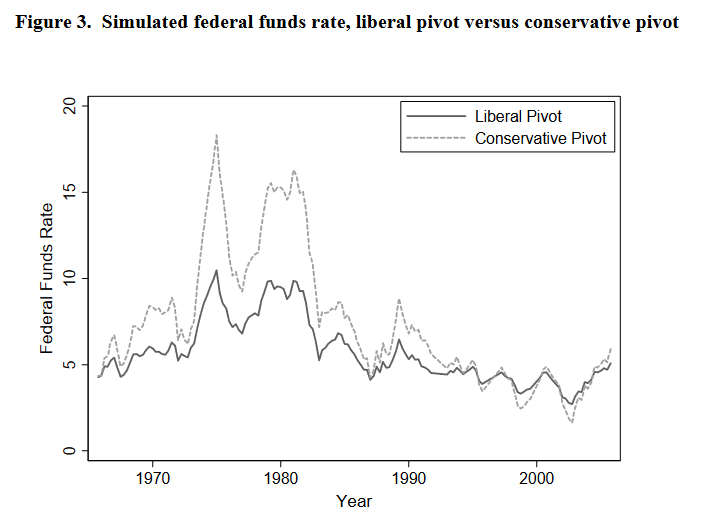

I got distracted from this work in 2006 but the conference paper has a few citations and some interesting resutls. Not as relevant today since the federal funds rate has been at or near the lower bound for years...

How do the President and the Congress affect the policy choices of the Federal Reserve System? I draw on a commonly used tool for estimating the sensitivity of Fed responses to output and inflation - the Taylor rule - to learn about the politics of monetary policy. The Taylor rule provides a convenient way to determine if Fed choices can be explained by the partisan makeup of Congress and the White House. Does the Fed respond more aggressively to inflation under a Republican President or if a Republican majority controls Congress? Does the Fed respond to recession sooner and with lower interest rates if the President is a Democrat? The results indicate changes in the pivotal legislator-- as described by Morris (2000) - influence monetary policy choices, rather than the President alone, appointment to the Board, or the Board chairman. Congress and the President jointly influence the policy choices of the Fed in ways that benefit the core constituencies of the major parties. The Fed is systematically more responsive to
inflation when a Republicans control the White House and the Congress.

One insight of the paper is that congressional majorities matter, not just the party of the president.  The key result is captured in Figure 3 in the paper.  Republican majorities lead to a higher federal funds rate in the presence of growing inflation.

```{r, echo=FALSE}

```


[Click here](https://jkcorder.files.wordpress.com/2017/02/taylor.pdf) to download the paper.


