<!-- Run common_r before code chunks -->

# Working with time series

## Modeling presidential approval

For the assignment due in two weeks you will model or predict approval of US presidents as a function of economic conditions and war.  The dependent variable is presidential approval, measured using the Gallup poll.  In a 2010 article in *Public Opinion Quarterly*, Benny Geys concludes that presidential approval is influenced by US spending in foreign conflicts [@geys2010]. He relied on data from 1948 to 2008,  capturing the experience of 11 US Presidents and four long-term foreign conflicts (Korea, Vietnam, and Iraq and Afghanistan after 9/11).  The data are organized by quarter, starting 1948 Q2 and ending 2008 Q3.  The Gallup Poll, administered dozens of times every year (in some years, several times a month), often includes the question "Do you approve or disapprove of the way [president’s name] is handling his job as president?"  The approval rating is simply the percentage of the population that answers "approve".  The data are summarized below and you can see the long-run average is probably around 50%.  Work by political scientists has linked the level of this approval rating to the state of the economy and highlighted the fact that approval ratings immediately following election are typically higher than average (the "honeymoon" period).  Other work has linked increasing casualties in war to declining presidential approval and Geys starts his piece with the claim that we should consider fiscal as well as human costs.

The quarterly level of presidential approval is summarized in the figure below.


```r

# Use the haven package read_dta function to read the STATA dataset
poq<- read_dta("data/poq_guys.dta")

# Use the lubridate make_date function to create a date
# Notice the trick to convert the quarter to the first month of the quarter - be careful with merging data to make sure it is matched with the right period
poq <- poq %>% 
  mutate(
    date = make_date(year, (3*quarter-2)))

# Create a figure
ggplot(poq, aes(y=approval, x=date)) +
  ggtitle("Figure 1. Presidential approval, 1948-2008") +
  geom_line(color="#095872", size=1) +
  theme(plot.title.position = "plot", plot.title = element_text(face="bold")) +
  labs(x="Date", y="Percent approving")
```

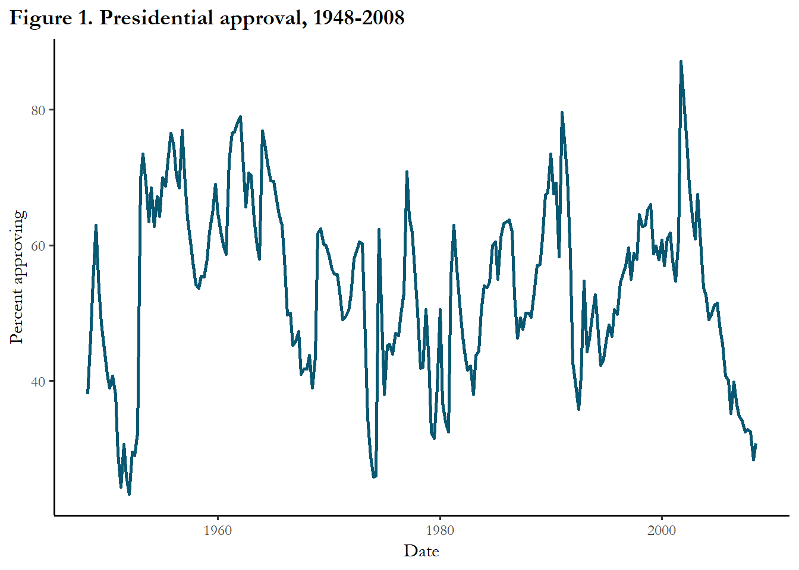

Data organized by date are known as time series and data of this form introduce some particular challenges with arcane names like *autocorrelation* and *nonstationarity*.  There is a particular and compelling advantage to using data organized by date - you can add in new variables - anything you can imagine - if you expect it is relevant.

We will cover each of the challenges in turn:

- what it means to have stationary series, why that is important, and how we transform a nonstationary series to a stationary series.

- what is means to have serial correlation, why that is important to know, and how we fix the problem.

We will use the presidential approval data to introduce tests for stationarity, estimate a simple model to see what serial correlation looks like, and next week we will talking about alternative ways to fix that problem. 

## Nonstationary data can lead to spurious findings

The first step when working with time series data is to test that the series is *stationary*.  Statisticians working with time series data uncovered a serious problem with standard econometric techniques applied to time series: estimation of parameters of the OLS model produces statistically significant results between time series that contain a trend and are otherwise random. This revelation dates back to the mid-1920s, in a piece titled "Why do we sometimes get nonsense-correlations between Time-Series?" [@yule1926we]. The finding led to considerable work on how to determine what properties a time series must possess if econometric techniques are to be used.  The basic conclusion was that any time series used in econometric applications must be stationary.  (We will discuss one exception – next week – when two nonstationary time series are *cointegrated.*).

### Determining the properties of a series {-}

You can think about any time series as composed of four different elements:  random error, a trend, a drift, and memory (how much the value today depends on the value yesterday.)  If we put all of these together, we would have an equation that looks like this:

 $$Y_t=\rho Y_{t-1}+\mu+\beta t +\epsilon_t$$
 
The memory is captured with $\rho$.  If $\rho=0$, then the there is no memory.  If the value of $\rho>1$ or $\rho<-1$, the series will be *explosive.* 

The drift is represented as $\mu$. 

The trend is represented as $\beta t$. If $\beta=0$, then there is no trend.  

If all of the parameters are zero, then all that is left is white noise or random error ($\epsilon_t$). 

A special case is when $\rho$ =1. A time series is described as a *random walk* if the variable of interest (Y~t~) is a function of past values plus some random error:

$$Y_t=Y_{t-1}+\epsilon_t$$

Notice that this is the same as above with $\rho=1$, $\beta=0$, and $\mu=0$

If Y~t~ may be accompanied by a constant, $\mu$, which means that the best guess for Y~t+1~ is Y~t~+$\mu$.  This is designated a *random walk with a drift*. 

Rather than depending upon Y~t-1~ , Y~t~ may simply be a function of a deterministic trend. In this case, Y~t~ is a function of $\beta*t$  and $\epsilon_t$.  This is designated a trend-stationary process. 

In general, a series is stationary is $-1<\rho<1$ and we formally test this below.  (If $\rho$=1, a random walk, the series is not stationary.


### Some examples {-}

To give you a sense of the difference between a stationary series and one that is not stationary, I will create several series with random numbers, one entirely random, three with $\rho=0.7$ and three with a unit root or $\rho=1$, and one that is explosive.


```r

# Adapted from Principles of  Econometrics with R
# https://bookdown.org/ccolonescu/RPoE4/

N <- 500
a <- 0.5
l <- 0.01
rho <- 0.7

set.seed(246810)
v <- ts(rnorm(N,0,1))

# Random noise
y4 <- ts(rep(0,N))
for (t in 2:N){
  y4[t]<- v[t]
}
plot(y4,type='l', ylab="", main="Random or white noise")
abline(h=0)
```

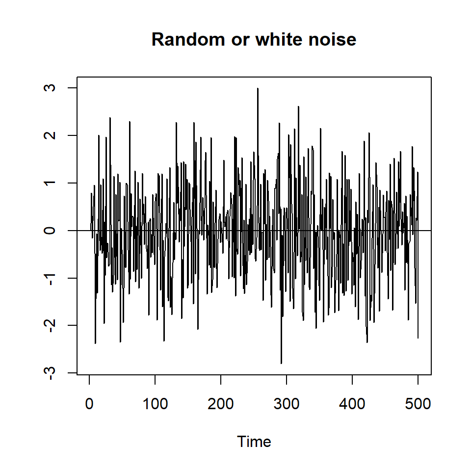

```r

# AR(1)
y <- ts(rep(0,N))
for (t in 2:N){
  y[t]<- rho*y[t-1]+v[t]
}
plot(y,type='l', ylab="", main="AR(1)")
abline(h=0)
```

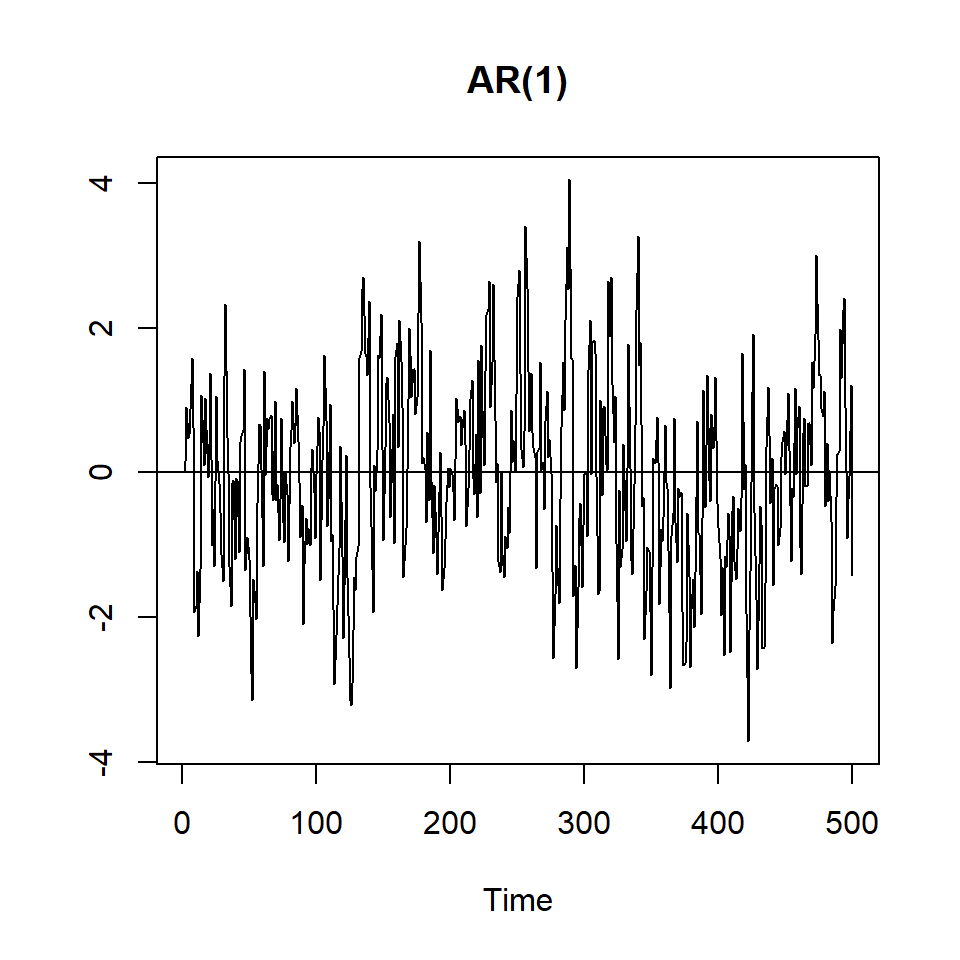

```r

# AR(1) with drift
y <- ts(rep(0,N))
for (t in 2:N){
  y[t]<- a+rho*y[t-1]+v[t]
}
plot(y,type='l', ylab="", main="AR(1) with drift")
abline(h=0)
```

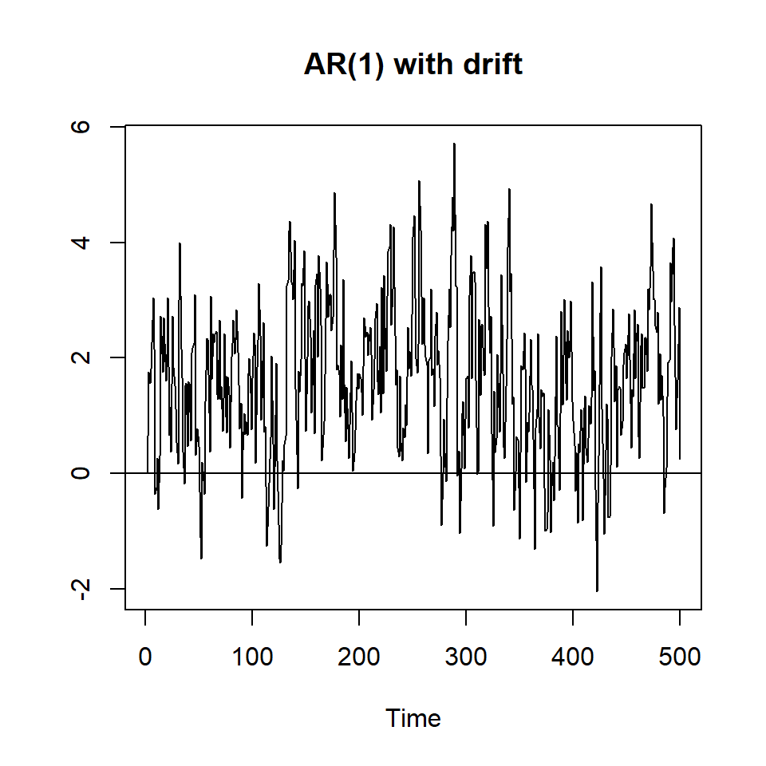

```r

# AR(1) with drift and trend
y <- ts(rep(0,N))
for (t in 2:N){
  y[t]<- a+l*time(y)[t]+rho*y[t-1]+v[t]
}
plot(y,type='l', ylab="", main="AR(1) with trend and drift")
abline(h=0)
```

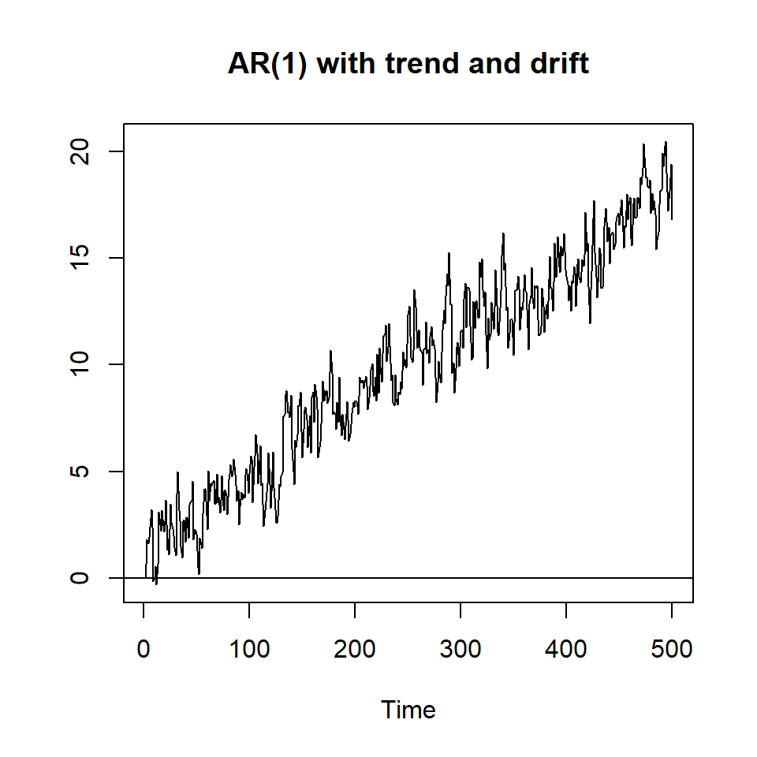

```r

# Random walk
y <- ts(rep(0,N))
for (t in 2:N){
  y[t]<- y[t-1]+v[t]
}
plot(y,type='l', ylab="", main="Random walk")
abline(h=0)
```

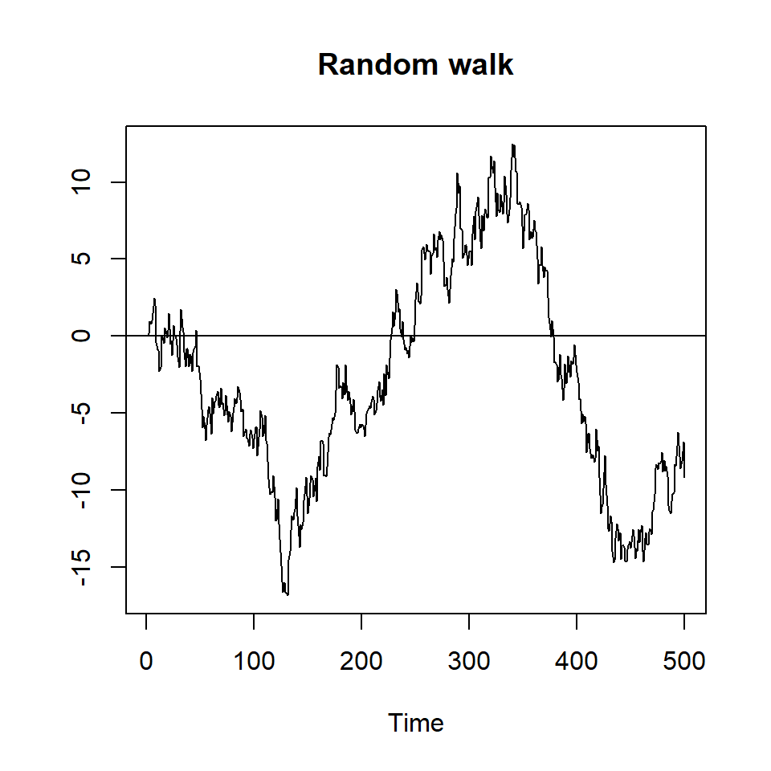

```r

# Random Walk with drift
y3 <- ts(rep(0,N))
for (t in 2:N){
  y3[t]<- a+y3[t-1]+v[t]
}
plot(y3,type='l', ylab="", main="Random walk with drift")
abline(h=0)
```

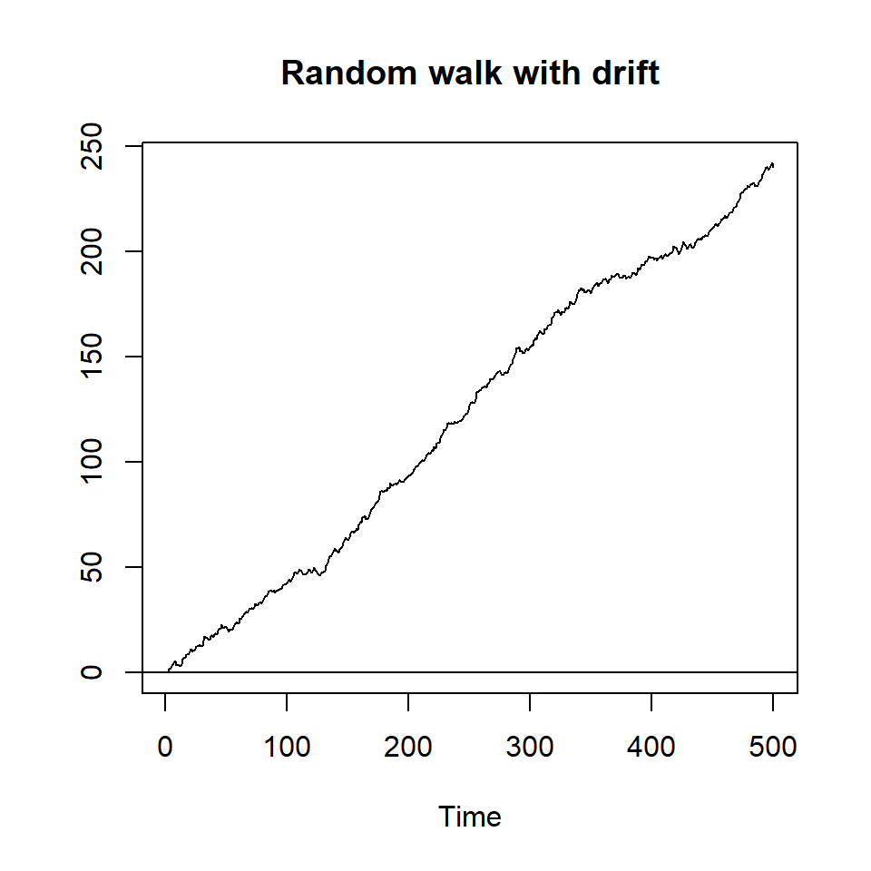

```r

# Random walk with trend and drift"
y <- ts(rep(0,N))
for (t in 2:N){
  y[t]<- a+l*time(y)[t]+y[t-1]+v[t]
}
plot(y,type='l', ylab="", main="Random walk with trend and drift")
abline(h=0)
```

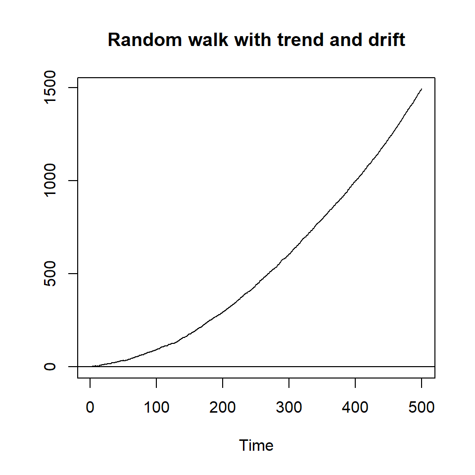

```r


# explosive
y <- ts(rep(0,N))
for (t in 2:N){
  y[t]<- 1.075*y[t-1]+v[t]
}
plot(y,type='l', ylab="", main="Explosive")
abline(h=0)
```

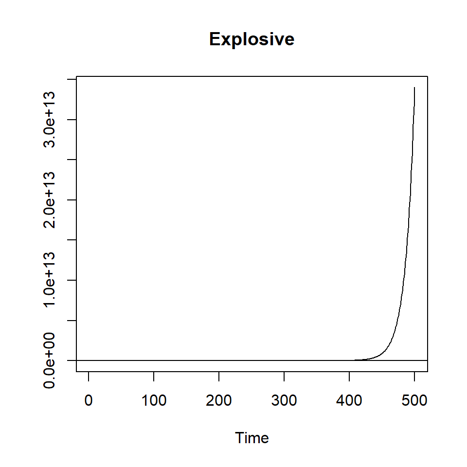

The first three series appear to be stationary  - a constant mean and constant variance across the range of the series.  the fourth series - ar(1) with trend - appears to have a constant variance but a mean that increases over time.  The nextlast three series are not stationary.  The fourth has a higher mean in the middle of the time series.  The next two (and the explosive series) have a mean that increases over time.  Notice that the ar(1) with a drift is stationary while the random walke with a drift is not.  So it really matters if the autoregressive parameter is lower than 1.0.

###  A statistical test

Are the characteristics of a time series – the mean and variance - constant over time?  If the mean and variance are constant over time, then the series is stationary.  If the mean and variance change, then the series is nonstationary.

You can get some idea about problems with nonstationarity just by looking at the plot.  Does the series appear to have a stable mean or a trend?  Does the variance of the series appear to be constant over time?

We can use a simple statistical test to estimate the parameters of any times series we are using, to identify a trend or drift, and to asses the value of $\rho$.  so we don't have to rely on our intuition based on the figures, we estimate the properties from the sample data.

How can you know if a series is stationary? Remember that the key thing we want to know is the value of $\rho$ and reject the idea that the value of that parameter is 1.0.

In order to test this revisit this equation from above:

$$Y_t=\rho Y_{t-1}+\mu+\beta t +\epsilon_t$$

Subtract Y~t-1~ from each side of the equation above:

$$Y_t-Y_{t-1}=(\rho-1) Y_{t-1}+\mu+\beta t +\epsilon_t$$
  
We can use OLS to estimate the parameters of this equation. The output below is for the presidential approval variable. 


```r
# Create some new variables and identify the variables retained for the assignment.

# WAR VARIABLES
# Create a duration counter including each conflict
poq$weary<-poq$weary_kor+poq$weary_Viet+poq$weary_Afgh
# Create a single casualty variable
poq$casualty<-poq$vietnam+poq$iraqcas+poq$koreacas
# Create a cumulative casualty variable
poq$cumulative<-poq$koreacasCUM+poq$VietcasCUM+poq$iraqcasCUM
# Create a dummy variable for war
poq$wardummy<-poq$Iraqdum+poq$Vietdum+poq$Koreadum
# The defense spending variable is DoDspend

# ECONOMIC VARIABLES
# Inflation is  Infl_new
# Unemployment is unempl
# Economic growth is growth
# Michigan Index of consumer sentiment is mics

# CONTROLS
# Honeymoon is honeymoon
# Divided government is dg
# Election year is elyear
# Watergate is water

# Create the data for the paper and use this data for the rest of the notes.

poq<-poq %>% select(date, approval, unempl, Infl_new, growth, mics, weary, casualty, wardummy, cumulative, honeymoon, water, elyear, dg, DoDspend) %>% filter(date<"2009-01-01")
```
The output above is known as the Dickey-Fuller test.

```r

# create lag and difference
poq$l.approval<-lag(poq$approval, 1, na.pad=TRUE)
poq$d.approval<-poq$approval-poq$l.approval
# Add a counter

poq$count<-c(1:nrow(poq))

df_example<-lm(d.approval~l.approval+count, data=poq)
# I am using summary() rather than stargazer since I want to show the t-values
summary(df_example) 

Call:
lm(formula = d.approval ~ l.approval + count, data = poq)

Residuals:
    Min      1Q  Median      3Q     Max 
-14.724  -3.869  -0.609   2.625  33.667 

Coefficients:
             Estimate Std. Error t value Pr(>|t|)    
(Intercept)  8.291512   2.051907   4.041 7.19e-05 ***
l.approval  -0.139016   0.033121  -4.197 3.82e-05 ***
count       -0.006526   0.006131  -1.064    0.288    
---
Signif. codes:  0 '***' 0.001 '**' 0.01 '*' 0.05 '.' 0.1 ' ' 1

Residual standard error: 6.592 on 238 degrees of freedom
  (1 observation deleted due to missingness)
Multiple R-squared:  0.07053,	Adjusted R-squared:  0.06272 
F-statistic:  9.03 on 2 and 238 DF,  p-value: 0.0001659
```
 
Since the counter ($t$) is not statistically significant, there is not trend.  And since ($\rho-1$) is different from zero, the series if stationary. The constant is not zero, so this is ar(1) with drift.  We can reject the hypothesis that this series is not a random walk.

If the coefficient on the lagged value of the series is zero,  $(\rho - 1)=0$ then the series is not stationary (the series contains what is called a *unit root*).   In the example above, ($\rho - 1) < 0$ (the coefficient is -0.139 and the coefficient is statistically significant). This means $\rho<1$.  This is what you will typically see with a stationary series.

If $\beta>0$ then the series contains a trend.  In the example above $\beta=0$.

If $\beta=0$ (not significant)  and $(\rho - 1)$ is not zero (significant), then the series is stationary.  

The approval series is stationary.

We can use the same test to make sure that all of the variables in order model are stationary.

The key thing to avoid is regressing a nonstationary $Y$ on a nonstationary $X$.

#### Why we are concerned about spurious regression

We can create a random time series, $Y_1$, and and random time series, $X$.  I will also create a third series, $Y_2$, that is a linear function of $X$. 

We should be able to use OLS to determine which $Y_i$ is unrelated (random) and which is related.  The table below reports the coefficients from the regressions that evaluate those links. 


```r

# Adapted from Principles of Econometrics with R

set.seed(246810)
v1 <- ts(rnorm(N,0,1))
v2 <- ts(rnorm(N,0,1))
v3<-  ts(rnorm(N,0,1))

# Create a series with a unit root for X and Y1

Y1 <- ts(rep(0,N))
for (t in 2:N){
  Y1[t]<- Y1[t-1]+v1[t]
}

X <- ts(rep(0,N))
for (t in 2:N){
  X[t]<- X[t-1]+v2[t]
}

# Create Y2 as a linear function of X plus an error

Y2 <- 2+5*X+v3

data<-cbind(Y1,Y2,X)
m1<-lm(Y1~X, data=data)
m2<-lm(Y2~X, data=data)
stargazer(m1, m2, type = 'text',  model.numbers=FALSE, omit.stat=c("ser","f"))

=========================================
                 Dependent variable:     
             ----------------------------
                   Y1            Y2      
-----------------------------------------
X               0.142***      5.000***   
                (0.038)        (0.006)   
                                         
Constant       -3.966***      1.965***   
                (0.419)        (0.063)   
                                         
-----------------------------------------
Observations      500            500     
R2               0.027          0.999    
Adjusted R2      0.025          0.999    
=========================================
Note:         *p<0.1; **p<0.05; ***p<0.01
```
<br>
Notice that there is a statistically significant link between $Y_1$ and X, even though they are totally random and unrelated.  This is the spurious result we risk reporting if variables are not stationary.

### Using the **urca** package and the `ur.test` function

We can pursue a simple to test for stationarity using the `ur.test` function from the **urca** package.  We remain focused on the test for a unit root, but we might use the regression to test for the presence of a trend. One other wrinkle:  the standard p-value is not used to assess statistical significance, a critical value is reported at the end of the output and that is what we use to evaluate whether or not the series is significant (so the regression result may show p<0.05 but you need to check the critical value)


```r
summary(ur.df(y=poq$approval, lags=0, type='trend'))

############################################### 
# Augmented Dickey-Fuller Test Unit Root Test # 
############################################### 

Test regression trend 


Call:
lm(formula = z.diff ~ z.lag.1 + 1 + tt)

Residuals:
    Min      1Q  Median      3Q     Max 
-14.724  -3.869  -0.609   2.625  33.667 

Coefficients:
             Estimate Std. Error t value Pr(>|t|)    
(Intercept)  8.284986   2.049168   4.043 7.13e-05 ***
z.lag.1     -0.139016   0.033121  -4.197 3.82e-05 ***
tt          -0.006526   0.006131  -1.064    0.288    
---
Signif. codes:  0 '***' 0.001 '**' 0.01 '*' 0.05 '.' 0.1 ' ' 1

Residual standard error: 6.592 on 238 degrees of freedom
Multiple R-squared:  0.07053,	Adjusted R-squared:  0.06272 
F-statistic:  9.03 on 2 and 238 DF,  p-value: 0.0001659


Value of test-statistic is: -4.1972 6.0219 9.0305 

Critical values for test statistics: 
      1pct  5pct 10pct
tau3 -3.99 -3.43 -3.13
phi2  6.22  4.75  4.07
phi3  8.43  6.49  5.47
```
 Note that the key statistic $tau3$ is the t-value associated with the first lag of the sereis ($z.lag1$) : significant means stationary.
 
 The output below just shows the results of this test for our simulated series - the random variable (y4) from the figures above and the unit root (y3) from the same set of figures.
 

```r
# This command instructs the function to omit missing values and include one lag of Y, as we did above.
summary(ur.df(y4,  type='trend', lags=0))  

############################################### 
# Augmented Dickey-Fuller Test Unit Root Test # 
############################################### 

Test regression trend 


Call:
lm(formula = z.diff ~ z.lag.1 + 1 + tt)

Residuals:
     Min       1Q   Median       3Q      Max 
-2.75720 -0.71175 -0.00893  0.70039  3.04527 

Coefficients:
              Estimate Std. Error t value Pr(>|t|)    
(Intercept)  1.304e-03  9.104e-02   0.014    0.989    
z.lag.1     -1.050e+00  4.507e-02 -23.306   <2e-16 ***
tt          -8.131e-05  3.155e-04  -0.258    0.797    
---
Signif. codes:  0 '***' 0.001 '**' 0.01 '*' 0.05 '.' 0.1 ' ' 1

Residual standard error: 1.015 on 496 degrees of freedom
Multiple R-squared:  0.5227,	Adjusted R-squared:  0.5208 
F-statistic: 271.6 on 2 and 496 DF,  p-value: < 2.2e-16


Value of test-statistic is: -23.3058 181.0659 271.5939 

Critical values for test statistics: 
      1pct  5pct 10pct
tau3 -3.98 -3.42 -3.13
phi2  6.15  4.71  4.05
phi3  8.34  6.30  5.36
summary(ur.df(y3, type='trend', lags=0))

############################################### 
# Augmented Dickey-Fuller Test Unit Root Test # 
############################################### 

Test regression trend 


Call:
lm(formula = z.diff ~ z.lag.1 + 1 + tt)

Residuals:
     Min       1Q   Median       3Q      Max 
-2.65403 -0.71415  0.03071  0.70711  3.07356 

Coefficients:
             Estimate Std. Error t value Pr(>|t|)    
(Intercept)  0.471046   0.093106   5.059 5.94e-07 ***
z.lag.1     -0.009994   0.006514  -1.534    0.126    
tt           0.004904   0.003263   1.503    0.134    
---
Signif. codes:  0 '***' 0.001 '**' 0.01 '*' 0.05 '.' 0.1 ' ' 1

Residual standard error: 1.014 on 496 degrees of freedom
Multiple R-squared:  0.004852,	Adjusted R-squared:  0.0008397 
F-statistic: 1.209 on 2 and 496 DF,  p-value: 0.2993


Value of test-statistic is: -1.5343 38.322 1.2093 

Critical values for test statistics: 
      1pct  5pct 10pct
tau3 -3.98 -3.42 -3.13
phi2  6.15  4.71  4.05
phi3  8.34  6.30  5.36
```
You can see that the test with the stationary series rejects the null- the series is identified as stationary.

But the test on the unit root we created does not reject the null - that series is not stationary.
 
Use of these tests to determine if time series are stationary is well-established in practice.

### Variables may require some elaborate transformations.

what happens if a variable is not stationary?  The time series must be *transformed* in some way – subtracting the trend or creating the first difference, or using an alternative functional form. 

You have several variables to choose from as you specify a model of presidential approval for the assignment.  Some of these variables are stationary, but others are not.  We need to figure out what types of transformations might be appropriate for these variables and the implications of these transformations.

I would like to use three variables in the running example: casualties, the index of consumer sentiment (a subjective perception about how the economy is doing, and the honeymoon period.  I expect presidential approval to decrease when there are casualties, increase when people believe the economy is doing well, and be higher during the first quarter of any term.

I need to test each of these variables for stationarity, just like I tested the $Y$ variable.


```r
summary(ur.df(poq$honeymoon,  type='trend', lags=0))  

############################################### 
# Augmented Dickey-Fuller Test Unit Root Test # 
############################################### 

Test regression trend 


Call:
lm(formula = z.diff ~ z.lag.1 + 1 + tt)

Residuals:
    Min      1Q  Median      3Q     Max 
-0.8044 -0.1848 -0.1561 -0.1338  3.8678 

Coefficients:
              Estimate Std. Error t value Pr(>|t|)    
(Intercept)  0.1993973  0.1092503   1.825   0.0692 .  
z.lag.1     -0.3877001  0.0512282  -7.568 8.27e-13 ***
tt          -0.0003184  0.0007626  -0.417   0.6767    
---
Signif. codes:  0 '***' 0.001 '**' 0.01 '*' 0.05 '.' 0.1 ' ' 1

Residual standard error: 0.823 on 238 degrees of freedom
Multiple R-squared:  0.194,	Adjusted R-squared:  0.1872 
F-statistic: 28.64 on 2 and 238 DF,  p-value: 7.133e-12


Value of test-statistic is: -7.5681 19.0962 28.6444 

Critical values for test statistics: 
      1pct  5pct 10pct
tau3 -3.99 -3.43 -3.13
phi2  6.22  4.75  4.07
phi3  8.43  6.49  5.47
summary(ur.df(poq$casualty,  type='trend', lags=0))  

############################################### 
# Augmented Dickey-Fuller Test Unit Root Test # 
############################################### 

Test regression trend 


Call:
lm(formula = z.diff ~ z.lag.1 + 1 + tt)

Residuals:
    Min      1Q  Median      3Q     Max 
-1879.7  -137.8   -52.9     7.8  6918.1 

Coefficients:
             Estimate Std. Error t value Pr(>|t|)    
(Intercept) 215.43037   86.18242    2.50   0.0131 *  
z.lag.1      -0.20696    0.03927   -5.27 3.05e-07 ***
tt           -1.08346    0.58260   -1.86   0.0642 .  
---
Signif. codes:  0 '***' 0.001 '**' 0.01 '*' 0.05 '.' 0.1 ' ' 1

Residual standard error: 594.5 on 238 degrees of freedom
Multiple R-squared:  0.1046,	Adjusted R-squared:  0.09705 
F-statistic:  13.9 on 2 and 238 DF,  p-value: 1.957e-06


Value of test-statistic is: -5.2702 9.265 13.8975 

Critical values for test statistics: 
      1pct  5pct 10pct
tau3 -3.99 -3.43 -3.13
phi2  6.22  4.75  4.07
phi3  8.43  6.49  5.47
# I had to filter to get rid of the quarters without mics
test<- poq %>% filter(date>"1952-10-01")
summary(ur.df(test$mics,  type='trend', lags=0))

############################################### 
# Augmented Dickey-Fuller Test Unit Root Test # 
############################################### 

Test regression trend 


Call:
lm(formula = z.diff ~ z.lag.1 + 1 + tt)

Residuals:
     Min       1Q   Median       3Q      Max 
-15.6974  -3.2255   0.1581   3.0782  15.1889 

Coefficients:
             Estimate Std. Error t value Pr(>|t|)   
(Intercept)  8.026702   2.677881   2.997  0.00304 **
z.lag.1     -0.089116   0.029427  -3.028  0.00275 **
tt          -0.002522   0.005122  -0.492  0.62287   
---
Signif. codes:  0 '***' 0.001 '**' 0.01 '*' 0.05 '.' 0.1 ' ' 1

Residual standard error: 4.89 on 219 degrees of freedom
Multiple R-squared:  0.04123,	Adjusted R-squared:  0.03247 
F-statistic: 4.708 on 2 and 219 DF,  p-value: 0.009953


Value of test-statistic is: -3.0284 3.1809 4.7083 

Critical values for test statistics: 
      1pct  5pct 10pct
tau3 -3.99 -3.43 -3.13
phi2  6.22  4.75  4.07
phi3  8.43  6.49  5.47
```
The tests reveal a couple of things - casualties and the honeymoon variable are both stationary, but the index of consumer sentiment, the first test, is not.  This series is not stationary.

### We have options {-}

- Detrend.  Our test for stationarity has two parts -- one test for trend.
If the trend variable was significant, we could detrend – remove a linear trend.  Identify the linear trend (regression $Y$ on t).  Create a predicted value.  Subtract the predicted value from the original.  Note that the MICS variable does not have a linear trend, so this probably won’t work in this instance.  I will demonstrate this next week.

- First–difference.  In many cases, a series can be transformed from nonstationary to stationary by taking the first difference. This is the typical approach to manage nonstationarity.  Rather than using $X_t$ as an independent variable, the independent variable becomes $X_t-X_{t-1}$.  A series that is stationary without any transformation is designated as I(0), or integrated of order 0. A series that has stationary first differences is designated I(1), or integrated of order 1.  

- Other transformations.  We could take the log or use some other type of transformation.

Carefully consider the substantive implications of these transformations. Returning to presidential approval example, consider the implications of a positive link between presidential approval and economic conditions. 

#### How to use MICS? {-}

- Alternative 1 (raw series).  The level of presidential approval is a function of the level of MICS.  When consumer sentiment is high, approval is high.  We CANNOT run this regression since we know that approval is I(0) but mics is I(1) – this model would be “unbalanced.”

 - Alternative  2 (de-trended series).  Presidential approval is a function of departure of MICS from a trend.  If MICS is increasing and remains increasing, the level of presidential approval does not change. If the rate of increase of MICS falls (an observation is below trend), then presidential approval falls. We WOULD NOT take this approach since we know MICS has no trend.

- Alternative 3 (first difference).  Levels of presidential approval are a function of changes in MICS.  If MICS falls, then presidential approval falls.  If MICS falls from very high to high, then presidential approval falls.  If there is no change in consumer sentiment (remains low or remains high), then approval is expected to remain at the mean.  Notice the subtle changes in theory that we incorporate if we transform the variable.

- Alternative 4 (percent change).  Presidential approval responds not just to the change in MICS from the current level, but how big of a change that is from the current level, as a percentage.  So a change from 100 to 120 (+20%) would be more meaningful than a change from 110 to 120 (+9.1%)

- Alternative 5 (alternative functional form - log).  In other cases, we may other reasons to transform a series.   It is not uncommon for large numbers to be transformed with the log or logarithm.  The POQ piece uses data on US casualties in war, but includes the log of these numbers.  The intuition is that it is not the level of casualties that matter, or even the difference from the last period, but the percentage change that matters - so small changes from low levels will be more important than small changes from high levels.  This can be picked with a log and it is very common to see series that have a couple of very high numbers but many low numbers transformed using the log.

Notice how the technical prescription may or may not coincide with what you think happens substantively.  

### What the transformed series look like

We can compare the plots of the MICS data using these transformations.  (Note that we would need to check that these new, transformed series are stationary too.)  This is just to show you how these transformations work. 


```r
# Create the first differnce
poq$d.mics<-poq$mics-lag(poq$mics)

#Create  transformed series

#We have to add 1 to make sure zeroes are converted to log=0
poq$log.mics<-log(poq$mics+1)

# Calculate the percent change for mics
# First calculate the lag
poq$l.mics=lag(poq$mics)
poq$pct.mics=100*(poq$mics-poq$l.mics)/(poq$l.mics+1)  
poq$d.mics<-poq$mics-poq$l.mics

# compare the plots

ggplot(poq, aes(y=mics, x=date)) +  ggtitle("Index of Consumer Sentiment") + geom_line(color="blue", size=1.25) + labs(x="Date", y="MICS")
```

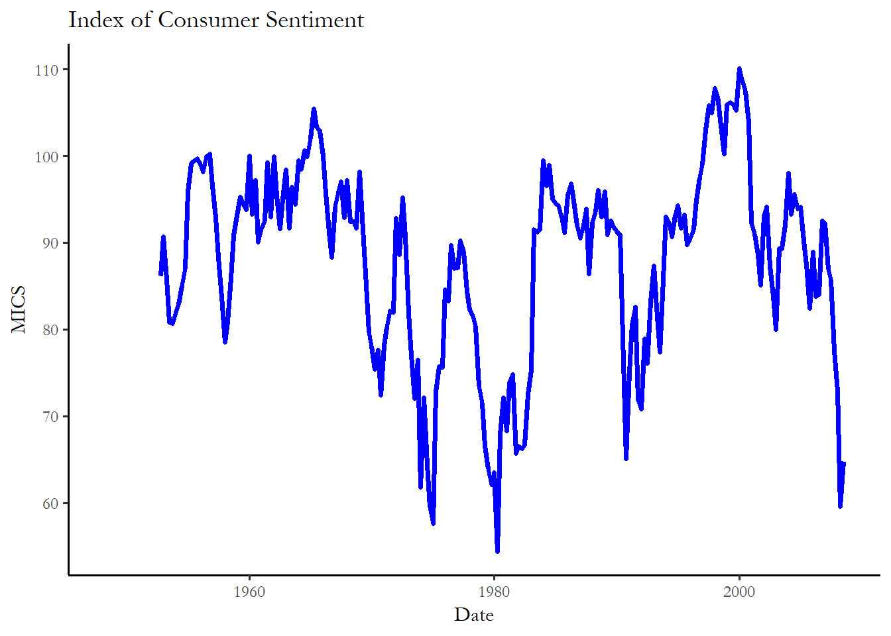

```r

ggplot(poq, aes(y=log.mics, x=date)) +  ggtitle("Log, Index of Consumer Sentiment") + geom_line(color="blue", size=1.25) + labs(x="Date", y="Log, MICS")
```

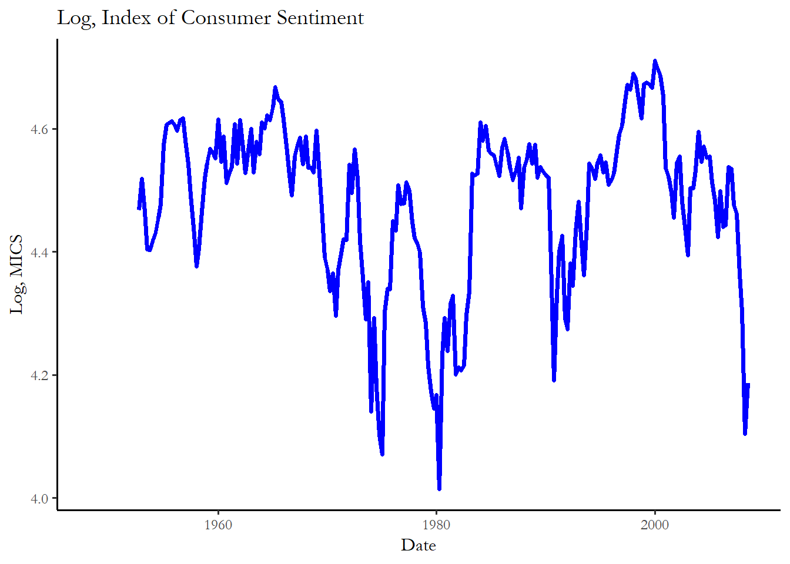

```r

ggplot(poq, aes(y=pct.mics, x=date)) +  ggtitle("Percent change, Index of Consumer Sentiment") +  geom_line(color="blue", size=1.25) + labs(x="Date", y="Percent change from previous quarter")
```

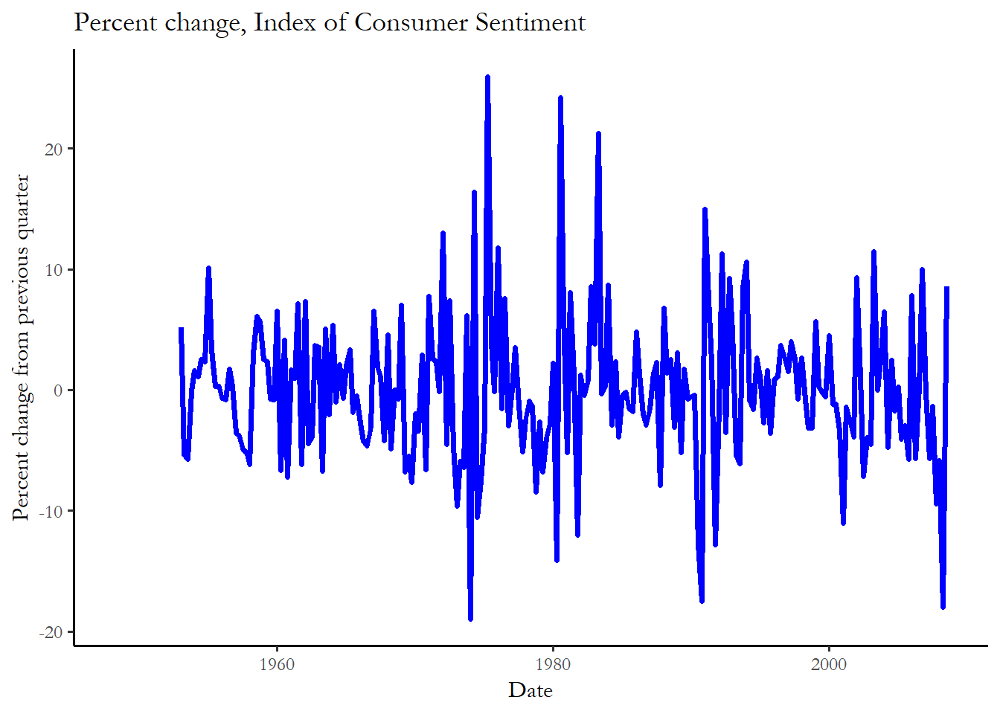

```r

ggplot(poq, aes(y=d.mics, x=date)) +  ggtitle("First difference, Index of Consumer Sentiment") +
  geom_line(color="blue", size=1.25) + labs(x="Date", y="First difference")
```

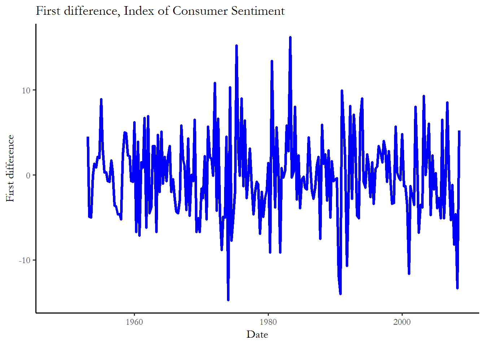

## Residuals may be correlated

###  What is autocorrelation? What problems does autocorrelation introduce?

To date we have discussed two common violations of assumptions of the classical linear regression model: one formal assumption (*heteroskedasticity*) and another implicit assumption (*unit homogeneity*).  We approached heteroskedasticity as a nuisance – how can we select estimators for the standard errors that are robust to these violations?   This week we take a similar approach to deal with the problem of autocorrelation – also labeled serial correlation in the special case of time series data.    Next week we adopt a different strategy for dealing with autocorrelation – treating the autocorrelation as additional information (a good thing) in the data – similar to the way we learned something new or added information when we included an interaction term.

Autocorrelation is the label for observed correlation between the error terms across observations in the model.  The classical linear regression model assumes that the errors term are uncorrelated – random – across observations.  We typically observe autocorrelation in two applications – when observations are organized as a time series (serial correlation) or when data are geographic units that share borders (spatial correlation).  In both cases “neighboring” observations – close proximity in space and time – are related.  What are the implications for OLS?

Parameter estimates generated via OLS are still unbiased, but estimated variances of OLS parameters are biased.  OLS in the presence of serial correlation tends to underestimate the true variances and standard errors, and inflate t values, potentially leading to the erroneous conclusion that coefficients are statistically different from 0. The formula used to compute error variance ($\sigma^2$) is a biased estimator – usually underestimates the actual variance in the error, so, the estimated $R^2$ will not be a reliable estimate of the true $R^2$

### Detecting Autocorrelation

Again, as with heteroskedasticity, we do not actually observe the error ($u$) or its variance
In order to determine if autocorrelation exists, we again rely on our estimate of u, which is $e$.

### Starting with OLS

Start, as always, with a model, most likely a model involving time series data.  In this case the dependent variable is presidential approval and the predictors are the Michigan Index of Consumer Sentiment and an indicator for the honeymoon period (4 in the first quarter of any presidential term, 3,2,1 and 0 by the first quarter of the second year). the index of consumer sentiment (MICS) is a subjective measure of how people perceive the state of the econonmy. The idea is that if the economy is good, then presidential approval will be higher.  There is also a dummy variable for the honeymoon period - the first quarter of any presidential term.  We expect approval to be higher earlier in the term, rather than later in the term.  I will use the first differnce of MICS.

 
$$Presidential.approval_t = \beta_0 + \beta_1(d.mics_t)+ \beta_2(honeymoon) + u_t$$

```r
poq$d.mics=poq$mics-lag(poq$mics)

model1<-lm(approval~d.mics+casualty+honeymoon, data=poq)
stargazer(model1,  type="html",
          model.names=FALSE, model.numbers=FALSE, style="apsr", digits=2,
          dep.var.labels=c("Presidential approval"),
          title="**Table 1. Presidential approval as a function of economy, war and the honeymoon, OLS**",
          notes= "p<.10* ; p<.05**",  notes.append = FALSE,
          covariate.labels=c("MICS, first difference", "Casualities", "Honeymoon"), omit.stat=c("ser","f"),
          star.cutoffs = c(0.10,0.05))
```


<table style="text-align:center"><caption><strong>**Table 1. Presidential approval as a function of economy, war and the honeymoon, OLS**</strong></caption>
<tr><td colspan="2" style="border-bottom: 1px solid black"></td></tr><tr><td style="text-align:left"></td><td>Presidential approval</td></tr>
<tr><td colspan="2" style="border-bottom: 1px solid black"></td></tr><tr><td style="text-align:left">MICS, first difference</td><td>0.14</td></tr>
<tr><td style="text-align:left"></td><td>(0.16)</td></tr>
<tr><td style="text-align:left">Casualities</td><td>-0.002<sup>**</sup></td></tr>
<tr><td style="text-align:left"></td><td>(0.001)</td></tr>
<tr><td style="text-align:left">Honeymoon</td><td>3.04<sup>**</sup></td></tr>
<tr><td style="text-align:left"></td><td>(0.74)</td></tr>
<tr><td style="text-align:left">Constant</td><td>54.58<sup>**</sup></td></tr>
<tr><td style="text-align:left"></td><td>(0.90)</td></tr>
<tr><td style="text-align:left">N</td><td>223</td></tr>
<tr><td style="text-align:left">R<sup>2</sup></td><td>0.08</td></tr>
<tr><td style="text-align:left">Adjusted R<sup>2</sup></td><td>0.07</td></tr>
<tr><td colspan="2" style="border-bottom: 1px solid black"></td></tr><tr><td colspan="2" style="text-align:left">p<.10* ; p<.05**</td></tr>
</table>


### Using the residuals to diagnose problems

Again, like heteroskedasticity, the first thing to do is to actually look at your residuals, to determine whether or not they appear to follow some sort of a pattern.  The first figure just plots the residuals over time and they look fairly random.  But the second figure shows that the residuals are clearly related - error today is a positive function of error in the previous quarter.


```r
plot(lag(model1$residuals),model1$residuals)
```

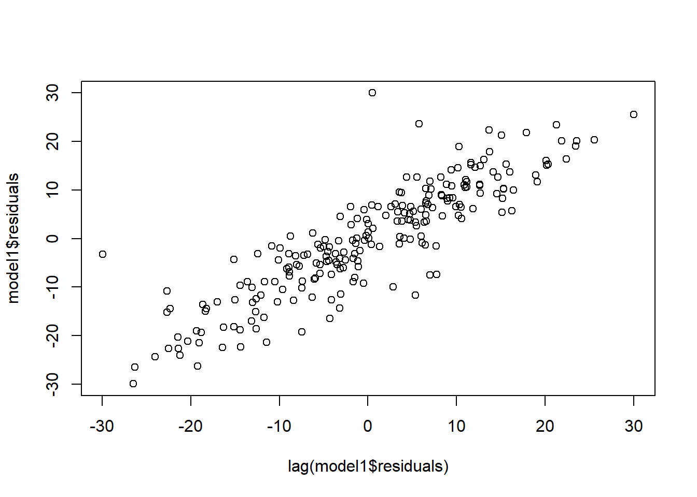

## A statistical test for autocorrelation

The figure is instructive, but there is not specific guidance about the severity of the problem.  We instead rely on a simple measure of serial correlation, the durbin-watson, defined as:


$$d = \dfrac{\sum_{i = 2}^N (e_i - e_{i-1})^2}{\sum_{i = 1}^N e_i^2}$$
In other words, the sum of the every residual minus its lag, squared, divided by the sum of the residuals squared.  (Or, more accurately, the covariance of the error and lagged error divided by the variance of the error term). This statistic is easy to compute, and even easier given that just about every statistical package will kick out a Durbin-Watson statistic automatically if you ask it to.  When reporting regression results for time series it is absolutely standard to report the Durbin-Watson $d$ test for autocorrelation

Several conditions must hold, however, in order to use the Durbin-Watson $d$
	
First:	The regression equation must include a constant or intercept term.  If for some reason your model does not include such a term (sometimes there are theoretical/statistical reasons to suppress the intercept), the Durbin-Watson is not appropriate

Second:	We assume that the disturbances, $u_i$, are generated by the following underlying mechanism:


$$u_t = \rho u_{t-1} + v_t  \textrm{ } \textrm{  where } –1 < \rho < 1$$
The form of this equation should be familiar.  $\rho$, or rho, is called the coefficient of autocorrelation, and describes the relationship between the error term and its past values – the assumption is the error in our model is a function of some relationship with its last value and a purely random term, $v_t$.

This is important because it assumes a specific error-generating mechanism known as first-order autoregressive, or AR(1).  This mechanism implies that that the relationship of the errors to each other is between each error and its immediate lag

This assumption does not always hold – there are situations in which we might expect the error term to be second-, third-, or fourth- (or other-) order regressive (quarterly data?)

The value of the durbin-watson test statistic is approximately (2*(1-$\rho$)). Where $\rho$ = parameter in the linear model above first order autocorrelation above 

Finally, the model does not include lagged values of the dependent variable as one of the explanatory variables.  We will cover these dynamic models next week


### Assuming these conditions are fulfilled, how do we use the D-W d?

A d closer to 0 means positive autocorrelation, a d closer to 4 means negative autocorrelation

In order to determine how close to 0 or 4 is close enough to determine that the model has either positive or negative autocorrelation, there are both upper and lower critical values for d, which depend on the number of observations (N) and the number of explanatory variables (k).

The null hypothesis is:  No autocorrelation.  In the ouput below, the test is not ambiguous.  We clearly must reject the null and accept the alternative hypothesis - there is autocorrelation.


```r
dwtest(model1)

	Durbin-Watson test

data:  model1
DW = 0.24122, p-value < 2.2e-16
alternative hypothesis: true autocorrelation is greater than 0
```

### A more contemporary test: Breusch-Godfrey (BG)

As time series work has proliferated and advanced, a number of tests have emerged as alternatives to Durbin-Watson. The general consensus is to use what is known as the *Breusch-Godfrey test*. This test has two advantages over Durbin-Watson.   First, this test is robust to including lagged values of the dependent variable, a step we will take next week.  Second, the test permits us to look at the serial correlation beyond the first lag.   If the error is strictly a product of random error:

$$e_t=v_t$$,

where $v_t$ is mean zero and variance $\sigma^2$, then the autocorrelation function should be composed of $\rho$=0 for k>0.  

This is described as a *white noise process*.

If there is no serial correlation – at lag 1 or other lags – in our model, then the error term should appear to be white noise.  There are formal tests for this implemented in many statistical packages.  The Breusch Godfrey (BG) test statistic is a function of the R^2 of a regression of the error at t against the errors at lags 1 to k. This should be zero or close to zero if the errors are uncorrelated. Specifically:

$$BG =(T-k)*R^2$$

T is the number of time periods, k is the number of lags tested, and R^2^ is the goodness of fit test statistic from a regression of the error on its lags.    The `bgtest` function reports if the test is statistically significant. If the test is significant, then the residuals are correlated.  Below, I calculate the test statistic manually for 1 lag and call the test for up to lag 4.  The first number is just to show you where the test statistic comes from.  The second set of output is what we will use for the assignment.


```r
model4<-lm(model1$residual~lag(model1$residual))
summary(model4)$r.squared*(222-1)
[1] 170.4665
kable(tidy(bgtest(model1, order=1, type = c("Chisq"))))
```


| statistic| p.value| parameter|method                                                       |
|---------:|-------:|---------:|:------------------------------------------------------------|
|  174.7438|       0|         1|Breusch-Godfrey test for serial correlation of order up to 1 |

```r
bgtest(model1, order=4, type = c("Chisq"))

	Breusch-Godfrey test for serial correlation of order up to 4

data:  model1
LM test = 175.62, df = 4, p-value < 2.2e-16
```

## Next week

Once you are confident the variables are stationary, then you can choose a modeling strategy helps to mitigate the problems of serial correlation. There are two common approaches  

### ARIMA models

The autoregressive integrated moving average (ARIMA) modeling strategy permits us to remedy the problem of serial correlation by treating the error term as a dynamic process. All of the dynamics - the influence of the past on current observations - is introduced via the error term. This assumes the effects of X on Y are *contemporaneous*.  There is no way (technically or substantively) in this modeling framework that past values of X cause current values of Y or that past values of Y influence current values of Y.  This suggests that ARIMA strategy may be a special case and a more general strategy for handling dynamics may be appropriate.

### Dynamic models

Dynamic models are simply models that include lagged (prior) values of X or Y.  Instead of only treating the error as dynamic, Why not model persistence or dynamics directly, by including lagged values of X or Y?  Read Kennedy, Chapter 19 before next week.  Much of what I will be going over in class next week will be derived from @keele_kelly2006, which you might review online.
