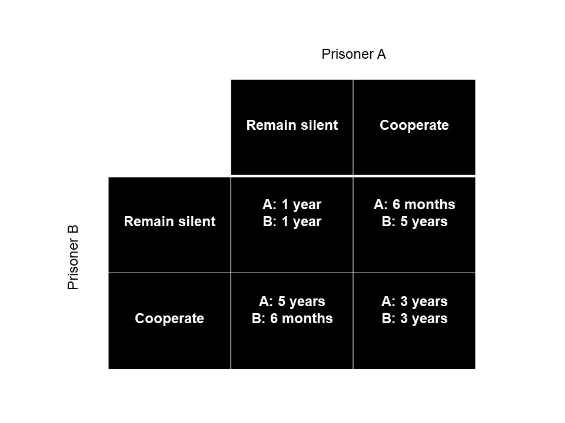
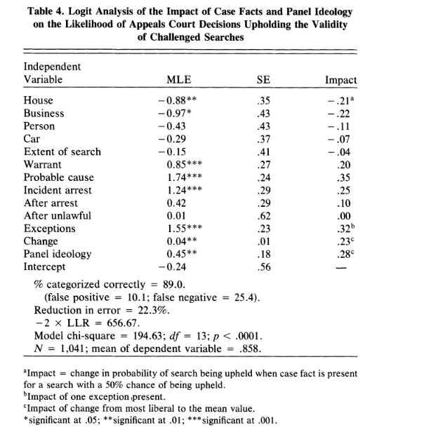
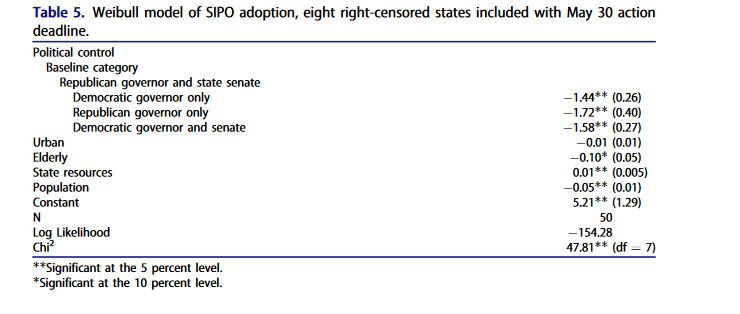
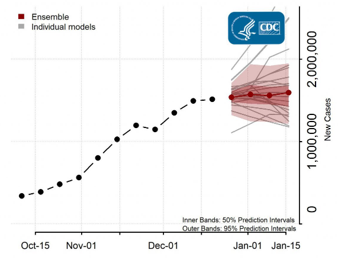
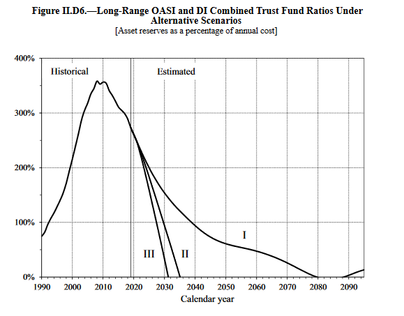
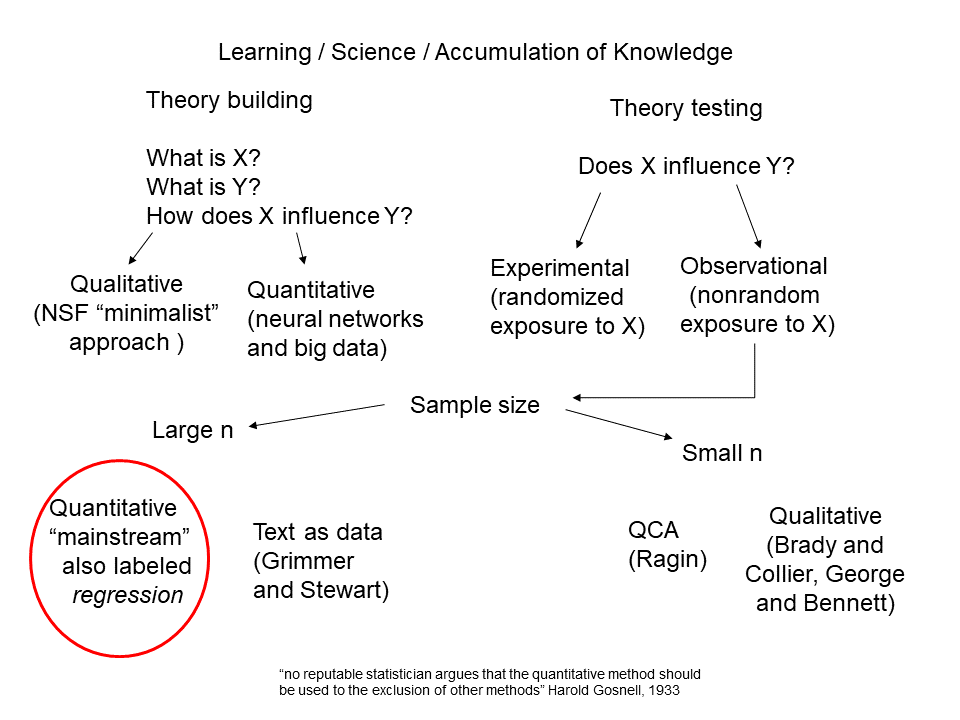
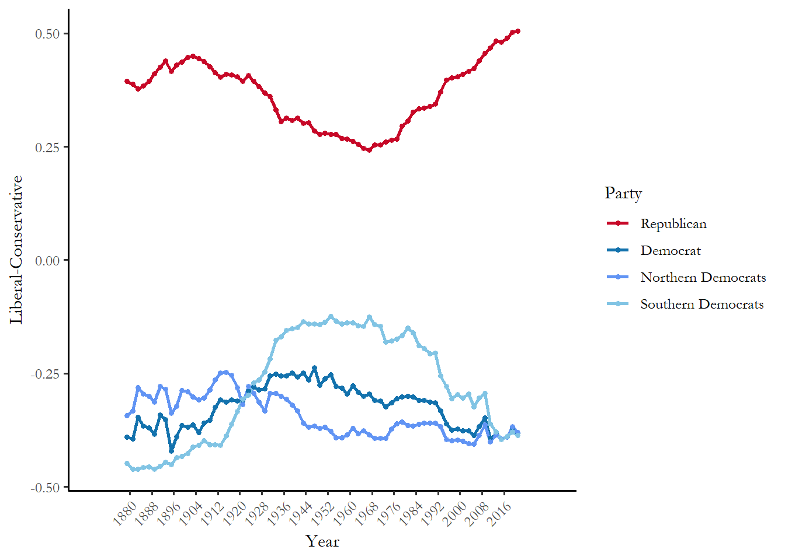

<!-- Run common_r first if using as a Notebook -->
<!-- Requires two data files and six images -->
<!-- Update D-NOMINATE to medians-->
<!-- Remove dynamic table references - one appears and one doesn't?-->

# Why math? Why R?

## Math in social science

Social scientists have exploited advances in applied mathematics for 100 years. Much of the early quantitative work in Political Science and Sociology relied on analysis of census and other aggregate data collected by federal, state and local government (election returns, for instance).  Advances in survey research in the 1940s triggered an explosion of work on political behavior.  International relations drew heavily on game theory in the Cold War era.  Computers permitted rapid aggregation of data and complex statistical applications.  This integration of math, technology, and social science has a long history.  CBS News relied on a team of Columbia University social scientists to employ the latest technology to predict the outcome of the 1952 election on live TV based on early election returns.

In a broad sense, there are two distinct types of ways that mathematics underpins social sciences research: (1) mechanistic or formal models and (2) empirical models or statistical models.  The most ambitious (and controversial) social science combines both.  For a lively and sobering account of the origins and use of these tools check out *IF THEN: How the Simulmatics Corporation Invented the Future* [@lepore2020].  I learned the details about the 1952 election night coverage from that book.  

We should sort out the distinction between formal models and empirical models before we talk about simulations and what this course does and does not cover.

### Mechanistic models (aka formal models) {-}

There are a number of formal models that you may be familiar with.  From your coursework on American politics, work on voting by Anthony Downs.  From a course on international relations, maybe the prisoner's dilemma.  From social choice theory, Condorcet's paradox.   These models do not draw in data - they are strictly theoretical.  We don't measure or estimate any parameters of these models. We might use mathematical or computational strategies to come up with solutions. 

#### The paradox of voting {-}

Anthony Downs pioneered the idea that the *party differential* (B) is what motivates someone to vote in an election [@downs1957].  If the difference between the two competing parties is large, you are much better off if your preferred party wins, so you have an incentive to vote.  But the benefit you gain is only a function of how much your voter matters (p).  If your vote has no probability of impacting the outcome, then your expected gain from voting is zero.  Later work building on this insight added considerations of costs associated with voting (C) and the benefits of voting - related to your sense of civic duty (D).  The benefit of voting (R) can be summarized in a simple formula: 

$$R = (B \times p) - C + D$$
If R is a positive number, we vote.  If less than zero, we don't.  We don't estimate the parameters of the model - the values for p, B, C or D.  But there are nevertheless some specific empirical implications that we can test.  For instance, if one area has lower costs associated with voting, then all else equal, turnout should be higher.  And if elections are competitive, meaning your vote has a higher probability of impacting the outcome, turnout should be higher.  The model is useful for thinking about turnout, even if we do not start with a measure of anything.

#### The prisoner's dilemma {-}

The prisoner's dilemma is a simple one-step, one-shot game that models the interaction between two prisoners who have the option to confess or stay silent.  The game is strategic since the payoffs for each prisoner depend on the actions of the other.  The game is widely used to demonstrate how individually rational choices can produce outcomes that are collectively sub-optimal.  


**Figure 1. The prisoner's dilemma**

The Nash equilibrium - the solution - to this game is that both prisoners confess - neither player would have an incentive to change her choice even if she knew the choices of the other.  The collectively optimal solution is for both prisoners to stay silent (combined prison time sums to two years).  (Criminal organizations overcome this dilemma by what are euphemistically called *side payments* or making confessions costly once you leave prison.)

### Empirical models (aka statistical models) {-}

Empirical models are grounded in data.  They are gross simplifications of reality, designed to help us understand causality and, in my view, most useful to determine which of a number of potentially relevant variables might help us understand what we observe.  Is voting behavior in the US more a function of race, or gender, or education levels?  Does church attendance matter?  What was the relative weight of political and other factors in determining the length of time between the appearance of confirmed cases of COVID-19 and the implementation of Shelter-in-Place orders in the US states? What explains a judge's decision to declare a search to be unreasonable? How much does the judge's ideology matter compared to other (case-specific) factors? 

>What types of questions are posed this way in your sub-field? 

Two specific examples might clarify how these models are used.  Note that the theorizing is informal - we are not using a mathematical approach to generate specific empirical features of a model.  We are simply claiming that we think X influences Y. There is always a causal logic that inspires the tests - an informal, heuristic casual model is the starting point and the statistical model follows and is linked to the causal model.  See my notes below about @mcelreath2020. 

#### What helps us understand the choices of a judge? {-}

This example is from @songer1994.  This example might not quite align with the description above since they do invoke a formal model as they develop the statistical model, but they don't present or manipulate the formal model in any explicit way.  The model treats a judge's decision to permit the use of a evidence from a contested police search --  positive coefficients in this context mean the judge was more likely to keep the evidence, negative coefficients mean that factor made it less likely.



**Figure 2. Screenshot from @songer1994**

You can see from the table that case-specific factors matter - if the search is conducted in your home or business, the judge is less likely to permit the evidence to be introduced.  But if the search was incident to an arrest or executed after obtaining a search warrant, then the judge is more likely to permit the evidence. The impact column suggests that judicial ideology exerts a powerful independent effect on the outcome of cases decided in US Circuit Courts.  A more conservative panel is more likely to permit the evidence to be introduced.

#### What helps us predict how long it tooks states to adopt shelter-in-place orders? {-}

In a recent co-authored piece in *Policy Design and Practice*, I used a statistical to test how different features of US states may have led to more rapid or slower adoption of Shelter-in-Place orders [@corder2020]. We don't offer any type of formal treatment specifying the utility function of the governor, but simply employ a statistical model to see what types of state acted quickly.   In this model, negative coefficients mean a shorter (smaller) number of days between observation of confirmed cases and executive action. 



**Figure 3.  Screenshot from @corder2020**

We found that political factors (specifically, Republican party control of the state senate and a Republican governor) translate into long delays, but differences between urban and rural states are close to zero and differences between high population and low population states are relatively small.  

#### Use and mis-use of statistical models {-}

While the use of statistical models is commonplace, there is some anxiety about the use of these models - particularly if we learn how manipulating information or attitudes can lead to actions in the moment. These reservations did not stop technology entrepreneurs from going down this road - collecting massive amounts of behavioral data, using that data to influence your choice about what to buy or where to live or what to read. There are some indications that the combination of better models and better data is effective.  Companies like Cambridge Analytica claimed they were able to make these types of interventions in 2016 US presidential election, precisely targeting messages and advertising to influence the immediate decisions of small subsets of persuadable voters.  (In this case, data was collected via Facebook in violation of multiple privacy and data-sharing regulations). In other contexts, if you want to learn about behavioral psychologists are leveraging these insights to improve (or least change) public policy, read about *nudges* [@ThalerSunstein08]
 
### Simulations - drawing on mechanistic and empirical components {-}

There is a broad class of modeling approaches that draw on both mechanistic and empirical models - using parameters estimated from observation to simulate some behavior or outcome of interest.  In some cases the models are somewhat atheoretical, leveraging the insights from observation.  In other cases, only a limited amount of data inform the model and the insights are from the mechanics.  Macroeconomists use a complex simulation ("FRB/US") to forecast the path of the economy when the Federal Reserve sets interest rates.  Actuaries in the Social Security Administration use demographic and actuarial approaches to simulate the value of the Social Security trust fund over time.  How do these approaches work?  Two examples are on the news:  the weather (every day) and the growth of COVID-19 cases (from 2020-2). 

#### Weather forecasts {-}

This short description of how weather forecasters use models was published by the *Washington Post* in May, 2018.  Notice the two distinct components - mathematical models and extensive data collection.

>Weather forecasters often discuss the models they use to help predict the weather. But what are these models? How do they work? And what are their strengths and weaknesses?

>The foundation for models are mathematical equations based on physics that characterize how the air moves and heat and moisture are exchanged in the atmosphere. Weather observations (pressure, wind, temperature and moisture) obtained from ground sensors and weather satellites are fed into these equations. The observations are brought into the models in a process known as data assimilation.

>In a model, the atmosphere is divided into a three-dimensional grid and each grid point is given the assimilated data. These are called initial conditions.  Then at each grid point, the mathematical equations are applied and stepped forward in time. The outputs over many time steps specify future weather at all grid points.

>    @wapo2018

The key thing to recognize here is the implication of "stepped forward in time" - there are a set of equations that translate initital conditions at time *t* to expected conditions at time *t+1*, those expected conditions at time *t+1* are translated into expected conditions at time *t+2*.  So while we are observing actual things at *t* anything after that is strictly a function of the underlying equations. You can imagine that equations for movement of moisture and heat are fairly precise, but we still know that weather forecasts beyond a couple of days are not very reliable.

#### Modeling COVID 19 {-}

Weather forecasting helps you understand the modeling process, but is strictly a natural phenomena.  It would seem to be the same for understanding the spread of a virus.  The virus has some properties related to how easy it moves from one person to another and how quickly they show symptoms. But there are also social components - how closely do people live to each other, are people likely to wear masks? Or limit contact with others outside of their households? Epidemiologists use all of these considerations to model the number of expected cases of COVID-19.  Here is an example of this type of projection from the CDC.  The bold path is the ensemble model - an estimate based on 22 different models generated by a variety of academic and government teams. 



**Figure 4.  Centers for Disease Control and Prevention projections for January 2021 Covid cases**
 
You can see the wide variation as we move out one month in to the future - anywhere from 1.2 million cases to 2 million cases per week by January 16, 2021.  At the time, even the lower range of this projection seemed almost unfathomable.  But the number ultimately ended up at about 1.7 million, exactly as predicted.

#### Social Security Administration Office of Chief Actuary {-}

The SSA produces an annual estimate of the balance in the OASDI trust funds - the money available to make up the shortfall between Social Security revenues (FICA tax collections) and Social Security expenditures (payments to elderly or disabled recipients).  These estimates factor in demographic and economic assumptions about mortality, fertility, immigration, economic growth, inflation, interest rates and other data that might impact future claims and future revenue.  The estimates are summarized for three different scenarios - media coverage typically focuses on the intermediate assumptions (II). I is the "low-cost" scenario and III is the "high-cost" scenario.  



**Figure 5.  Screenshot from @SSA2020**

You can see that combined Trust Funds are likely to be exhausted by 2035.

#### Why don't we see many (or any) of these types of simulations in Political Science journals? {-}

Imagine an approach to modeling human behavior that is analogous to the weather forecasting approach.  Why not?  For one, the underlying mechanical models are just not as mature as physics, and may never be.  In addition, the data collection is also less extensive and subject to error, but that may be changing.  So today the technology just doesn't seem up to the task of iterating over many periods to see what the effects are of a particular message or exposure to information or action would be over the long-run, for instance.

Second, the use of simulations of this form has a sordid and depressing history in Political Science.  Think about the ethical implications if this actually worked.  If you understand a system of human or social and political behavior and you could manipulate the initial conditions, then you could bring about the outcomes you desire.  This kind of thinking and ambitions led to some disastrous applications of this technology in the 1960s - from counterinsurgency efforts in Vietnam, to efforts to prevent urban unrest in American cities. This was work carried out by political scientists, funded by the federal government, that was at best fraudulent and at worst harmful (again, see @lepore2020).  I can come up with some positive or useful examples - modeling an arms race, for example, or modeling how parties may moderate a message in order to attract allies.  For the latter, check out the book *Paper Stones* [@sprague88].  There is an entire discipline formed around these efforts (*Cliodynamics*) but not much of this research seeps in to Political Science journals.

Notice the important difference between the statistical model and these longer-term simulations.  The statistical models are helping us understand how messages influence your choices in the next period - the next minute - or the next choice you make - and don't feed in to a larger multi-period simulation or even anticipate or really care about long-run effects.

## The narrow focus of this course

Simply put, the focus of this course is the statistical model.  We won't be looking at formal models or simulations.  We will start with a simple, linear model and advance to more complex models that widen the range of things we can predict (to binary choices, counts, durations, or data observed over time).  The place of all of this in the broader research enterprise can be difficult to understand.  Think of all of the ways that you could learn by observation - a statistical model is just one approach among many and is most useful only if a number of assumptions or conditions are satisfied.  The graphic below places this effort in the broader context of our research enterprise, differentiating what we do in this class from qualitative work and from theory-building work.  My approach to statistical modeling centers on theory-testing with large (or at least not small) samples, sometimes randomly generated. Note that a *comparative case study*, for instance, might employ any of these tools - theory-building and theory-testing, quantitative or qualitative, text or numbers as data - so labeling something a comparative case study doesn't tell you what type of approach you are taking. 



**Figure 6.  How does regression fit in?**

The works cited in the figure are representative and you have probably run across them in other courses.

This course is also almost entirely located in the *frequentist* statistical tradition, since almost all of the work you read in the literature uses these tools.  I will introduce Bayesian tools and there is a course and text in the Bayesian tradition that you might take a look at it on your own "Rethinking Statistics" [@mcelreath2020].  That course also emphasizes how causal models precede and inform statistical models, why documentation and coding is both useful for you and vital for replication.  You can find his lectures on YouTube: check out the first lecture - golems, owls, and DAGS. 

## Why use R?

In order to build your understanding of statistical modeling, we will use the statistical software R. Why?

- R is free

- R is flexible

- R is supported a user community dedicated to the idea of open source

- R is transportable -- you can easily take what you learn for one project and apply it to another

- R is reproducible -- this is key

## How R works

Commands in R create and use what are known as *objects*.  An object could be a single number, a column of numbers (a vector), a matrix, or a matrix that is identified as data (a *data frame* sometimes abbreviated df). Objects are named by you when they are created. 

Commands in R use `functions` to take input and produce output.  There are many functions packed in the base R installation, but we are some specialized functions that we need to add.  These specialized function are published in **packages** that you can install on your PC.  When you use a function from a package, you must first make that package visible to R with the `library` function

The typical structure of an R command is

    object <- function()

You can chain together several functions with a pipe, `%>%`, so you might see many lines of commands linking together to generate one new object.


## Three examples

### Comparing groups. Turnout in the 2016 presidential election {-}

The Current Population Survey is a US Census product that is based on a monthly survey of ~60,000 people living in the United States.  The primary use of the CPS is to measure the monthly unemployment rate.  In 1960 the Census began to include a supplement each November that recorded whether not someone voted.  Since the survey is so large, we can use it to generate reliable estimates of turnout for small groups.


```r
# Any lines that start with a # are just comments, notes to myself so I can recall why I made particular choices.  I use comments liberally.

# Use the read_fwf function from the read_r library
# Read the data from the CPS raw data file
# I used the codebook to identify the variables and column numbers
# We can take a look at the codebook in class.
# This is really tedious work, and potentially introduces errors
cps16<- read_fwf("data/nov16pub.dat", fwf_cols(
  hrinsta=c(57,58),
  prtage=c(122,123),
  pemaritl=c(125,126),
  sex=c(129,130),
  ptdtrace=c(139,140),
  pehspnon=c(157,159),
  prpertyp=c(161,162),
  penatvty=c(163,165),
  pemntvty=c(166,168),
  pefntvty=c(169,171),
  prcitshp=c(172,173),
  prinusyr=c(176,177),
  weight=c(613,622),
  prnmchld=c(635,636),
  vote=c(951,952)),
  col_types = cols()
)

# Filter to include only citizens 18 and older
# The filter function just keeps a subset of observations in the new object
# Notice the use of a pipe %>%
# This requires the dyplr library
cps_valid<- cps16 %>% filter(hrinsta==1 & prtage>=18 & prpertyp==2 & prcitshp!=5)

# Recode to treat people who refused or did not answer as not voting
# This is the dplyr recode function  
cps_valid$turnout<-recode(cps_valid$vote, '-9' = 0, '-3' = 0, '-2' = 0, '2' = 0, '1' = 1)

# Create new variable race and make it a character (a categorical variable)
# Notice that I am reading from and writing to the same data frame
# murate is the function to create a new variable from an existing variable
cps_valid<- cps_valid %>%
  mutate(
    race = case_when(
      ptdtrace==1 & pehspnon!=1 ~ "White, not Hispanic",
      ptdtrace==2 ~ "African American",
      ptdtrace==4 ~ "Asian",
      ptdtrace==1 & pehspnon==1 ~ "Hispanic",
      TRUE ~  "Other"
    )
  )

# Create an R object  that summarizes turnout by race
# the .groups option, included here, suppresses a warning message that doesn't apply with a single grouping variable
# group_by is a function
# summarize is a function
d<- cps_valid %>%
  group_by(race) %>%
  summarize(turnout = 100*weighted.mean(turnout, weight, na.rm = TRUE), count=n(), .groups = 'drop')

# Produce a table with the kable function and include options to customize column names, add a title, limit to two digits after the decimal point.
kable(d, digits = 2, caption = "**Table 1.  Turnout, by race, 2016 US presidential election**", col.names=c("Race", "Turnout", "Count"))
```


Table: (\#tab:cps)**Table 1.  Turnout, by race, 2016 US presidential election**

|Race                | Turnout| Count|
|:-------------------|-------:|-----:|
|African American    |   59.42|  9834|
|Asian               |   49.04|  3794|
|Hispanic            |   47.16|  7899|
|Other               |   49.05|  3103|
|White, not Hispanic |   65.30| 69164|

You can see the turnout among White voters was much higher than any racial or ethnic minorities, one component of Donald Trump's victory and something that would change in 2020.  

### Creating figures.  Ideological polarization in the U.S. House of Representatives {-}

You may have encountered Poole-Rosenthal scores (also known as D-NOMINATE scores) in your reading on the US Congress.  The scores use roll-call votes to measure the ideological position of members of Congress relative to other members.  We can use these scores to track the ideological polarization in Congress.   The figure below summarizes the mean Republican and Democratic member of the House of Representatives in each 2-year session.


```r
# This code is from  https://voteview.com/articles/party_polarization

# Note that I am reading the data from a website - you can run this chunk to replicate the figure
nom_dat <- read_csv("https://voteview.com/static/data/out/members/HSall_members.csv", show_col_types=FALSE)
south <- c(40:49,51,53)

# Added this to suppress a warning message
options(dplyr.summarise.inform = FALSE)

polar_dat <- nom_dat %>% 
    filter(congress>45 & chamber != "President") %>%
    mutate(year = 2*(congress-1) + 1789) %>%
    group_by(chamber,congress,year) %>% 
    summarise(
      party.mean.diff.d1 = mean(nominate_dim1[party_code==200],na.rm=T) - 
                           mean(nominate_dim1[party_code==100],na.rm=T),
      prop.moderate.d1 = mean(abs(nominate_dim1)<0.25,na.rm=T),
      prop.moderate.dem.d1 = mean(abs(nominate_dim1[party_code==100])<0.25,na.rm=T),
      prop.moderate.rep.d1 = mean(abs(nominate_dim1[party_code==200])<0.25,na.rm=T),
      overlap = (sum(nominate_dim1[party_code==200] <
                       max(nominate_dim1[party_code==100],na.rm=T),na.rm=T)  +
                 sum(nominate_dim1[party_code==100] >
                       min(nominate_dim1[party_code==200],na.rm=T),na.rm=T))/
                 (sum(!is.na(nominate_dim1[party_code==100]))+
                  sum(!is.na(nominate_dim1[party_code==200]))),
      chamber.mean.d1 = mean(nominate_dim1,na.rm=T),
      chamber.mean.d2 = mean(nominate_dim2,na.rm=T),
      dem.mean.d1 = mean(nominate_dim1[party_code==100],na.rm=T),
      dem.mean.d2 = mean(nominate_dim2[party_code==100],na.rm=T),
      rep.mean.d1 = mean(nominate_dim1[party_code==200],na.rm=T),
      rep.mean.d2 = mean(nominate_dim2[party_code==200],na.rm=T),
      north.rep.mean.d1 = mean(nominate_dim1[party_code==200 & 
                                             !(state_icpsr %in% south)],na.rm=T),    
      north.rep.mean.d2 = mean(nominate_dim2[party_code==200 & 
                                             !(state_icpsr %in% south)],na.rm=T),    
      south.rep.mean.d1 = mean(nominate_dim1[party_code==200 & 
                                              (state_icpsr %in% south)],na.rm=T),    
      south.rep.mean.d2 = mean(nominate_dim2[party_code==200 & 
                                             (state_icpsr %in% south)],na.rm=T),    
      north.dem.mean.d1 = mean(nominate_dim1[party_code==100 & 
                                              !(state_icpsr %in% south)],na.rm=T),    
      north.dem.mean.d2 = mean(nominate_dim2[party_code==100 & 
                                              !(state_icpsr %in% south)],na.rm=T),    
      south.dem.mean.d1 = mean(nominate_dim1[party_code==100 & 
                                              (state_icpsr %in% south)],na.rm=T),    
      south.dem.mean.d2 = mean(nominate_dim2[party_code==100 & 
                                              (state_icpsr %in% south)],na.rm=T),    
    ) 

polar_dat_long <- polar_dat %>% gather(score,value,-chamber,-year,-congress)
labels <- c("dem.mean.d1"="Democrat",
            "rep.mean.d1"="Republican",
            "north.dem.mean.d1"="Northern Democrats",
            "south.dem.mean.d1"="Southern Democrats")

# This is based on the voteview RMD but modified so that it does not use ggrepel and is not a function

pdatl <- polar_dat_long %>% 
              filter(chamber=="House",
                       score %in% c("dem.mean.d1","rep.mean.d1",
                                    "north.dem.mean.d1","south.dem.mean.d1")) %>%
                mutate(Party=labels[score]) %>%
                ungroup()
  
ggplot(data=pdatl,
               aes(x=year,y=value,group=Party,col=Party)) +
               scale_x_continuous(expand = c(0.15, 0), 
                                 breaks=seq(1880, max(pdatl$year), by=8)) +
              geom_line(size=1) + geom_point(size=1.2) + 
              xlab("Year") + ylab("Liberal-Conservative") + 
              theme(axis.text.x = element_text(angle = 45, hjust = 1)) +
              scale_color_manual(values=c("Republican"="#c70828",
                                          "Democrat"="#1372ad",
                                          "Northern Democrats"="#6194F4",
                                          "Southern Democrats"="#81c4e4"))
```



**Figure 7. Polarization in the US House of Representatives**

You can see how the medians have diverged over time - Republicans become much more conservative and Democrats somewhat more liberal as the differences between Southern and Northern Democrats diminish.  The data and R code are from the voteview website [@voteview22]

### Estimating a model.  ANOVA with one variable {-}

This is just an example using `lm` function (short for linear model).  This is a linear probability model and we will learn alternative (and better) modeling strategies for this situation in week 4 (logistic regression).  But I just wanted you to see that we can use `lm` to perform ANOVA (a regression with a categorical variable).

R recognizes race as a categorical variable and automatically creates a dummy variable with the baseline category as the first factor and compares that group to every other group.


```r
# First I am using the factor function to make sure that White voters (the largest racial group) are the baseline category.
cps_valid$race2<-factor(cps_valid$race, levels=c("White, not Hispanic", "African American", "Hispanic", "Asian", "Other"))
# In this case I just produce the table and don't retain the model info
# lm estimates the model
# tidy formats the output so that we can use kable
# kable produces the table
temp<-tidy(lm(turnout~race2, weight=weight, data=cps_valid))
kable(temp, digits=3, caption = "**Table 2. Race and turnount, 2016, ANOVA**")
```


Table: (\#tab:cps_model)**Table 2. Race and turnount, 2016, ANOVA**

|term                  | estimate| std.error| statistic| p.value|
|:---------------------|--------:|---------:|---------:|-------:|
|(Intercept)           |    0.653|     0.002|   344.216|       0|
|race2African American |   -0.059|     0.005|   -12.272|       0|
|race2Hispanic         |   -0.181|     0.005|   -34.693|       0|
|race2Asian            |   -0.163|     0.008|   -21.412|       0|
|race2Other            |   -0.162|     0.009|   -17.959|       0|

We learn that White voters turnout at a bit higher rates than African Americans, but those two groups have substantially higher turnout than other racial and ethnic minorities. Note how the predicted values correspond to (match) the levels reported in Table 1. 

In future classes we will work with the **stargazer** package to produce regression tables that are publication-ready.

## Reproducing results - why is that important?

One the features of R that is powerful is the ability to share your research for replication.  No one needs to have a proprietary or expensive piece of software or access to specialized resources to reproduce your work.  Moreover, anyone with a working knowledge of R can inspect your programming to see exactly how you transformed or manipulated data, exactly the modeling choices you made, and how you evaluated the robustness of your choices.  Other researchers can experiment with different approaches and improve the work over time.  We will talk more about replication later in the term, but it is a good idea to cultivate a habit of meticulous recording of your work.  I use comments and Rmarkdown files to do that.

### Why can't I use EXCEL? {-}

EXCEL is very useful for data entry.  But there are two major drawbacks to EXCEL for research.  First if you share data in EXCEL, then many people without access to that software can't review your work.  And as Microsoft changes EXCEL over time, your data may become unreadable to people with newer versions.  We would like to avoid this software dependence.  R markdown files are simply text files, so anyone can look at them.  And most replication archives encourage you to submit and store your data in the same form - as a text file anyone can read.  You will learn how this works as we learn about the Harvard Dataverse in future classes.

Another drawback of EXCEL is the potential for errors. You can't see how a cell value is calculated without inspecting each cell, so it would be tedious to do that and a corrupted cell or typo could lead to an error.  There is also the potential for mismatching records when you merge data from different sources.  And cut-and-paste errors.  And you really can't do any or much of the statistical analysis in EXCEL, so you will end up reading the data into statistical software anyway.

Think this sounds far-fetched?  There was a very recent and very public error by a pair of influential economists.  One short account *The Reinhart-Rogoff error – or how not to Excel at economics* describes the error and implications. What happened?

>Reinhart and Rogoff’s work showed average real economic growth slows (a 0.1% decline) when a country’s debt rises to more than 90% of gross domestic product (GDP) – and this 90% figure was employed repeatedly in political arguments over high-profile austerity measures....in their Excel spreadsheet, Reinhart and Rogoff had not selected the entire row when averaging growth figures: they omitted data from Australia, Austria, Belgium, Canada and Denmark. In other words, they had accidentally only included 15 of the 20 countries under analysis in their key calculation. When that error was corrected, the “0.1% decline” data became a 2.2% average increase in economic growth.

>    @borweinbailey2018

So it is fine to use EXCEL to record information, but once you have a snapshot of the raw data preserved as a text file, all of the manipulations, transformation, and modeling should be done in a way that is transparent and reproducible - and R works for that purpose.

### Note on qualitative methods

A recent issue of **Perspectives on Politics** introduced a really important set of documents and discussions: *The Qualitative Transparency Deliberations.* Here is short summary from the article:

>In recent years, a variety of efforts have been made in political science to enable, encourage, or require scholars to be more open and explicit about the bases of their empirical claims and, in turn, make those claims more readily evaluable by others. While qualitative scholars have long taken an interest in making their research open, reflexive, and systematic, the recent push for overarching transparency norms and requirements has provoked serious concern within qualitative research communities and raised fundamental questions about the meaning, value, costs, and intellectual relevance of transparency for qualitative inquiry.

>@jacobsetal2021

The short article presents findings from a much larger set of reports by several working groups that, together, give a very good sense of the scope of qualitative work in Political Science and some of the questions about qualitative research practice that political scientists confront.  The entire collection is available at this link:

https://static.cambridge.org/content/id/urn:cambridge.org:id:article:S1537592720001164/resource/name/S1537592720001164sup002.pdf

You could construct a semester-length seminar on just the first report.  We will take a look, but if you plan to adopt a qualitative approach for your own work, it would make sense to read this report, learn about this work.

## Next week

One common misconception about statistical models is that they are only really useful for applications to political behavior, particularly analysis of survey data.  This doesn't describe the way the models have been applied in Political Science and, in particular, ignores the recent proliferation of statistical and experimental work in public policy evaluation.  We will spend a week talking about learning from data, with a particular focus on learning about how government programs perform.  The assignment due before class is loosely structured, designed to get you to think about the potential for this work, practical and ethical challenges, and some of the reasons why evidence-based policy-making has emerged as a powerful tool, particularly in the last decade.

<!-- Add readings for week 2 -->


