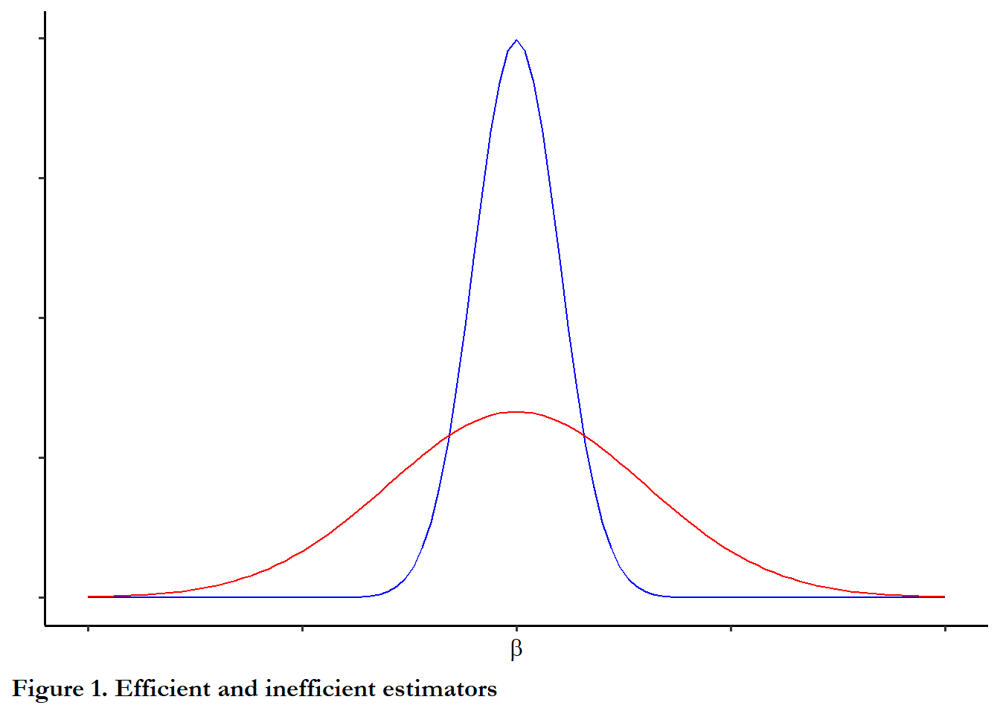

<!-- Run common_r first if using as a Notebook -->
<!-- Needs ANES common data file at line 20 -->
<!-- Fix model names in final table from 1,2,3 to labels-->

# Regression: review and assumptions

## Why we care

We estimate the parameters of a statistical model for a couple of reasons.  First, we want to know the influence of each variable on the outcome we are interested in.  This is what we call the *point estimate* for the the parameter, $\beta_i$. Second, we want to know if we can draw an inference about a population that we have randomly sampled from.  In order to be clear about the certainty of that inference, we need to understand the *sampling distribution* of $\beta_i$ as well as the point estimate.

### Bias and efficiency {-}

In repeated samples and if certain assumptions are satisfied, the OLS estimator for $\beta_i$ is unbiased and efficient. 

-  *Unbiased* means that the average $\beta_i$ across the repeated samples is $\beta_i$. 

-  *Efficient* means that the OLS estimator has the lowest variance for $\beta_i$.  

So the sampling distribution for $\beta_i$ has a mean of $\beta_i$ and variance of $\sigma^2$.  The standard error of $\beta_i$ is $\sqrt{\sigma^2}$

The figure below shows two hypothetical sampling distributions - both are unbiased, but one is efficient and the other is not.


```r
ggplot(data.frame(x = c(-5, 5)), aes(x)) +
  stat_function(fun = dnorm, color="blue", args = list(mean = 0, sd = .5)) +
  stat_function(fun = dnorm, color="red",  args = list(mean = 0, sd = 1.5)) +
  labs(x=expression(beta), y=" ", caption="Figure 1. Efficient and inefficient estimators" ) +   
  theme(plot.caption.position = "plot", plot.caption = element_text(hjust=0, face="bold", size=rel(1.1))) + theme(axis.text.x=element_blank(), axis.text.y=element_blank())
```



### Type II errors with OLS {-}

Recall that we use t-tests to evaluate whether or not an estimated coefficient is *statistically significant*.

The t-test is the ratio of the estimated coefficient to the standard error of the coefficient: 

$$t =\beta_i / \sqrt{\sigma^2}$$

We use the arbitrary standard of p<.05 to designate a result as significant and we reach typically reach this threshold if the absolute value of t is greater than 2 ( $\left\lvert{t}\right\rvert>2.00$).

If the standard error of $\beta_i$ is high then the values of the t-test will be low and  this will drive down the value of the t-test and we will be unlikely to observe statistically significant coefficients. This is a *Type II error*

>For an interesting discussion of the origins of the t-test check out *Guinnessometrics: The Economic Foundation of “Student’s t*  [@ziliak2008]

## When should we expect high standard errors for $\beta_i$?

Consider the simple two variable model:

$$y=\beta_0+\beta_1x+u$$

The formula for slope is:   

$$\beta_1=cov_{x,y}/var_{x}$$

To calculate the intercept:   

$$\beta_0 = (\beta_1*\mu_x)-\mu_{y}$$

The variance of $\beta_1$ is the variance of the disturbance term divided by the variance of x:

$$\sigma_\beta^2=\sigma^2_u \  /  var_{x}$$

We approximate or estimate the variance of the disturbance term from the errors observed in our sample where: 

$$\sigma^2_u =\frac{\sum(e_i)^2}{(n-2)}$$

There is some sleight of hand here.  This approximation only works if certain assumptions are satisfied.  More on this below.

We know the formula for the variance of x is:

$$\sum(x_i-\mu_x)^2$$

So the formula for variance of $\beta_1$ is:

$$ \sigma^2_{\beta_1}=\frac{\sum(e_i)^2}{(n-2)\times\sum (x_i-\mu_x)^2}$$

### Research design implications{-}

We would expect to see a high variance for $\beta_1$

- when n is small

- when the range of X is small (which would decrease the variance of X)

- when the error terms are large (the model is imprecise).

What type of research would help you reduce this variance:  large n, wide range of x. and complete or well-specified model

## Assumptions behind OLS

Five key assumptions must be satisfied in order for the OLS estimator to be unbiased and efficient (BLUE).   Each of these are an assumption about how the observed data are generated and three of the five assumptions are about the error or disturbance term ($u$).  Depending on the text or reference you consult, these assumptions may be grouped or numbered in different ways.

1. The model is linear in parameters and correctly specified

2. The expected value of the disturbance term ($u$) is zero

3. The disturbance term is spherical or i.i.d. (independent and identically distributed)

- The variance of $u$ is constant across observations (homoskedastic)

- There is no correlation between two disturbance terms 
       (no autocorrelation or serial correlation)
       
4.  X is uncorrelated with the disturbance term ($u$) or X is fixed (this stronger form of the assumption is curious since it is never satisfied!).  If we were to generate multiple samples our Xs and our errors would vary. This is a challenge with observational data.  We will evaluate this assumption more directly when we learn about panel data

5.  The number of observations exceed the number of variables (the model is identified) and there is no exact linear correlation between two regressors (no collinearity)

## Using information in the error term to diagnose violations of OLS assumptions

When we calculate parameters in the linear model we can obtain an estimate of the error term associated with each observation.

Given values of each X and estimates for each $\beta$ we can calculate a predicted value for Y (typically designated as $\hat{y}$)

$$\hat{y} = \beta_0 + \beta_1x_1+\beta_2x_2$$

Since

$$y = \beta_0 + \beta_1x_1+\beta_2x_2+e$$ 

The error term ($e$) is simply $y-\hat{y}$.

When we estimate a model using the `lm` function in R, the residuals are stored in the object along with the coefficients and other test statistics.

We can use this new variable, $e$, to learn if the model violates assumptions about either heteroskedasticity or autocorrelation (These are sometimes labeled in econometrics texts as  problems of "nonspherical disturbances").

This example draws on the **sandwich** package vignette [@zeileis2004].  The dependent variable is per capita expenditures on public schools in each US state (and the District of Columbia).  The independent variable or predictor is per capita income.  We would expect a positive link, with wealthier states spending more on public education.

### An example: US public school expenditures and state income {-}


```r
# The data function indicates that we want to have access to this example dataset included in the sandwich package. The sandwick package is loaded in the common.r file
data("PublicSchools")

# We uses pipes and the filter function from the dplyr package to filter out any observations with missing data for expenditures or per capita income.  You can see in the data window that we dropped one observation (51 obs goes to 50 obs).  
ps <- PublicSchools%>% filter(!is.na(Expenditure), !is.na(Income))

# This line just changes Income from dollars to thousands of dollars
# So 1,000 becomes 1
# This makes it easier to read and interpret the output
ps$Income <- ps$Income * 0.001

# We use the lm function from base R to estimate the relationship between per capita income and school expenditures at the state level.  The results are stored in an object called fit.  We are going to fit a line rather than the quadratic described in the vignette
fit <- lm(Expenditure ~ Income, data = ps)

# The summary command prints the output
summary(fit)

Call:
lm(formula = Expenditure ~ Income, data = ps)

Residuals:
     Min       1Q   Median       3Q      Max 
-112.390  -42.146   -6.162   30.630  224.210 

Coefficients:
            Estimate Std. Error t value Pr(>|t|)    
(Intercept)  -151.26      64.12  -2.359   0.0224 *  
Income         68.94       8.35   8.256 9.05e-11 ***
---
Signif. codes:  0 '***' 0.001 '**' 0.01 '*' 0.05 '.' 0.1 ' ' 1

Residual standard error: 61.41 on 48 degrees of freedom
Multiple R-squared:  0.5868,	Adjusted R-squared:  0.5782 
F-statistic: 68.16 on 1 and 48 DF,  p-value: 9.055e-11
```

###  A better table{-}
 
Since the `summary`  function doesn't produce a nicely formatted html table, we will employ `stargazer` from the  **stargazer** package to present the results.  I added a few options to produce the type of table that I like.


```r
stargazer(fit,  type="html",
          model.names=FALSE, model.numbers=FALSE, style="apsr", digits=2,
          dep.var.labels=c("Public school expenditures per capita"),
          title="Table 1.  Public school expenditures as a function of per capita income, OLS",
          notes= "p<.10* ; p<.05**",  notes.append = FALSE,
          covariate.labels=c("Per capita income, in thousands"),
          star.cutoffs = c(0.10,0.05))
```


<table style="text-align:center"><caption><strong>Table 1. Public school expenditures as a function of per capita income, OLS</strong></caption>
<tr><td colspan="2" style="border-bottom: 1px solid black"></td></tr><tr><td style="text-align:left"></td><td>Public school expenditures per capita</td></tr>
<tr><td colspan="2" style="border-bottom: 1px solid black"></td></tr><tr><td style="text-align:left">Per capita income, in thousands</td><td>68.94<sup>**</sup></td></tr>
<tr><td style="text-align:left"></td><td>(8.35)</td></tr>
<tr><td style="text-align:left">Constant</td><td>-151.27<sup>**</sup></td></tr>
<tr><td style="text-align:left"></td><td>(64.12)</td></tr>
<tr><td style="text-align:left">N</td><td>50</td></tr>
<tr><td style="text-align:left">R<sup>2</sup></td><td>0.59</td></tr>
<tr><td style="text-align:left">Adjusted R<sup>2</sup></td><td>0.58</td></tr>
<tr><td style="text-align:left">Residual Std. Error</td><td>61.41 (df = 48)</td></tr>
<tr><td style="text-align:left">F Statistic</td><td>68.16<sup>**</sup> (df = 1; 48)</td></tr>
<tr><td colspan="2" style="border-bottom: 1px solid black"></td></tr><tr><td colspan="2" style="text-align:left">p<.10* ; p<.05**</td></tr>
</table>
<br>
You can see from the table that the link between per capita income and spending on public education is positive, as expected.

What do the residuals looks like from this regression?  We can use a simple histogram to get a quick look at how or if these errors conform to our key assumptions.


```r
ggplot(data=ps, aes(fit$residuals)) +
geom_histogram(binwidth = 20, color = "black", fill = "blue") +
theme(panel.background = element_rect(fill = "white"), axis.line.x=element_line(), axis.line.y=element_line()) + scale_y_continuous(breaks=c(0,3,6,9)) + theme(plot.caption.position = "plot", plot.caption = element_text(hjust=0, face="bold", size=rel(1.1)))+
labs(x ="Residual" , y=NULL, caption="Figure 2.  Residuals from the public schools model")
```


A typical econometrics text motivates discussion of problems of heteroskedasticity and autocorrelation by describing a "variance-covariance matrix of the disturbance vector."

By disturbance, they are simply referring to nx1 vector that contains each unobserved error term ($u_i$).  So a vector would like this:

$$\begin{bmatrix}
u_{1}\\
u_{2}\\
...\\
u_{n}
\end{bmatrix}$$

We can approximate this vector by looking at our sample error terms. But the variance-covariance matrix is just what is known in matrix algebra as the cross product of this vector $e^te$. So we could think about an n x n matrix that includes - on the diagonal the expected value of the variance  error term ($e_i^2$) and expected value of the covariance across error terms ($e_ie_j$).  A matrix of this form would be:

$$\begin{bmatrix}
u_{1}^2 & u_{2}u_{1}& u_{3}u_{1} & ...  & u_{n}u_{1} \\
u_{1}u_{2} & u_{2}^2 & u_{3}u_{2} & ... & u_{n}u_{2}\\
u_{1}u_{3} & u_{2}u_{3} & u_{3}^2 & ... & u_{n}u_{3}\\
... & ... & ... & ... & ... \\
u_{1}u_{n} & u_{2}u_{n} & u_{3}u_{n} & ... & u_{n}^2  
\end{bmatrix}$$  

Homoskedasticity is observed when the elements on the diagonal - the expected value of the square of each disturbance term  - are identical across values of x.  If the series of terms above the main diagonal summed to a positive number, this would indicate we had serial correlation, a positive covariance between each error term and the observation that preceded it. No serial correlation is present when the error terms don't covary.  

We use these assumptions to simplify our approximation of the variance of the slope coefficient.  If these assumptions are not satisfied, then the our calculation or approximation of the standard error of $\beta_1$ is not accurate.

## What happens if the assumption of homoskedasticity is violated?

Heteroskedasticity is present when the variance of the error term is not constant across observations.

### When might heteroskedasticity occur?{-}

- state-level or country-level observations:  accuracy of data may be a function of level of development.  We expect that highly developed economies will record and report more accurate data on economic performance

- individual-level observations: some types of people may give more accurate (or less accurate) response in surveys.  Highly educated respondents are likely to misrepresent voting behavior (knowing that they are expected to turn out and vote)

- data collected over time: if the quality of data collected and reported improves over time- less measurement error - then the model errors will be lower today than in the past.

- the true functional form of the model is not linear.  (Many texts, consistent with the King and Roberts piece I linked for you below, note that this is the most likely culprit if you observe heteroskedastic errors.  Maybe we should fix this underlying cause rather than adjust standard errors?)

### Consequences of heteroskedasticity{-}

- OLS estimators are inefficient. 

- Methods used to estimate the variance of are biased, so t-tests and confidence intervals are corrupted.

- The estimate of the coefficient itself is unbiased.

## Diagnostic tests

### Breusch Pagan test statistic (BP){-}

The basic test for heteroskedasticity is the Breusch Pagan test statistic (BP).  The test statistic is a positive function of the explained sum of squares from a regression of the squared OLS residuals on the independent variables.  If the variance of the error term is a function of the level of the independent variables then the test statistic will be statistically significant.  Table 3 reports output from the `bptest` function, evaluating heteroskedasticity for the model we have estimated.


```r
temp<-tidy(bptest(fit))

kable(temp[1:2], caption="Table 3. Breusch-Pagan test", digits=3)
```


Table: (\#tab:model_demobp)Table 3. Breusch-Pagan test

| statistic| p.value|
|---------:|-------:|
|    11.729|   0.001|
**Table 3.  Heteroskedasticity diagnostics.**

Since the null hypothesis is rejected (p~0.00), the error term in this case is heteroskedastic.. You can perform this test manually - regressing each X on the squared error or you can confirm the test statistic by plotting the squared error versus each independent variable.  The plot below confirms the existence of a relationship between the squared error and the predictor *Income*.  And this makes sense all poor states will not have many resources to spend on education, while rich states will have some discretion over how to allocate resources and some will spend more than others.  It appears that one outlier drives most of this but you still see the upward sloping regression line.


```r
fit$ressq<-fit$residuals^2
ggplot(data=ps, aes(y=fit$ressq, x=Income))+
  geom_smooth(formula = y ~ x, method = "lm")+
  geom_point() +
  labs(y ="Squared residual" , x="Per capita income, in thousands" , caption="Figure 3.  Squared error as a function of per capita income") +   
  theme(plot.caption.position = "plot", plot.caption = element_text(hjust=0, face="bold", size=rel(1.1)))+
  labs(x ="Residual" , y=NULL) 
```


## Solutions

What if we do find that our error term is heteroskedastic?  There are two types of solutions commonly used.  For large samples, we calculate robust standard errors.   For small samples, we rely on a *bootstrapped* estimate of the error.  In R it is straightforward to implement both of these with the **sandwich** package.   For both strategies, we use different approaches to calculate the "variance-covariance" matrix for the model coefficients.  We can then use `stargazer` to compare the results.

### Robust standard errors (large samples){-}

For details about the vcov functions and the sandwich package you can find a helpful vignette at this link:

ftp://journal.r-project.org/pub/R/web/packages/sandwich/vignettes/sandwich.pdf

The robust or heteroskedasiticity-consistent (HC) standard errors rely on a different formula that does not assume that the error is independent of X.  There are many options here and each one is described in references in the vignette.  The formula selected below replicates robust standard errors in STATA. 

### The bootstrap (small samples){-}

Bootstrapped standard errors are calculated by repeating the regression using the public school data but creating a unique random sample each time.  The software samples with replacement until it has the same number of observations in the dataset (so some observations may be repeated and maybe a couple of times, while other observations are dropped entirely).  Every sample is unique.  The regression is estimated and after 100 samples (specified with R=100 below), the standard deviation of the coefficient is calculated across the 100 estimates.  

### How to use this information {-}

With a small dataset, it doesn't take long to calculate the standard errors for each approach, so why not calculate and compare?  If I was going to publish or use these results, I would probably just take the most conservative (highest) standard error. 

When we implement these strategies below, I am using and estimating the variance-covariance matrix for the model parameters.   For our example model there are two parameters ($\beta_0$ and $\beta_1$).  So the matrix takes the form:

$$\begin{bmatrix}
\beta_{0}^2 & \beta_{0}\beta_{1}\\
\beta_{1}\beta_{0} & \beta_{1}^2\\
\end{bmatrix}$$  

We will focus on the elements on the main diagonal ($\beta_0^2$, $\beta_1^2$), but the other elements (the covariance between the parameters) will be important later in the semester.


```r
# The sandwich package contains the vcovHC functions and vcovBS

# The key here is the type: const is regular standard errors, HC0 gives you what are known as White's adjust standard errors, HC3 replicates robust standard errors in STATA.  All of this is documented in the sandwich package documentation. 

#cov1 is the variance covariance matrix calculated with an adjustment that compensates for the presence of heteroskedasticity
cov1         <- vcovHC(fit, type = "HC3")

# this shows you what the matrix produced above looks like
# You don't need this step to produce the table below
print(cov1)
            (Intercept)     Income
(Intercept)   19217.444 -2624.6180
Income        -2624.618   359.5008

# this step takes the square root of the terms on the main diagonal.
# So we have the standard error of both parameters: intercept and slope
robust_se    <- sqrt(diag(cov1))

# this just shows the standard errors as we will import them into the table
# You don't need this step to produce the table below.
print(robust_se)
(Intercept)      Income 
  138.62700    18.96051 
```

The chunk below calculates the bootstrapped standard errors.


```r
# Calculate standard errors via the bootstrap
cov2  <- vcovBS(fit, cluster=NULL, use = "pairwise.complete.obs", type="xy", R=100 )
bootstrap_se <-sqrt(diag(cov2))
```

The table below includes the point estimates and standard errors calculated three different ways.  The point estimates are the same, but the last set of options in the `stargazer` function are key: NULL shows the original standard errors, column 2 is robust standard errors and column 3 is bootstrapped standard errors.


```r

stargazer(fit, fit, fit, type = "html", digits=2, style="apsr",
          notes= "p<.10* ; p<.05**",  notes.append = FALSE,
          star.cutoffs = c(0.10,0.05),
          #column.names = c("Standard", "Robust", "Bootstrapped"),
          dep.var.labels=c("Public school expenditures per capita"),
          covariate.labels=c("Per capita income, in thousands"),
          omit.stat=c("ser","f"),
          title="Table 4.  Three different calculations of the standard error",
          se = list(NULL, robust_se, bootstrap_se))
```


<table style="text-align:center"><caption><strong>Table 4. Three different calculations of the standard error</strong></caption>
<tr><td colspan="4" style="border-bottom: 1px solid black"></td></tr><tr><td style="text-align:left"></td><td colspan="3">Public school expenditures per capita</td></tr>
<tr><td style="text-align:left"></td><td>(1)</td><td>(2)</td><td>(3)</td></tr>
<tr><td colspan="4" style="border-bottom: 1px solid black"></td></tr><tr><td style="text-align:left">Per capita income, in thousands</td><td>68.94<sup>**</sup></td><td>68.94<sup>**</sup></td><td>68.94<sup>**</sup></td></tr>
<tr><td style="text-align:left"></td><td>(8.35)</td><td>(18.96)</td><td>(15.36)</td></tr>
<tr><td style="text-align:left">Constant</td><td>-151.27<sup>**</sup></td><td>-151.27</td><td>-151.27</td></tr>
<tr><td style="text-align:left"></td><td>(64.12)</td><td>(138.63)</td><td>(113.63)</td></tr>
<tr><td style="text-align:left">N</td><td>50</td><td>50</td><td>50</td></tr>
<tr><td style="text-align:left">R<sup>2</sup></td><td>0.59</td><td>0.59</td><td>0.59</td></tr>
<tr><td style="text-align:left">Adjusted R<sup>2</sup></td><td>0.58</td><td>0.58</td><td>0.58</td></tr>
<tr><td colspan="4" style="border-bottom: 1px solid black"></td></tr><tr><td colspan="4" style="text-align:left">p<.10* ; p<.05**</td></tr>
</table>
<br>

Recall our rule of thumb for statistical significance - if the coefficient is more than twice as large as the standard error, our result likely significant.  In this case, $\beta_1$ is 68.94 and the standard error is 18.96 at most, clearly significant since $\beta_1$ is more than 3 times the standard error.

In this case, the bootstrapped standard errors and the robust standard errors are very close.  Since the sample is small, I could use the bootstrapped standard errors and also report that the the primary result is statistically significant whether you use generic standard errors, robust standard errors or bootstrapped standard errors

## Notes about the readings

### A different perspective on adjusted standard errors {-}

@kingroberts2015 highlight the fact that heteroskedasticity is a symptom of some other problems - so it might be more productive to fix the underlying problem, rather than adjusted standard errors:

>In fact, robust and classical standard errors that differ need to be seen as bright red flags that signal compelling evidence of uncorrected model misspecification. They highlight statistical analyses begging to be replicated, respecified, and reanalyzed, and conclusions that may need serious revision.

### The **sandwich** package {-}

Alternative approaches to estimating the standard errors of the parameters are described in detail in the sandwich package vignette.  The authors explain that using type=CONST reproduces classical standard errors and...

>All others produce different kinds of HC (heteroskedasticity-consistent) estimators. The estimator HC0 was suggested in the econometrics literature by White(1980) and is justified by asymptotic arguments. The estimators HC1, HC2 and HC3 were suggested by MacKinnon and White (1985) to improve the performance in small samples. A more extensive study of small sample behaviour was carried out by Long and Ervin (2000) which arrive at the conclusion that HC3 provides the best performance in small samples as it gives less weight to influential observations.  Recently, Cribari-Neto(2004) suggested the estimator HC4 to further improve small sample performance, especially in the presence of influential observations.

The text and cites are from the **sandwich** package vignette: "Econometric Computing with HC and HAC Covariance Matrix Estimators" [@zeileis2004]
