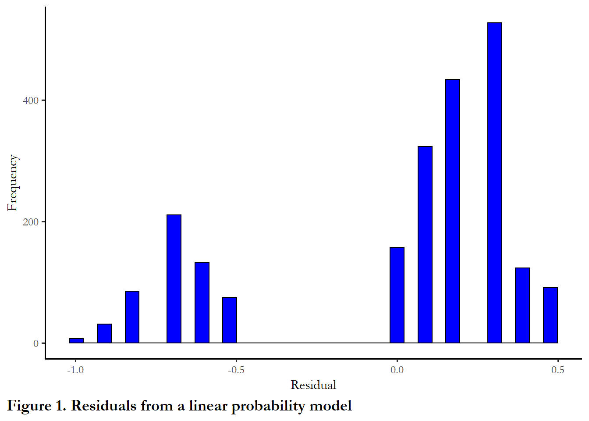
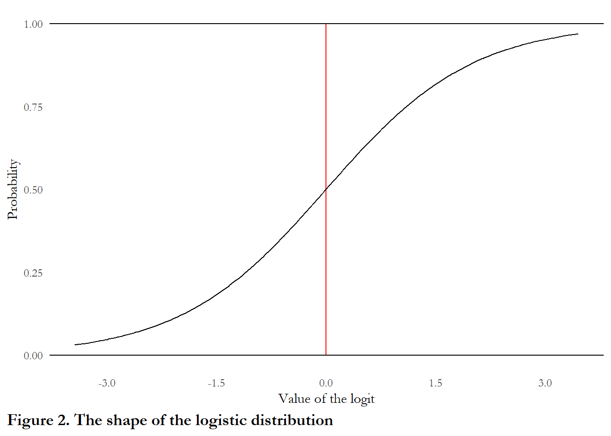
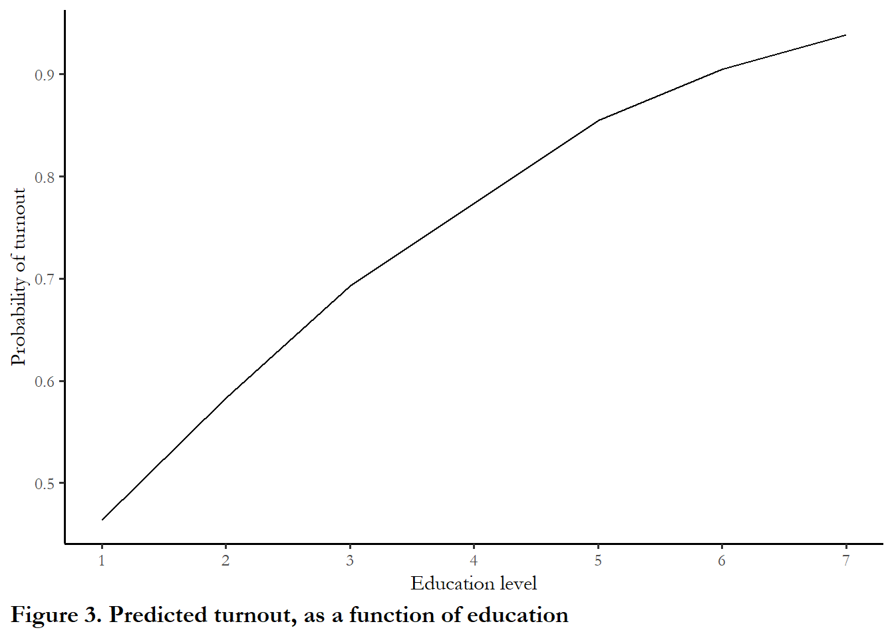
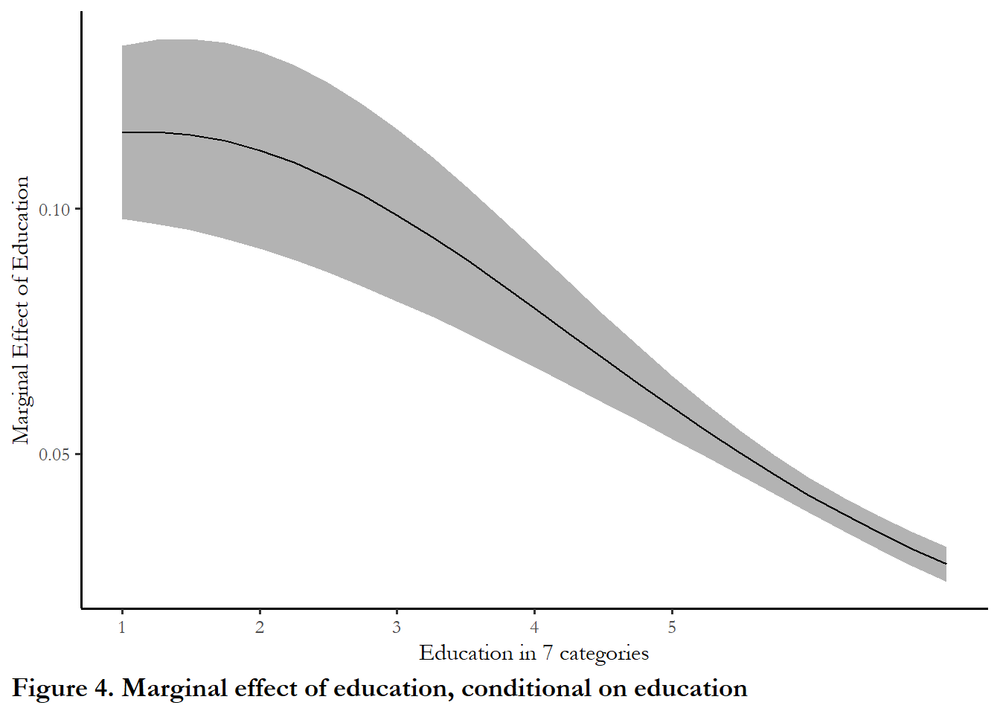
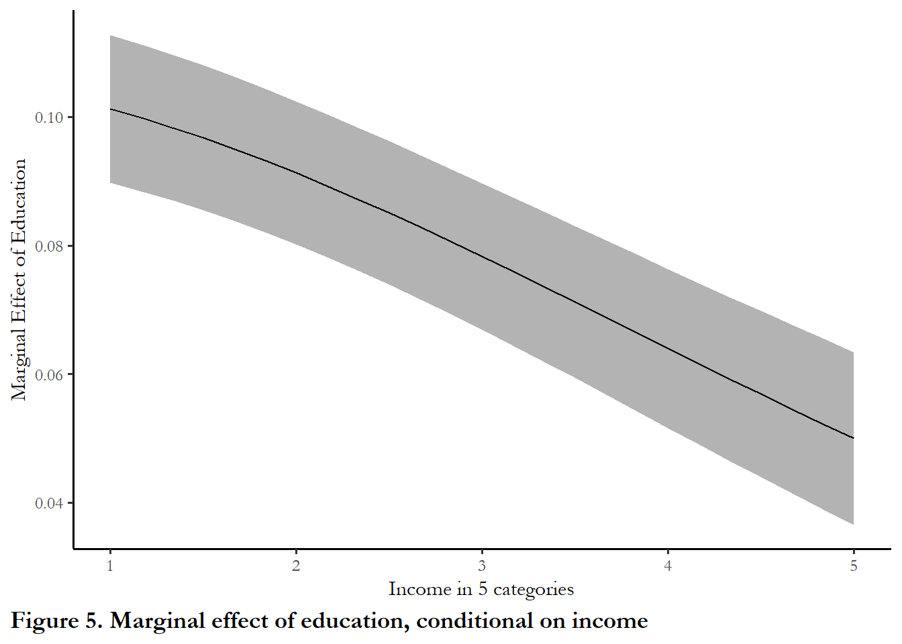
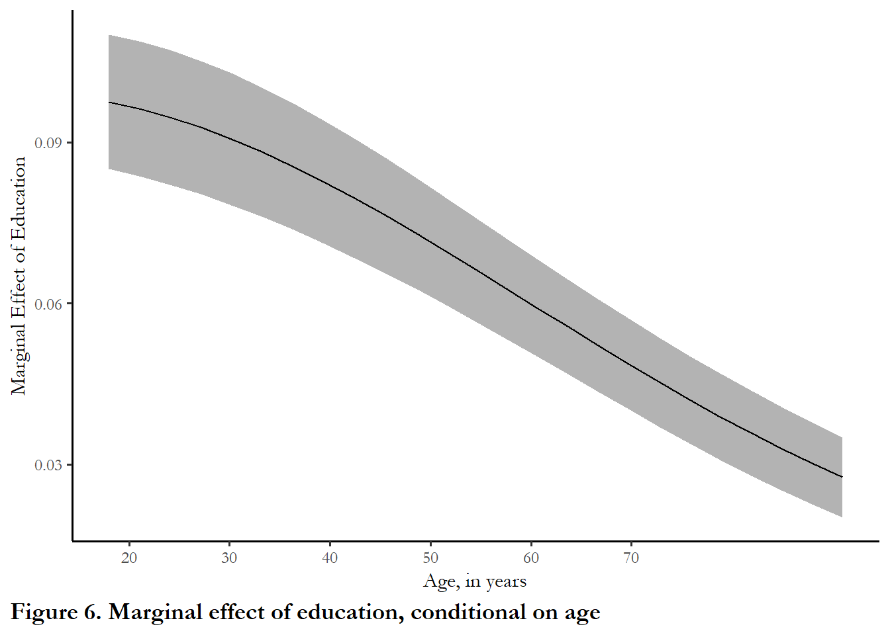

<!-- Run common_r first if using as a Notebook -->
<!-- Needs ANES common data file at line 20 -->

<!-- add stargazer options to tables - see chapter 2 -->
<!-- Specify kable column alignmnet for Table 7 - also check table referenec.-->
<!-- produce the logit figure with stat_function as in chapter 2 -->


# Logistic regression

## The linear probability model

A number of  applications in political science involve dependent variables that are binary: political behavior (vote / don't vote), judicial politics (affirm / reverse), and the study of Congress (yes / no roll call vote).  OLS fails when used to model a binary outcome.   Specifically, one of the core assumptions of the classical linear regression model is violated.  The error term is not normal with a mean of zero and variance of $\sigma^2$. 

To motivate the search for an alternative estimator, consider a simple model of turnout as a function of education.  My expectation is that highly-educated people will be more likely to vote - costs are lower (easy to navigate registration and information hurdles) and norms about participation and engagement yield a strong payoff in terms of fulfilling civic duty.  Exactly how strong is this effect?  And, below, how strong relative to other factors like income, race or gender?


### An example: turnout as a function of education, 1992 {-}

We could rely on a simple linear probability model to test the impact of education.  We could estimate the coefficients with OLS using the `lm` function. The table is printed with `stargazer`.  An example using ANES data from 1992 is below.


```r
# filter to select 1992
temp <- anes %>% filter(VCF0004==1992)
# estimate a linear model of turnout as function of income
# na.action=na.exclude instructs R
# to ignore any observations with missing values
model1<-lm(turnout~education, data=temp, na.action=na.exclude)
# view the model info
stargazer(model1, style="apsr", type="html",
          covariate.labels = c("Education", "Constant"),
          dep.var.labels = c("Turnout"),
          title="**Table 1.  Turnout as a function of education, linear probability model**",
          notes= "p<.10* ; p<.05**",  notes.append = FALSE,
          star.cutoffs = c(0.10,0.05), digits=3)
```


<table style="text-align:center"><caption><strong>**Table 1. Turnout as a function of education, linear probability model**</strong></caption>
<tr><td colspan="2" style="border-bottom: 1px solid black"></td></tr><tr><td style="text-align:left"></td><td>Turnout</td></tr>
<tr><td colspan="2" style="border-bottom: 1px solid black"></td></tr><tr><td style="text-align:left">Education</td><td>0.079<sup>**</sup></td></tr>
<tr><td style="text-align:left"></td><td>(0.005)</td></tr>
<tr><td style="text-align:left">Constant</td><td>0.438<sup>**</sup></td></tr>
<tr><td style="text-align:left"></td><td>(0.022)</td></tr>
<tr><td style="text-align:left">N</td><td>2,197</td></tr>
<tr><td style="text-align:left">R<sup>2</sup></td><td>0.102</td></tr>
<tr><td style="text-align:left">Adjusted R<sup>2</sup></td><td>0.102</td></tr>
<tr><td style="text-align:left">Residual Std. Error</td><td>0.409 (df = 2195)</td></tr>
<tr><td style="text-align:left">F Statistic</td><td>249.253<sup>**</sup> (df = 1; 2195)</td></tr>
<tr><td colspan="2" style="border-bottom: 1px solid black"></td></tr><tr><td colspan="2" style="text-align:left">p<.10* ; p<.05**</td></tr>
</table>
<br>
You can see that turnout is higher for people who are highly educated - the slope coefficient is positive.

Specifically, someone who has a grade school education (1) is much less likely to report they voted than someone with an advanced degree (7).  We can use the constant and the slope to calculate the predicted probability for both groups.

For grade school education, the calculation is:

$$p=0.438 + (0.079*1) = 0.517$$ 

For advanced degrees, the calculation is:

$$p=0.438 + (0.079*7) = 0.991$$ 

So why not use the linear model?

### Challenges or limitations {-}

One problem that can happen with this type of model is we could have an expected probability over 100%, which makes no sense.  A second problem is revealed by a simple inspection of the residuals.  The residuals are distributed in two clusters - mean about +0.25 and about -0.75 (differences between the predicted values and observed outcomes of either 1 or 0).  This is clearly not normally distributed.

The residuals are summarized in Figure 1.  I used the `tidy` function from the **broom** package to pass the errors created with `residuals` to `ggplot` to produce the figure.  


```r
# Collect the residuals in a dataframe
errors<-tidy(residuals(model1))

ggplot(data=errors, aes(x=x))+
  geom_histogram(bins=35, col="black", fill="blue") + 
  labs(y="Frequency", x="Residual") + 
 labs(caption="Figure 1. Residuals from a linear probability model") + 
  theme(plot.caption.position = "plot", plot.caption = element_text(hjust=0, face="bold", size=rel(1.15)))
```



## Logistic regression or logit

In order to overcome these problem, we use logistic regression, rather than OLS, when our dependent variable only takes two values. 

Using a dummy variable as a dependent variable requires you to think of the response (observed as "vote" or "abstain", "Republican" or "Democrat", "Incumbent" or 'Challenger") as a probability.  When you observe the outcome, you know that an individual voted with probability of 1.00 or abstained with a probability of 1.00. 

The day before the election, you could describe the probability that someone will vote or abstain as a probability: there is an 80% chance that this respondent will vote in the election tomorrow.   Logistic regression estimates the unobserved probability that someone votes or does not vote, based on the observed data on voting and nonvoting for a group of people.  When you group together 100 people each with an 80 percent chance of voting, then you should observe 80 voters.

###  Using a table to understand the link between education and turnout {-}

Persisting with the relationship between education and turnout, I produced three tables below that summarize the bivariate distribution of education and turnout using the 1992 ANES.  The first table just reports the proportions zero and one for each education category.  The second table reports actual observed numbers of zeroes and ones in each category.   Table 3 neatly summarizes the probability of turnout in each category. 


```r
# Produce and print the simple table of turnout by education level
round(prop.table(table(temp$education, temp$turnout), margin=1),2)
   
       0    1
  1 0.45 0.55
  2 0.52 0.48
  3 0.29 0.71
  5 0.16 0.84
  6 0.09 0.91
  7 0.04 0.96

# And here are the numbers for each group - we will use these below
table(temp$education, temp$turnout)
   
      0   1
  1  75  91
  2 133 123
  3 211 527
  5  85 434
  6  31 323
  7   7 157

# Produce the table using group_by
# to get the probability and the number
d<- temp %>%  filter(!is.na(turnout), !is.na(education)) %>%
  group_by(education) %>%
  summarize(turnout = 100*mean(turnout, na.rm = TRUE),
            count=n(),
            .groups = 'drop')
# Produce a table with the kable function and
# include options to customize column names,
# limit to 1 digit after the decimal point,
# include a caption so the table is labeled
kable(d,
      digits = 1, 
      caption = "**Table 2. Turnout, by education, 1992 US presidential election**",
      col.names=c("Education", "Turnout", "Count")) 
```


Table: (\#tab:table1)**Table 2. Turnout, by education, 1992 US presidential election**

| Education| Turnout| Count|
|---------:|-------:|-----:|
|         1|    54.8|   166|
|         2|    48.0|   256|
|         3|    71.4|   738|
|         5|    83.6|   519|
|         6|    91.2|   354|
|         7|    95.7|   164|

You can see that the actual probability of turnout in the sample is 55% for those with grade-school education and 96% for the highest level of education.   The linear probability model, above, slightly under-estimated the probability of turnout for the lowest level of education and over-estimated the probability of turnout for the highest level of education.

### Using logistic regression to understand turnout {-}

Before unpacking how logistic regression works, we can take a look at an example.  We use `glm` function to implement logistic regression.  Using the command and interpreting the coefficients are very similar to OLS regression.  The coefficients tell you whether the relationship is positive or negative.  The p-value indicates statistical significance.  In R, the goodness of fit test statistic reported is the AIC or *Akaike's Information Criteria*.  We will discuss that test below.

We are using `glm` to estimate a logit model, but this a function that helps us estimate a much broader range of models that you will learn later in the term.


```r

# estimate the logit model
# We know this a logistic regression since:  family=binomial(link = "logit")
model2<-glm(turnout~education, data=temp, family=binomial(link = "logit"), na.action=na.exclude)
stargazer(model2, style="apsr", type="html",
          covariate.labels = c("Education", "Constant"),
          dep.var.labels = c("Turnout"),
          title="**Table 3.  Turnout as a function of education, logit**",
          notes= "p<.10* ; p<.05**",  notes.append = FALSE,
          star.cutoffs = c(0.10,0.05), digits=3)
```


<table style="text-align:center"><caption><strong>**Table 3. Turnout as a function of education, logit**</strong></caption>
<tr><td colspan="2" style="border-bottom: 1px solid black"></td></tr><tr><td style="text-align:left"></td><td>Turnout</td></tr>
<tr><td colspan="2" style="border-bottom: 1px solid black"></td></tr><tr><td style="text-align:left">Education</td><td>0.479<sup>**</sup></td></tr>
<tr><td style="text-align:left"></td><td>(0.034)</td></tr>
<tr><td style="text-align:left">Constant</td><td>-0.623<sup>**</sup></td></tr>
<tr><td style="text-align:left"></td><td>(0.123)</td></tr>
<tr><td style="text-align:left">N</td><td>2,197</td></tr>
<tr><td style="text-align:left">Log Likelihood</td><td>-1,108.571</td></tr>
<tr><td style="text-align:left">AIC</td><td>2,221.143</td></tr>
<tr><td colspan="2" style="border-bottom: 1px solid black"></td></tr><tr><td colspan="2" style="text-align:left">p<.10* ; p<.05**</td></tr>
</table>
<br>
The output looks familiar - the table includes coefficients, standard errors, and goodness-of-fit statistics.  You can see that, as expected, the key coefficient is positive - highly educated people are more likely to turn out.

(Note that I did not use survey weights in this example.  You can use survey weights with `glm` and we will use those in the assignments since later versions of the ANES do include weights)

## Logistic regression: the details

Logistic regression differs from OLS in several ways.

- the model is nonlinear: the coefficients are on the scale of the logit
- the parameters are estimated via maximum likelihood
- the goodness-of-fit test statistics are based on the likelihood
- effects of one predictor are conditional on all others

### The model is nonlinear {-}

First, the logit estimator is nonlinear.  The scale of estimation (and the coefficients reported in the table) are not probabilities but on the scale of the logit. 

The logit transforms unobserved probabilities (which are bounded between 0 and 1) to an unbounded scale centered at 0.0. The formula for the transformation is

$$logit(p)=\ln(p/(1-p))$$

where $p$ is a probability, between 0 and 1. 

If $p$=0.5 then the logit=0.0

If $p$=.05 then the logit is about -3.00

If $p$=0.95. then the logit is about 3.00   

Coefficients reported in the table indicate how much a one unit increase in X affects the logit of Y.  So, above, a one unit change in education produces a positive increase of 0.48 in the logit of Y. 

Translating the change in the logit to a change in probability is not easy.  The formula for the transformation is:

$$prob(Y)=\frac{1}{(1+exp^{(-(logit)})}$$

The figure below maps values of the logistic on to the [0,1] probability interval


```r
# Generate x - a random uniform number from -3.5 to 3.5
# I do this by taking 200 draws on the 0 to 7 and subtracting each from 3.5
x<-3.5-runif(200,0,7)
# Generate the probability y associated with logit x
y<-1/(1+exp(-x))
# PUt x and y in a data frame
data<-data.frame(x,y)
# generate the figure
ggplot(data = data, aes(x = x, y = y)) +
  geom_segment(aes(x=0,xend=0,y=0,yend=1), color="red") +
  geom_hline(yintercept=c(0.0, 1.0)) +
  geom_line() + labs(x ="Value of the logit" , y="Probability") +
  coord_cartesian(ylim = c(0,1)) + theme(axis.line=element_blank(), axis.ticks=element_blank()) +
  scale_x_continuous(breaks=c(-3.0,-1.5, 0.0, 1.5, 3.0))+
labs(caption="Figure 2. The shape of the logistic distribution") + 
  theme(plot.caption.position = "plot", plot.caption = element_text(hjust=0, face="bold", size=rel(1.15)))
```



#### The coefficients are on the scale of the logit {-}

The logit is computed with coefficients from the linear model $\beta_0+\beta_1X_1$.  To determine how much a one unit change in education affects the probability of voting, we would compute$\beta_0+\beta_1X_1$ for education level "1" and compare that to the logit (and associated probability) for other education levels. 

#### The effect of education on turnout {-}

I used three approaches to compute and summarize predicted values from the regression.  Using the `predict` function, I calculated the logit for each observed value of education.  Using the formula above, I converted this logit to a probability.   Finally, Using the `predict` function and designating type="response" I calculated the predicted probability for each education level.


```r
# Calculate predicted quantities

# calculate the predicted logit
temp$fitted<-predict(model2)

# convert to probability
temp$prob<-1/(1+exp(-temp$fitted))

# Or I could grab the probability with the predict function
temp$response<-predict(model2, type="response")


# Since I only have one variable, in the model I can just create a simple table
table3<- temp %>% group_by(education) %>%
    filter(!is.na(education)) %>%
    summarize(
    fitted   = mean(fitted, na.rm=TRUE),
    probability     = mean(prob, na.rm=TRUE),
    response = mean(response, na.rm=TRUE))

kable(table3, digits=3, caption="**Table 4. Predicted values**")
```


Table: (\#tab:fitted)**Table 4. Predicted values**

| education| fitted| probability| response|
|---------:|------:|-----------:|--------:|
|         1| -0.144|       0.464|    0.464|
|         2|  0.334|       0.583|    0.583|
|         3|  0.813|       0.693|    0.693|
|         5|  1.770|       0.854|    0.854|
|         6|  2.248|       0.905|    0.905|
|         7|  2.727|       0.939|    0.939|
The predicted logit for someone with a grade school education is:

$$logit=-0.144= -0.623+(1*0.479)$$

This translates into a $p$ of .464 or a probability of 46.4%.  Note that this still underestimates the probability of voting for in the sample for those with a grade school education.  This is mainly due to something you may have noticed in the tables above: people in category 2 actually turnout at a higher rate than people in category 1, so even a simple nonlinear model will not capture this.

Figure 4 summarizes the link between education and turnout that is implied by our model - moving up the education scale is associated with positive gains in turnout, with the largest gains between category 1 and 2 and the small gains between category 6 and 7.  We would say that the *marginal effect* of education diminishes as education increases (you may have heard that phrase "diminishing marginal returns").


```r
#This plot just generates a figure from the probabilities in Table 3
ggplot(data = table3, aes(x = education, y = response)) +
  geom_line() + labs(x ="Education level" , y="Probability of turnout") + 
  scale_x_continuous(breaks=c(1,2,3,4,5,6,7))  +
labs(caption="Figure 3. Predicted turnout, as a function of education") + 
  theme(plot.caption.position = "plot", plot.caption = element_text(hjust=0, face="bold", size=rel(1.15)))
```



### Parameters are estimated via maximum likelihood

The second major difference between logistic regression and OLS is that the parameters are estimated via what is known as a *maximum likelihood estimator*.  We rely on a likelihood function - what is the likelihood that the data (a "0" or "1") are observed given the proposed parameters of the model?  The proposed parameters are often designated as $\Theta$. The likelihood function is then maximized - what parameters of the model generate the highest likelihood for observing the ANES sample outcomes?   While the calculation is complex, the intuition is straightforward - we want to choose the parameters for our model that make it most likely that we would observe the outcomes in the sample given our choice of model.

How do we calculate the likelihood?  Consider each observation that has a 40% chance of voting ($p$=0.40): if we observe a "1" we calculate the likelihood for that observation as 0.40 ($p$).  If we observe a "0" we calculate the likelihood for that observations as  0.60 (1-$p$). So every observation contributes to the likelihood.

Given the predicted probability for each unique observation and the observed 0 or 1, we can multiply all of the likelihoods together to get a number.  We want to maximize that number - use parameter estimates that return the highest possible value.

$$p(y\mid\Theta)=\prod_{i=1}^Np(y_i\mid\Theta)$$

Technically, this is accomplished by taking the log of the likelihood function and maximizing this log. Why the log?  The log of the product of the likelihoods is equal to the sum of the logs of each likelihood, so calculation is much easier and feasible with the log likelihoods.  The log of 1 is zero - and the log of a very small probability is -5, so the sum of the logs will be some large negative number.  And closer to zero is better.

$$\ln p(y\mid\Theta)=\sum_{i=1}^Nlnp(y_i\mid\Theta)$$

To walk through the details, we will stick with the numbers on education.  Looking at the table above, we have 166 people with grade-school educations -  and the predicted probability of turnout for this level of education is 0.464.  We observe 75 "0" and 91 "1".  So that group's contribution to the likelihood would be:

$$log((1.0-0.464)^{75} + log(0.464)^{91}$$

Those numbers add up to -116.6.  If we calculate this pair of numbers for each of the 7 education categories we would end up with a log-likelihood of -1108.6.  There is not another combination of parameters (intercept, slope) that would produce a better (closer to zero) log-likelihood. 

The solution is obtained via calculus - we can determine the equation for the likelihood function, take the first derivative with respect to our parameters ($\beta_0$ and $\beta_1$), set it to zero (maximum or peak of the curve) and solve for $\beta_0$ and $\beta_1$.  We will discuss this estimation strategy in more detail in later chapters.

### The goodness-of-fit test statistics are based on the likelihood {-}

A third difference from OLS is how we evaluate goodness-of-fit.  To evaluate model fit, we can compare the likelihood of a simple naive model that treats every observation as having the same probability of turnout (a constant) to the likelihood of a 3-variable model, adding income and age to our simply model of turnout as a function of education.  The statistical test to compare likelihood is an *LR test*.  An example is below.  I estimate the constant-only model, the education only model and compare the log-likelihood with the 3-variable model.


```r
# I am recreating the 1992 dataset to sweep out any observations with any missing data before I re-estimate the models so that I have the same number of observations in each regression.

temp <- anes %>% filter(VCF0004==1992, !is.na(turnout), !is.na(education), !is.na(income), !is.na(age), !is.na(turnout))

# first estimate the new model with education, age and income as predictors
model3<-glm(turnout~education+age+income, data=temp, na.action=na.exclude, family=binomial(link="logit"))

# estimate the constant only model
model0<-glm(turnout~1, data=temp, family=binomial(link = "logit"), na.action=na.exclude)

logLik(model0)
'log Lik.' -1123.883 (df=1)

# estimate education only with the trimmed data
model2a<-glm(turnout~education, data=temp, family=binomial(link = "logit"), na.action=na.exclude)

logLik(model2a)
'log Lik.' -1012.031 (df=2)

# Check the likelihood for the multivariate model

logLik(model3)
'log Lik.' -920.4862 (df=4)
options(knitr.kable.NA = '')
#use the lrtest function from the lmtest package to generate the statistics
gfstats<-tidy(lrtest(model0, model3))
gfstats$p.value[2]=sprintf("%.03f", gfstats$p.value[2])
kable(gfstats, digits = c(1, 2, 1, 2, 3), col.names=c("df", "Log-likelihood", "df", "chi-square", "p"), caption="**Table 5. Likelihood ratio (LR) test**")
```


Table: (\#tab:lrtests)**Table 5. Likelihood ratio (LR) test**

| df| Log-likelihood| df| chi-square|p     |
|--:|--------------:|--:|----------:|:-----|
|  1|       -1123.88|   |           |      |
|  4|        -920.49|  3|     406.79|0.000 |

You can see that log-likelihood gets closer to zero from -1124 to -1012 to -920 - so this is suggesting an improved fit.  Is the improvement in the log-likehood statistically significant?  The LR is indicating yes, significant at $p<0.001$.

The formula for the LR test is:

$$LR = -2 ln\left(\frac{{L}(m_0)}{{L}(m_3))}\right) = 2(logL(m_3)-logL(m_0))$$
The log likelihood of the constant only model is -1123,88  ($L(m_0)$)

The log likelihood of the full model is -920.49.  ($L(m_3)$)

$$ 2*(-920.49 - -1123.88) =  406.78 $$

#### What is pseudo R-squared? {-}

I don’t think pseudo R-squared is a particularly useful summary of model fit, but it is pervasive in the literature.  The pseudo R-squared is a function of the model likelihood, $L(m)$  


$$pseudo{\text -}R^2 = 1-((L(m_0)/L(m_3))$$  

where $L(m_0)$ is the constant only log-likelihood and $L(m_3)$ is the full model log likelihood.   This is a variant of the likelihood ratio test.

Note:  All the constant represents in the constant only model is the logit of the probability of turnout.  The probability of overall turnout:

$$p=1/(1+exp(-1.1444)) = 0.758 $$


The log likelihood of the constant only model is -1123,88  ($L(m_0)$)

The log likelihood of the full model is -920.49.  ($L(m_3)$)

The formula for the pseudo R-squared is:

$$ 1-(L(m_3)/L(m_0)=1-(-920.49/-1123.88)=0.180 $$

Why might this statistic be undesirable as an absolute goodness of fit summary?  The only way that the pseudo R-squared can approach 1.0 is if $L_m*$ approaches zero.  This would mean that we have a predicted value of 1.0 (an extremely high logit) for all respondents that vote and a predicted value of 0.0 (an extremely low logit)  for all respondents that do not vote.  This is unlikely to be observed in practice, so pseudo r-squared are likely to be fairly low.  The statistic remains, like the regular R-squared, a useful comparison across models.

#### Other measures of model fit {-}

You may see two measures of model fit that are reported in the maximum likelihood framework. The Bayesian Information Criteria (*BIC*) and Akaike’s Information Criteria (or “An” Information Criteria).  Both *AIC* and BIC are simple functions of the log of the likelihood function evaluated at a particular set of parameter estimates.

$$AIC = −N * L(m_*)+2k$$ 

$$BIC = −2 *L(m_*)+k*\log N$$ 

N is the number of observations, k is the number of model parameters, and $L_(m_*)$ is the log likelihood.

The model with the lowest IC is the best fit.  There is a set of literature that documents the circumstances under which each information criterion is appropriate but you will see them used interchangeably in political science work and typically both criteria point to the same model specification as the best fit.

### Effects of one predictor are conditional on all others {-}

Another feature of logistic regression that requires some care - but it also very useful - is that the marginal effect of a variable depends on the value of all other variables.

To consider how this works, we will estimate a model that use the estimates from our model with 3 predictors - age, education and income.  Using multiple predictors has a couple of advantages. We can isolate the effect of each variable (we will talk more about this logic - controlled comparison - next week).  With logit, we can also pick up interactions in this way - in other words, we saw above that the marginal effect of education diminished for higher levels of education.  Does the marginal effect of education also diminish for people who are older or high income?  We talk more about these *interaction effects* in Chapter 4.

The estimates from the 3-variable model are reported in Table 6.  Each of the variables matters in the expected way: older, more affluent and highly-educated respondents are more likely to report they voted. If you compare the AIC in the model below with the other tables, you can see that this model fits the data better than education alone.


```r

stargazer(model3, style="apsr", type="html",
          covariate.labels = c("Education", "Age","Income", "Constant"),
          dep.var.labels = c("Turnout"),
          title="**Table 6.  Turnout as a function of education, age and income**",
          notes= "p<.10* ; p<.05**",  notes.append = FALSE,
          star.cutoffs = c(0.10,0.05), digits=3)
```


<table style="text-align:center"><caption><strong>**Table 6. Turnout as a function of education, age and income**</strong></caption>
<tr><td colspan="2" style="border-bottom: 1px solid black"></td></tr><tr><td style="text-align:left"></td><td>Turnout</td></tr>
<tr><td colspan="2" style="border-bottom: 1px solid black"></td></tr><tr><td style="text-align:left">Education</td><td>0.528<sup>**</sup></td></tr>
<tr><td style="text-align:left"></td><td>(0.043)</td></tr>
<tr><td style="text-align:left">Age</td><td>0.040<sup>**</sup></td></tr>
<tr><td style="text-align:left"></td><td>(0.004)</td></tr>
<tr><td style="text-align:left">Income</td><td>0.418<sup>**</sup></td></tr>
<tr><td style="text-align:left"></td><td>(0.056)</td></tr>
<tr><td style="text-align:left">Constant</td><td>-3.646<sup>**</sup></td></tr>
<tr><td style="text-align:left"></td><td>(0.281)</td></tr>
<tr><td style="text-align:left">N</td><td>2,033</td></tr>
<tr><td style="text-align:left">Log Likelihood</td><td>-920.486</td></tr>
<tr><td style="text-align:left">AIC</td><td>1,848.972</td></tr>
<tr><td colspan="2" style="border-bottom: 1px solid black"></td></tr><tr><td colspan="2" style="text-align:left">p<.10* ; p<.05**</td></tr>
</table>
<br>
The **margins** package is useful as we interpret this regression.  The 'margins' function calculates, by default, the *Average Marginal Effect* for each variable in the model - this is the average of the marginal effects observed over the combinations of age, education, and income observed in the sample data.  The marginal effect is the impact of a one-unit change in X on the probability of Y. In the table below,    


```r
# In this chunk, we use the margins command to learn the marginal effects of each predictor
m<-margins(model3)
# This summary simply reports the Average Marginal Effect
# Marginal just means the effect of a one unit change in X
kable(summary(m), caption="**Table 7. Average marginal effects (AME)**")
```


Table: (\#tab:unnamed-chunk-1)**Table 7. Average marginal effects (AME)**

|factor    |       AME|        SE|         z|  p|     lower|     upper|
|:---------|---------:|---------:|---------:|--:|---------:|---------:|
|age       | 0.0058859| 0.0004847| 12.142917|  0| 0.0049358| 0.0068359|
|education | 0.0776852| 0.0056624| 13.719515|  0| 0.0665871| 0.0887832|
|income    | 0.0615812| 0.0078236|  7.871198|  0| 0.0462472| 0.0769152|
<br>
The margins package also lets you look at conditional marginal effects.  Conditional marginal effects just means marginal effects at particular combinations of the other X variables. The functions evaluate the marginal effect of education conditional on education (similar to the figure above), then income followed by age.  In each figure, one variable is varied along the X-axis and the others are held constant at the mean. By default, `cplot` produces a figure.  I suppress the figure but keep the output and pass the numbers to `ggplot`.


```r

figure_3<-cplot(model3, x="education", dx="education", what="effect", draw=FALSE)
ggplot(figure_3, aes(x = xvals)) +
  geom_ribbon(aes(ymin = lower, ymax = upper), fill = "gray70") +
  geom_line(aes(y = yvals)) +
  xlab("Education in 7 categories") +
  ylab("Marginal Effect of Education") +
  scale_x_continuous(breaks=c(1,2,3,4,5)) +
    labs(caption="Figure 4. Marginal effect of education, conditional on education") + 
  theme(plot.caption.position = "plot", plot.caption = element_text(hjust=0, face="bold", size=rel(1.15)))
```



```r
 
figure_4<-cplot(model3, x="income", dx="education", what="effect", se.type="shade", draw=FALSE)
# And pass those numbers to ggplot for a better looking figure
ggplot(figure_4, aes(x = xvals)) +
  geom_ribbon(aes(ymin = lower, ymax = upper), fill = "gray70") +
  geom_line(aes(y = yvals)) +
  xlab("Income in 5 categories") +
  ylab("Marginal Effect of Education") +
  scale_x_continuous(breaks=c(1,2,3,4,5)) +
  labs(caption="Figure 5. Marginal effect of education, conditional on income") + 
  theme(plot.caption.position = "plot", plot.caption = element_text(hjust=0, face="bold", size=rel(1.15)))
```



```r


figure_5<-cplot(model3, x="age", dx="education", what="effect", se.type="shade", draw = FALSE)

ggplot(figure_5, aes(x = xvals)) +
  geom_ribbon(aes(ymin = lower, ymax = upper), fill = "gray70") +
  geom_line(aes(y = yvals)) +
  xlab("Age, in years") +
  ylab("Marginal Effect of Education") +
  scale_x_continuous(breaks=c(20,30,40,50,60,70)) +
labs(caption="Figure 6. Marginal effect of education, conditional on age") + 
  theme(plot.caption.position = "plot", plot.caption = element_text(hjust=0, face="bold", size=rel(1.15)))
```



The marginal effect of education clearly diminishes as you are highly educated, higher income or older.  But if you are low-income, young, or have a low level of education, moving up one category of education will increase the probability of turnout by 0.10 (ten percent).

## Reading and questions

### Reading @foxlawless2004

The article I posted on Elearning is both interesting and a good application of logistic regression.  The authors surveyed a number of people who we might think of as appropriate to run for political office (highly educated professionals).  The objective is to figure out why women are under-represented in political office.  Are they under-represented in pipeline professions?  Do they not consider running for office?  If they consider it, do they take the step of running?  If they run, do they win?.  The focus of the article is the middle of the process - considering and running for office.  

As you read the article, notice that Table 1 reveals that women - controlling for other factors - are less likely to run for political office.  You know the logistic regression scale - so you can imagine that an effect of -0.73 is quite large.

The punchline is Table 4 - based on the logistic regression, controlling for all other factors in Table 3, men who consider themselves not at all qualified for office are twice as likely to consider running for office (60% of men compared to 30% of women).  This is on top of the fact that men are nearly twice as likely to consider themselves "very" qualified (26% compared to 13%)!

Notice that this is exactly what we are doing above - what is the response when we hold all the variables at the mean, but vary gender and self-perceived qualifications?

### What is an interaction term and can you use one in this context?

There is some controversy over the need for or usefulness of interaction terms in the logit model.  See [@berry2010], “Testing for Interaction in Binary Logit and Probit Models: Is a Product Term Essential.” The upshot of this work is that (1) you don’t need a product or interaction term to test for interaction effects and (2) you can see interaction effects if you use the margins commands to summarize predicted probabilities – for instance you could report probability of some behavior for White males, White females, African American females and African American males and learn if the effect of gender is the same for both racial groups and if the effect of race is the same for men and women. So without introducing interaction terms, you can learn if the marginal effects are conditional on other variables in the model.
