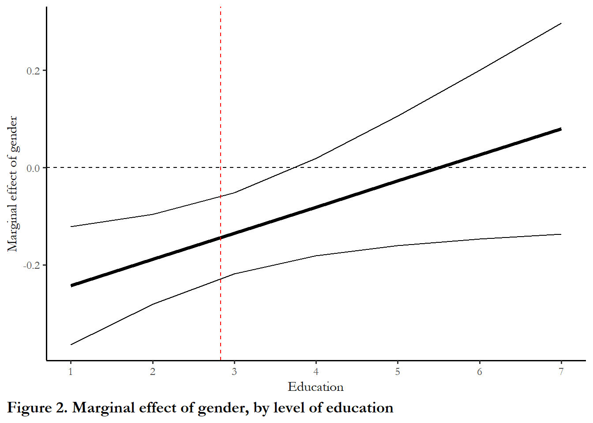

<!-- Run common_r first if using as a Notebook -->
<!-- Needs ANES common data file at line 21 -->

# Using interaction terms

To simplify this introduction to interaction terms, we will rely on a model that includes one ordinal and one dummy variable.  You know that, in many cases, we may be interested in variables that are qualitative.  We call those types of variables *dummy* variables.  More specifically a dummy variable is dichotomous and typically represents the presence or absence of a quality or attributes. The convention or practice is to code dummy variables as 1=presence of attribute and 0=not.

## Political participation as a function of gender

We will start with a simple example: the level of campaign activity as a function of gender.  The ANES includes several questions that ask what type of campaign activity you are involved in: trying to persuade, displaying preferences, going to meetings, giving money, or political work.  The recoded campaign activity measure is a scale from 0 (no persuading, attending meeting or rallies, wearing buttons or stickers, giving money to a campaign, or working for the candidate) to 5 (all of those things). The data are extracted from the cumulative ANES and the election year in this example is 1960. You could test if this effect is stable over time by swapping in a different election year in the RMD file. 


### Comparing OLS and a t-test {-}

#### Political activity of  women and men {-}

We will take at a look at a simple table first, the distribution of activity for men and women. Table 1 summarizes the distribution for men and women: the rows of the table are the percentage of in each category.  The sample data tell us that the most common response for men and women is no activity, but men are more likely engage in some type of activity.  While the count could go as high as five, the most activity observed in 1960 was three. 


```r
# This table draws on multiple functions:
# round, prop.table, table, and kable
kable(round(100*prop.table(table(anes$female_c, anes$activity), margin=1), digits=1), caption="**Table 1.  Political Activity and gender**")
```


Table: (\#tab:table41)**Table 1.  Political Activity and gender**

|      |    0|    1|   2|   3|
|:-----|----:|----:|---:|---:|
|Men   | 57.1| 32.9| 7.3| 2.8|
|Women | 67.1| 25.1| 6.0| 1.8|

#### A t-test {-}

Our first step to is to determine the effect of gender using a t-test to evaluate the difference in the mean between men and women. 


```r
# t.test is a base R function
# tidy is a function from the broom package. tidy converts test output to a data frame so we can use ggplot and kable to display and plot the results.

table2<-t.test(activity ~ female, data = anes, var.equal = TRUE) %>%
 tidy() %>%
 select(estimate1, estimate2, statistic, p.value)
 kable(table2, caption="**Table 2.  Difference in mean activity, men compared to women**", digit=3, col.names = c("Men", "Women", "t-test", "p-value"))
```


Table: (\#tab:table42)**Table 2.  Difference in mean activity, men compared to women**

|   Men| Women| t-test| p-value|
|-----:|-----:|------:|-------:|
| 0.557| 0.426|  3.037|   0.002|

#### OLS {-}

A second and identical strategy is to estimate the parameters of a simple model with a dummy variable indicating female or male as a predictor for campaign activity.  This is a linear model, estimated via OLS.  It is equivalent to ANOVA since all of the variables that we use as predictors are categories. The coefficients are reported in Table 3.


```r
# estimate activity as a function of gender
model1<-lm(activity~female, data=anes, na.action=na.exclude)

# view the model info
stargazer(model1,style="apsr", type = 'html', digits=3,
          title="**Table 3. Modeling campaign activity as a function of gender**", notes= "p<.01*** ; p<.05**",  notes.append = FALSE, dep.var.labels = c("Political Activity Scale"), covariate.labels = c("Female", "Constant"), omit.stat=c("ser","f"))
```


<table style="text-align:center"><caption><strong>**Table 3. Modeling campaign activity as a function of gender**</strong></caption>
<tr><td colspan="2" style="border-bottom: 1px solid black"></td></tr><tr><td style="text-align:left"></td><td>Political Activity Scale</td></tr>
<tr><td colspan="2" style="border-bottom: 1px solid black"></td></tr><tr><td style="text-align:left">Female</td><td>-0.131<sup>***</sup></td></tr>
<tr><td style="text-align:left"></td><td>(0.043)</td></tr>
<tr><td style="text-align:left">Constant</td><td>0.557<sup>***</sup></td></tr>
<tr><td style="text-align:left"></td><td>(0.032)</td></tr>
<tr><td style="text-align:left">N</td><td>1,109</td></tr>
<tr><td style="text-align:left">R<sup>2</sup></td><td>0.008</td></tr>
<tr><td style="text-align:left">Adjusted R<sup>2</sup></td><td>0.007</td></tr>
<tr><td colspan="2" style="border-bottom: 1px solid black"></td></tr><tr><td colspan="2" style="text-align:left">p<.01*** ; p<.05**</td></tr>
</table>
<br>
Since the coefficient on female is statistically significant, we can conclude that gender is related to the level of political activity.  More specifically, we can say that women are less politically active then men and the difference in mean activity is -0.131.  Review the R Markdown file and notice that this text is dynamic: I called in the result from model 1 in the previous sentence.

In the case of dummy variables, the constant can be substantively useful.  	As you know, the constant is the value of Y when the independent variable (X) is equal to zero.  In our past examples (when we were not using dummy variables), the independent variables often had no substantive meaning when set to zero, so our constant had no substantive meaning.	With only dummy variables, on the other hand, our independent variable does have substantive meaning,  In this case, an X o zero means the respondent is male. So, 
  
* Mean activity level of men:  

$$E(Y_i | X_i = 0)=\beta_0+\beta_1*0$$

$$ E(Y_i | X_i = 0) = \beta_0  $$

$$E(Y_i | X_i = 0) = 0.557$$


* Mean activity level of women:  

$$E(Y_i | D_i = 1)=\beta_0+\beta_1*1$$  

$$E(Y_i | D_i = 1) = \beta_0 +\beta_1$$  

$$E(Y_i | D_i = 0) = 0.557+ -0.131 = 0.426$$ 

The constant gives us the average or mean value of the dependent variable (here, level of political activity) for men, and the slope ($\beta_1$) measures how much the mean value of the dependent value for women differs from that of men,  Notice that the numbers from this regression and the t-test are identical - same test.

## Controlling for education

What about the impact of education?  We saw with our turnout examples that education is a good predictor of whether or not some votes. Is the effect of education similar for men and women?  Is the effect of gender similar for respondents with similar levels of education?  

### The logic of controllled comparison {-}

Before turning to the focus of this class, let's talk about the logic of controlled comparison, specifically leveraging this example. 

The intuition of controlled comparison is that while we are primarily interested in the effect of gender (X) on activity (Y), we know that there are other variables (Z) that are related to both X and Y.  In this case the idea is that there might be some correlation between education and gender, and some correlation between education and activity - it that is the case, then our estimate of the effect of gender, above, could be distorted if we exclude education.  This would be a form of *omitted variable bias*.  

### A simple example

To keep things simple, start by considering the impact of education.  If we control for gender, will the marginal effect of education remain consistent, the same for men and women?

The simplest way to approach controlled comparison is to look at the marginal effects - the way X impacts Y - for each level of the control variable (Z).

Since we only have two categories for gender, We could control for gender by estimating the effect of education separately for men and women -- this is the same logic or the answer to the same question:  is the marginal effect of education in the sample the same if we compare men and women?  The estimates in Table 4 explore this possibility.


```r
women <- anes %>% filter(female_c=="Women")
men   <- anes %>% filter(female_c=="Men")
model2a<-lm(activity~education, data=women, na.action=na.exclude)
model2b<-lm(activity~education, data=men, na.action=na.exclude)
# view the model info
stargazer(model2a, model2b, style="apsr", type = 'html', digits=3, title="**Table 4. Modeling campaign activity as a function of education, by gender**", notes= "p<.01*** ; p<.05**",  notes.append = FALSE, dep.var.labels = c("Political Activity Scale"), covariate.labels = c("Education", "Constant"), omit.stat=c("ser","f"), column.labels=c("Women", "Men"))
```


<table style="text-align:center"><caption><strong>**Table 4. Modeling campaign activity as a function of education, by gender**</strong></caption>
<tr><td colspan="3" style="border-bottom: 1px solid black"></td></tr><tr><td style="text-align:left"></td><td colspan="2">Political Activity Scale</td></tr>
<tr><td style="text-align:left"></td><td>Women</td><td>Men</td></tr>
<tr><td style="text-align:left"></td><td>(1)</td><td>(2)</td></tr>
<tr><td colspan="3" style="border-bottom: 1px solid black"></td></tr><tr><td style="text-align:left">Education</td><td>0.108<sup>***</sup></td><td>0.054<sup>***</sup></td></tr>
<tr><td style="text-align:left"></td><td>(0.016)</td><td>(0.018)</td></tr>
<tr><td style="text-align:left">Constant</td><td>0.112<sup>**</sup></td><td>0.408<sup>***</sup></td></tr>
<tr><td style="text-align:left"></td><td>(0.055)</td><td>(0.061)</td></tr>
<tr><td style="text-align:left">N</td><td>600</td><td>507</td></tr>
<tr><td style="text-align:left">R<sup>2</sup></td><td>0.067</td><td>0.017</td></tr>
<tr><td style="text-align:left">Adjusted R<sup>2</sup></td><td>0.066</td><td>0.015</td></tr>
<tr><td colspan="3" style="border-bottom: 1px solid black"></td></tr><tr><td colspan="3" style="text-align:left">p<.01*** ; p<.05**</td></tr>
</table>
<br>
The table above suggests, that, yes, we see a positive effect of education for men and positive effect of education for women.  Education does influence the level of campaign activity and the effect is similar.

### Exactly how does the effect of education differ for men and women? {-}

Figure 1 summarizes the estimates from each model in Table 4. The red line is the link between education and activity for women. The blue line is the link between education and activity for men.  You can see that the the differences in predicted campaign activity are smaller, in 1960, for highly-educated men and women, but larger for the group with the lowest levels of education.  Think about what this means substantively - having a low level of education decreases activity a lot for women, but less so for men.


```r
ggplot(women, aes(x = education, y = activity)) +
  geom_smooth(formula = y ~ x, method=lm, color= "red", se=FALSE) +
  geom_smooth(formula = y ~ x, data=men, method=lm, color= "blue", se=FALSE) +
  scale_x_continuous(name="Education", limits=c(1, 7), breaks=c(1,2,3,4,5,6,7)) +
  labs( y="Predicted activity", caption="Figure 1. Campaign activity as a function of education, for men (blue) and women (red)")
```


### A controlled comparison

An easier way to executve the same type of comparison is to simply include both variables in one multivariate model.

When you introduce a control variable, one of three things can happen:  

- your control variable and primary variable are significant.  (The effects are *additive*).

- your primary variable shifts from significant to not.  (So the original result was *spurious*.)

- your primary variable shifts from not significant to significant. (You original model was *confounding*.)

Important note:  if there is no correlation between X and Z then there will be absolutely no change in the model results. The correlation between the primary and control variables enters the calculation of $\beta_1$, and a zero correlation means no difference in the coefficient if an uncorrelated control is added.

## A multivariate model of campaign activity

The model below estimates political activity as a function of education and then combines education and female. Remember this data is from 1960 - so we need to be sensitive to what that means in terms of the role of gender and education and how gender and education are related.

Column 1 in the table below reports the impact of gender alone, replicating the result above.  Column 2 reports the impact of education alone.  Column 3 includes both variables, so in that model we are estimating the effect of education controlling for gender and, at the same, gender controlling for the effect of education. 

Since we are working across models, it is helpful to differentiate between a couple of phrases:

- *full effect*:  this the effect of X on Y with no controls

- *partial effect*: this is the effect of X on Y in the presence of controls on the scale of $X\beta$.  This is also labeled the *marginal effect*, where we think how a specific chang in X generates a change in Y holding all other variables constant at the mean (or some substantively meaningful level)

- *conditional marginal effects*:  marginal effects of X may be conditional on the value of Z (or, in nonlinear models, on the value of X)


```r
# estimate activity as a function of gender and education
model2<-lm(activity~education, data=anes, na.action=na.exclude)
model3<-lm(activity~female+education, data=anes, na.action=na.exclude)

stargazer(model1, model2, model3, style="apsr", type = 'html', title="**Table 5. Modeling campaign activity as a function of gender and education**",  notes= "p<.01*** ; p<.05**", notes.append = FALSE, dep.var.labels = c("Political Activity Scale"), digits=3, covariate.labels = c("Female", "Education"), omit.stat=c("ser","f"))
```


<table style="text-align:center"><caption><strong>**Table 5. Modeling campaign activity as a function of gender and education**</strong></caption>
<tr><td colspan="4" style="border-bottom: 1px solid black"></td></tr><tr><td style="text-align:left"></td><td colspan="3">Political Activity Scale</td></tr>
<tr><td style="text-align:left"></td><td>(1)</td><td>(2)</td><td>(3)</td></tr>
<tr><td colspan="4" style="border-bottom: 1px solid black"></td></tr><tr><td style="text-align:left">Female</td><td>-0.131<sup>***</sup></td><td></td><td>-0.144<sup>***</sup></td></tr>
<tr><td style="text-align:left"></td><td>(0.043)</td><td></td><td>(0.042)</td></tr>
<tr><td style="text-align:left">Education</td><td></td><td>0.079<sup>***</sup></td><td>0.081<sup>***</sup></td></tr>
<tr><td style="text-align:left"></td><td></td><td>(0.012)</td><td>(0.012)</td></tr>
<tr><td style="text-align:left">Constant</td><td>0.557<sup>***</sup></td><td>0.261<sup>***</sup></td><td>0.333<sup>***</sup></td></tr>
<tr><td style="text-align:left"></td><td>(0.032)</td><td>(0.041)</td><td>(0.046)</td></tr>
<tr><td style="text-align:left">N</td><td>1,109</td><td>1,107</td><td>1,107</td></tr>
<tr><td style="text-align:left">R<sup>2</sup></td><td>0.008</td><td>0.036</td><td>0.046</td></tr>
<tr><td style="text-align:left">Adjusted R<sup>2</sup></td><td>0.007</td><td>0.035</td><td>0.044</td></tr>
<tr><td colspan="4" style="border-bottom: 1px solid black"></td></tr><tr><td colspan="4" style="text-align:left">p<.01*** ; p<.05**</td></tr>
</table>
<br>
In the example above, the effects of gender persist when we control for education and the effects of education persist when we control for gender - so the effects of education and gender are additive.  They both operate independently - women are less active than men,  people with high education are more active than people with low levels of education. 

Keep in mind:  the way we have constructed this model assumes that education has a similar impact on both male and female levels of activity.  Said another way, we are assuming (and our estimates conform to the assumption) that the mean level of activity for men is different than the mean level of activity for women, but also assuming (implicitly) that the rate of change in activity based on educational attainment is the same for men and women.  This is the *unit homogeneity assumption* - you may also see this described as treatment homogeneity  

Since we know the electorate is about 50 percent women and 50 percent men, it makes sense that the average or typical marginal effect of education, which we estimated and reported in Table 6, is 0.08.  This is the coefficient on education, controlling for gender (0.08), the average of the effect on men (0.05) and women (0.11) from Table 5. 

In general, you can think about the coefficient reported in a table as the weighted average of the marginal effect of X across all categories or combinations of the other variables.

## Using interaction terms

We noticed something curious about the results in Table 4 and Figure 1- the effect of education is positive for both men and women, but seems to be larger for women.  We can test if this difference is statistically significant by relying on what is known as an interaction term.   This introduction of this term, which is simply the product of education and gender (X times Z) permits us to relax the *unit homogeneity assumption.*  (X and Z are multiplied together to generate the interaction terms and the individual variables are referred to as the *constitutive variables*.)  

>Introduction of an interaction term is typically explicitly theoretically motivated, rather than triggered by some type of empirical test.  


```r

# If you are using the lm function, then you don't need to actually create the interaction term by multiplying, you simply indicate that you want an interaction and R automatically includes both variables and their product in the model.

# estimate model with interaction term
model5<-lm(activity~female*education, data=anes, na.action=na.exclude)

# view the model info
stargazer(model1, model2, model5, style="apsr", type = 'html', digits=3,
          title="**Table 6. Modeling campaign activity as a function of gender, education and an interaction term**",
          notes= "p<.01*** ; p<.05**",  notes.append = FALSE,
          dep.var.labels = c("Political Activity Scale"), 
          covariate.labels = c("Female", "Education", "Interaction term"),
          omit.stat=c("ser","f"), column.sep.width=c("120pt"))
```


<table style="text-align:center"><caption><strong>**Table 6. Modeling campaign activity as a function of gender, education and an interaction term**</strong></caption>
<tr><td colspan="4" style="border-bottom: 1px solid black"></td></tr><tr><td style="text-align:left"></td><td colspan="3">Political Activity Scale</td></tr>
<tr><td style="text-align:left"></td><td>(1)</td><td>(2)</td><td>(3)</td></tr>
<tr><td colspan="4" style="border-bottom: 1px solid black"></td></tr><tr><td style="text-align:left">Female</td><td>-0.131<sup>***</sup></td><td></td><td>-0.296<sup>***</sup></td></tr>
<tr><td style="text-align:left"></td><td>(0.043)</td><td></td><td>(0.082)</td></tr>
<tr><td style="text-align:left">Education</td><td></td><td>0.079<sup>***</sup></td><td>0.054<sup>***</sup></td></tr>
<tr><td style="text-align:left"></td><td></td><td>(0.012)</td><td>(0.017)</td></tr>
<tr><td style="text-align:left">Interaction term</td><td></td><td></td><td>0.054<sup>**</sup></td></tr>
<tr><td style="text-align:left"></td><td></td><td></td><td>(0.025)</td></tr>
<tr><td style="text-align:left">Constant</td><td>0.557<sup>***</sup></td><td>0.261<sup>***</sup></td><td>0.408<sup>***</sup></td></tr>
<tr><td style="text-align:left"></td><td>(0.032)</td><td>(0.041)</td><td>(0.057)</td></tr>
<tr><td style="text-align:left">N</td><td>1,109</td><td>1,107</td><td>1,107</td></tr>
<tr><td style="text-align:left">R<sup>2</sup></td><td>0.008</td><td>0.036</td><td>0.050</td></tr>
<tr><td style="text-align:left">Adjusted R<sup>2</sup></td><td>0.007</td><td>0.035</td><td>0.048</td></tr>
<tr><td colspan="4" style="border-bottom: 1px solid black"></td></tr><tr><td colspan="4" style="text-align:left">p<.01*** ; p<.05**</td></tr>
</table>
<br>
The interaction term is statistically significant, which confirms our suspicion that the effects of eduction are different for men and women.  But exactly how much?

### Using model coefficients to clarify the size of effects.

The basic model with one dummy, one ordinal variable and an interaction term is:

$$Y=\beta_0+\beta_1D_1+\beta_2X_1+\beta_3(D_1X_1)$$

 
We can use the coefficients from the sample to calculate the expected mean activity level of men:

$$E(Y_i | X_i = 0) = \beta_0 + \beta_1*(0) + \beta_2*(education) + \beta_3*(0)*(education)$$
	
$$E(Y_i | X_i = 0) = 0.408 + 0.0543*(education)$$

And expected mean activity level for women:

$$ E(Y_i | X_i = 1) = \beta_0 +\beta_1*(1) + \beta_2*(education) + \beta_3*(1)*(education) $$

$$ E(Y_i | X_i = 1) = (\beta_0 +\beta_1) + (\beta_2+\beta_3)*(education) $$

$$ E(Y_i | X_i = 1) =0.112 + 0.108*education $$

Compare the results from the interaction term model with the results where we estimated the model for men and women separately - exactly the same.

So the use of an interaction term with a dummy variable is equivalent to testing if the effect of X is is on Z but running two separate regressions.

We would conclude here that the marginal effect of education on activity is conditional on gender.  The conditional marginal effect for men is $\beta_2$ and the conditional marginal effect on women is $\beta_2+\beta_3$.


### Summarizing marginal effects with figures

It is relatively easy to calculate the conditional marginal effects with the **margins** package, consistent with the prescriptions outlined in @brambor2006, discussed in more detail below.

I use the `cplot` function to generate the data for the figures, but `ggplot' to produce the figures.  The red dashed line shows the marginal effect at the average level of education. The solid dashed line is zero marginal effect.

The first figure summarizes the conditional marginal effect of gender, by education. The second figure summarizes the conditional marginal effect of education, by gender.  Notice how these figures are different from Figure 1: the y-axis is the marginal effect, not the predicted outcome.


```r
# Use cplot to generate the data and refine the figure with ggplot
cplotdata1 <- cplot(model5, x = "education", dx = "female", what="effect", n=7, draw=FALSE)
# Figure 2
ggplot(cplotdata1, aes(x = xvals, y = yvals)) +
  geom_line(lwd = 1.5) +
  geom_line(aes(y = upper)) +
  geom_line(aes(y = lower)) +
  labs(x="Education", y="Marginal effect of gender", caption="Figure 2. Marginal effect of gender, by level of education")+
  geom_hline(yintercept=0.00, lty=2) +
  geom_vline(xintercept=mean(anes$education, na.rm=TRUE), color="red", lty=2)+
  scale_x_continuous(name="Education", limits=c(1, 7), breaks=c(1,2,3,4,5,6,7)) 
```




```r
# Use cplot to generate the data and refine the figure with ggplot
cplotdata2 <- cplot(model5, x = "female", dx = "education", what="effect", n=2, draw=FALSE)
ggplot(cplotdata2, aes(x = xvals, y = yvals)) +
  geom_point() +
  geom_errorbar(data=cplotdata2, mapping=aes(x=xvals, ymin=upper, ymax=lower), width=0.1, size=1, color="blue") +
  theme(axis.title.x=element_blank(), axis.ticks.x=element_blank()) +
  labs(x=NULL, y="Marginal effect of education", caption="Figure 3. Marginal effect of education, by gender") +
  scale_x_continuous(breaks=c(0,1), limits=c(-0.5,1.5), labels=c("Men", "Women"))
```


The first figure reveals that gender only matters for women with a lower than average level of education.  For higher levels of education, the effect is zero.  (The red dotted line indicates the average level educationr - so, on average, the diffrence between men and women is about -0.13, matching up with the output from the models (Table 3)).

The second figure suggests that the marginal effect of education is somewhat higher for women than men, so gaps in activity between men and women will diminish as education increases.  But the confidence intervals suggest we really can't make the claim that the effect is much larger for women.  We can be more confident about what we learn from the Figure 5.

## Readings and notes

@brambor2006, a widely cited piece on interaction terms, gives some basic and useful guidance about how to handle interactions in statistical models.

#### Include interaction terms {-}

If there are compelling reasons to think that marginal effects will vary across observations - due to individual-level differences, institutional or social contexts-  then include those terms.  Otherwise you risk a model specification error. The only possible downside of adding interaction terms is if you interacted all variables with all variables, then you have a very complex and inefficient model.

#### Include all constitutive terms (and don’t worry about collinearity) {-}

Review: what is *collinearity*? You can imagine that if introduce a variable X and three dummy variables, and then proceed to test for conditional marginal effects with three interaction terms, you might have a strong correlation between X and all of the interaction terms (X*D~i~). This form of collinearity could reduce efficiency, increasing the likelihood of Type II error.  The temptation is to economize by dropping variables - either just leaving in the interaction terms or excluding variables that are not significant.  (This is a shorcut that is not a good idea in any case).  Brambor et al demonstrate that results are biased if interaction terms are included but one of the constitutive terms is dropped.  If you combine the imperative to include interaction terms and include all constitutive terns, then we anticipate that inefficiency may be price we pay for accurate specification. (This is a special case of a classic trade-off -- more variables means more inefficiency but too few variables risks omitted variable bias).

#### Do not interpret constitutive terms as unconditional marginal effects {-}

When we use interaction terms, the coefficient on on X is no longer the unconditional marginal effect of X on Y.  If you must know the unconditional marginal effect, just plot the marginal effect and check what that number is at the typical or average value of X (as above).

#### Calculate substantively meaningful marginal effects and measures of uncertainty {-}

Brambor et al highlight the fact that we can't simply think about standard errors as additive - and that we can to be careful to clarify exactly which differences - in marginal effects or outcomes - are statistically significant.  Figure 2 communicates all of the information we need - the unconditional marginal effect, the conditional marginal effects, and measures of uncertainty for each effect.
