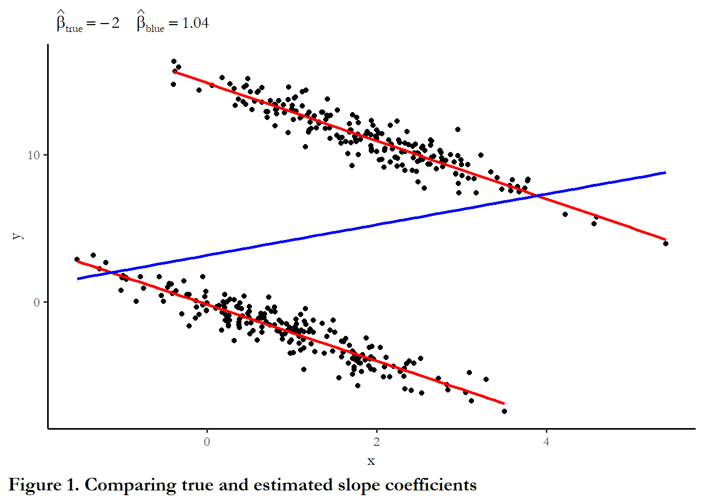

<!-- requires jop2013.dta -->

# Working with panel data

## Statistical models for panel data: "N" dominant approaches

Panel data describes datasets that have the same units observed over more than one time period. Panel data may be time dominant (a few units observed over a long period of time) or "N" dominant (many units observed over a short period of time).  

Panel data may be balanced (each unit observed the same number of times) or unbalanced (some units observed more or fewer times than others). 

Panel data offer a lot of leverage over empirical questions, but introduce a lot of modeling choices.

Economists often use panel data at the individual level - household or consumers observed or surveyed. Panel data econometrics is an entire subfield and there are books devoted it - one notable and influential contribution was Jeffrey Wooldridge's *Econometric Analysis of Cross Section and Panel Data* [@wooldridge2001]. The insights of panel data econometrics have also been exported to other fields, including political science.  Important findings about voting behavior emerged from the 1972/4/6 ANES panel study. These individual-level datasets are typically many people (large N) observed over a short period of time (small T).  Work in comparative politics has extended to panel data that have very different forms (smaller N and larger T).

The models that are the focus of this week were developed to be applied to "N" dominant datasets.  Next week we talk about dynamics and endogeneity, complications that become more problematic as T grows relative to N. 

### Why use panel data? {-}

There are at least four compelling, practical advantages from using panel data:

1. Increase N for small sample of nations or regions

2.  Address problems of multicollinearity (more variation in Xs and Y)

3. Model dynamic adjustment (leveraging many short-term reactions to estimate properties of long-term adjustment).  More on this in next week, but the upshot is the same as time series: lagged values of the dependent variable go a long way.  

4. Test for and model *unobserved heterogeneity* - the idea is that we need to understand features of individuals that may be related to Y, but that we can't measure or observe directly. If we have only a cross-sectional snapshot we can never get a handle of this - this systematic variation across individuals just gets lumped into the error term.  Panel data - multiple observations on individuals lets us estimate and manage this heterogeneiety.  This is very important.

### Panel data problems {-}

Two problems present themselves when we have panel data.

The problems we have already learned about that can emerge in cross-sectional and time-series applications are both present here: heteroskedasticity and serial correlation.

- Some observations have errors that persist over time (slow adjustment). 

- Observations on the same unit may share an error and this error may vary across units.

These problems may be minor if you have a few time periods, but they can be major if you have many time periods.

### Why panel data can be particularly tricky {-}

The figure below describes the relationship between X and Y in a hypothetical (contrived) time-dominant dataset. Think of each cluster of observations describing 100 years of experience in one country.  The plot below combines scatter plot and three regression lines - one line for the entire dataset (pooled) and one line for the 100 observations that for each country.

The basic model that links X and Y is a simple linear model:

$$Y=\beta_0+\beta_1X$$

Take a close look at the code below - I have specified the model parameters - how X is translated into Y with the true $\beta_1=-2$ for each country and different values for the intercept ($\beta_0$): 0 and 15.  X is also different: average of 1 for the first 200 observations and an average of 2 for the second 200 observations.  The difference in intercepts is a form of unobserved heterogeneity. If we pool the data together to estimate the slope, we are ignoring these differences.


```r
# example of unobserved heterogeneity 
# adapted from Garrett Glasgow's panel data course site
# the set.seed function just makes sure that the random numbers are the same each time I run the commands.  This is important for replication.
set.seed(10725)
x1 <- rnorm(200,1,1)
x2 <- rnorm(200,2,1)
e1 <- rnorm(200,0,0.8)
e2 <- rnorm(200,0,0.8)
# y1 and y2 are the same function of x but different intercept
# In the second regression, x is the same (-2) but the intercept is higher (15)
y1 <- 0 - 2*x1 + e1
y2 <- 15 - 2*x2 + e2

xy<-data.frame(x=append(x1,x2), y=append(y1,y2))
xy1<-data.frame(x=x1, y=y1)
xy2<-data.frame(x=x2, y=y2)
ggplot()+
  geom_point(data = xy, aes(x = x, y = y)) +
  geom_smooth(method=lm, se=FALSE, color="red", formula = y ~ x, data=xy1, aes(x = x, y = y)) +
  geom_smooth(method=lm, se=FALSE, color="red", formula = y ~ x, data=xy2, aes(x = x, y = y)) +
  geom_smooth(method=lm, se=FALSE, color="blue", formula = y ~ x, data=xy, aes(x = x, y = y)) +
  labs(subtitle=expression(~~hat(beta)[true]==-2~~~~hat(beta)[blue]==1.04),
    caption="Figure 1. Comparing true and estimated slope coefficients") + 
  theme(plot.caption.position = "plot", plot.caption = element_text(hjust=0, face="bold", size=rel(1.15)))
```


What is the link between X and Y?  Positive?   Negative?   Is the downward slope that describes each country the "true" link or is the upward sloping line that describes the entire collection of 200 observations the true link? (One lesson I take from this exercise is that we must be very careful if we use panel data and even skeptical of results that rely on just one cross-sectional snapshot IF we expect unmeasured heterogeneity).  

I could describe the data in any arbitrary number of ways.  In the example I had in mind we have two countries each observed 200 times - a total of 400 observations.  This could be data from 200 countries each observed two times.  This could be 20 countries each observed 20 times.  Pooled OLS is agnostic to how the data are collected.  It is just a regression of Y on X for the entire data set.  The code chunk below sets up the data in three forms - each with varying intercepts, varying levels of X and the same slope coefficient.  Each data set is indexed on ccode~n~ and time~t~.


```r

# This creates a dataset that is T>N, just like above
ccode1<-c(rep(1, 200), rep(2, 200))
time1<-c(rep(1:200,2))
data1<-data.frame(cbind(ccode1,time1))
data1$x <- rnorm(400,ccode1,1)
data1$e<-rnorm(400,0,0.8)
data1$beta0<- 15*(data1$ccode1-1)
data1$y<- data1$beta0 + (-2*data1$x) + data1$e

# This creates a dataset that is N~=T
ccode2<-c(rep(1,20))
for (n in seq(1:19)) {
ccode2<-append(ccode2, c(rep(n+1,20)))
}
time2<-c(rep(1:20,20))
data2<-as.data.frame(cbind(ccode2,time2))
data2$x <- rnorm(400,ccode2/10,1)
data2$e<-rnorm(400,0,0.8)
data2$beta0<- 15*(data2$ccode2/10)
data2$y<- data2$beta0 + (-2*data2$x) + data2$e

# This creates a dataset that is N>T
ccode3<-c(rep(1,2))
for (n in seq(1:199)) {
ccode3<-append(ccode3, c(rep(n+1,2)))
}
time3<-c(rep(1:2,200))
data3<-as.data.frame(cbind(ccode3,time3))
data3$x <- rnorm(400,ccode2/100,1)
data3$e<-rnorm(400,0,0.8)
data3$beta0<- 15*(data3$ccode3/100)
data3$y<- data3$beta0 + (-2*data3$x) + data3$e

reg.data1 <- lm(y~x, data=data1)
reg.data2 <- lm(y~x, data=data2)
reg.data3 <- lm(y~x, data=data3)

stargazer(reg.data1, reg.data2, reg.data3, style="apsr", type="html" , digits=2, model.numbers=FALSE, column.labels = c("T>N","N=T","N>T"), dep.var.labels = c(""),
title="Table 1. Estimates from three datasets", notes= "p<.10* ; p<.05**",  omit.stat=c("ser","f"), notes.append = FALSE, star.cutoffs = c(0.10,0.05))
```


<table style="text-align:center"><caption><strong>Table 1. Estimates from three datasets</strong></caption>
<tr><td colspan="4" style="border-bottom: 1px solid black"></td></tr><tr><td style="text-align:left"></td><td colspan="3"></td></tr>
<tr><td style="text-align:left"></td><td>T>N</td><td>N=T</td><td>N>T</td></tr>
<tr><td colspan="4" style="border-bottom: 1px solid black"></td></tr><tr><td style="text-align:left">x</td><td>1.02<sup>**</sup></td><td>2.08<sup>**</sup></td><td>-1.31<sup>**</sup></td></tr>
<tr><td style="text-align:left"></td><td>(0.30)</td><td>(0.32)</td><td>(0.43)</td></tr>
<tr><td style="text-align:left">Constant</td><td>2.80<sup>**</sup></td><td>11.36<sup>**</sup></td><td>14.98<sup>**</sup></td></tr>
<tr><td style="text-align:left"></td><td>(0.57)</td><td>(0.50)</td><td>(0.44)</td></tr>
<tr><td style="text-align:left">N</td><td>400</td><td>400</td><td>400</td></tr>
<tr><td style="text-align:left">R<sup>2</sup></td><td>0.03</td><td>0.10</td><td>0.02</td></tr>
<tr><td style="text-align:left">Adjusted R<sup>2</sup></td><td>0.03</td><td>0.10</td><td>0.02</td></tr>
<tr><td colspan="4" style="border-bottom: 1px solid black"></td></tr><tr><td colspan="4" style="text-align:left">p<.10* ; p<.05**</td></tr>
</table>
<br>
You can see from these examples that as N gets large relative to T, the estimate of the slope coefficient is closer to the true value, but still biased.

## Panel data in R

The estimates and examples below draw on a dataset used in a 2013 *Journal of Politics* article that investigated the link between border security and democratization [@owsiak2013]. I am pulling a couple of variables to look at the link between trade openness, economic performance, settled borders, and democratization.

The dependent variable is the *Polity 2* score for democratization (-10 to 10), trade openness is the lagged natural log of exports plus imports, and the economic performance index is lagged change in annual GDP per capita (as best I could determine based on the data descriptions at the Maddison project).  Settled borders is the key predictor.  Review the article for the theory and expectations - how the presence of settled borders permits decentralization and demilitarization, which abet the establishment or persistence of democracy.  

For details about the Polity index, see @polity. The data covers 1919-2006.

Before you run the panel data commands, below make sure you have installed and loaded the **plm** package in R.

To treat data as a panel, you must specify a two variables that, together, uniquely identifies each observation: a code for the individual and code for the time. In R, this is the `pdim` function


```r
# quitely=TRUE suppresses a warning message about conflict with dplyr
library(plm, quietly=TRUE)
# Need JOP data
jop<-read_stata("data/jop_2013.dta")
# Identify the dataset as panel data
pdim(jop, index=c("ccode", "year"))
Unbalanced Panel: n = 200, T = 2-89, N = 10434
```
The output above indicates that we have 200 countries, observed as few as 2 years and as many as 89 years.  There are total of 10,434 observations and, since we have different numbers of years for some countries, the data are "unbalanced."

One practical note.  If the data are time dominant (T>>N), then use the appropriate approach is to use what is known as feasible generalized least squares.  This will be covered next week.

If the data are "N" dominant (N>>T, or even N~T), then use the approach outlined here.   This example  is clear N>>T since we have 200 countries but only a maximum of 89 years. 

You can imagine that, due to the expense of collecting repeated observations, most panel data are large N and small T.

The basic model we are using takings this form:

$$Y_{it}=c_i+\beta_1X_{it}+u_i$$
Notice that intercept has a subscript, it may vary across observations

- If $c_i$ is constant across individuals ($\beta_0=\beta_{0_i}$), then OLS is OK

- If $c_i$ varies, then OLS is not appropriate (a form of omitted variable bias)

## Alternative solutions

###  Pooled data (generic and with robust standard errors) {-}

We could simply pool the data and assume intercepts are the same across individuals (and over time). This is equivalent to ignoring unit heterogeneity (unmeasured individual level differences).

You know this can be hazardous based on the example above.

The results are the same if we use the `plm` function and request model=pooling"


```r
pooled.ols <- lm(polity2 ~ lagtradeopen + laggdpchg + allsettle, data=jop, na.action=na.omit)
pooled.plm <- plm(polity2~ lagtradeopen + laggdpchg+  allsettle, data=jop, index=c("ccode", "year"), na.action=na.omit, model="pooling")

stargazer(pooled.ols, pooled.plm, style="apsr", type="html", title="**Table 2. Polity 2 scores as a function of trade, economics, and borders**", notes= "p<.10* ; p<.05**",  notes.append=FALSE, omit.stat=c("ser","f"), star.cutoffs=c(0.10,0.05), digits=2, dep.var.labels = c("Polity democracy score"), covariate.labels = c("Trade openness", "Economic growth", "Settled borders", "Constant"))
```


<table style="text-align:center"><caption><strong>**Table 2. Polity 2 scores as a function of trade, economics, and borders**</strong></caption>
<tr><td colspan="3" style="border-bottom: 1px solid black"></td></tr><tr><td style="text-align:left"></td><td colspan="2">Polity democracy score</td></tr>
<tr><td style="text-align:left"></td><td>OLS</td><td>panel</td></tr>
<tr><td style="text-align:left"></td><td></td><td>linear</td></tr>
<tr><td style="text-align:left"></td><td>(1)</td><td>(2)</td></tr>
<tr><td colspan="3" style="border-bottom: 1px solid black"></td></tr><tr><td style="text-align:left">Trade openness</td><td>1.22<sup>**</sup></td><td>1.22<sup>**</sup></td></tr>
<tr><td style="text-align:left"></td><td>(0.03)</td><td>(0.03)</td></tr>
<tr><td style="text-align:left">Economic growth</td><td>3.91<sup>**</sup></td><td>3.91<sup>**</sup></td></tr>
<tr><td style="text-align:left"></td><td>(1.29)</td><td>(1.29)</td></tr>
<tr><td style="text-align:left">Settled borders</td><td>3.07<sup>**</sup></td><td>3.07<sup>**</sup></td></tr>
<tr><td style="text-align:left"></td><td>(0.18)</td><td>(0.18)</td></tr>
<tr><td style="text-align:left">Constant</td><td>-11.50<sup>**</sup></td><td>-11.50<sup>**</sup></td></tr>
<tr><td style="text-align:left"></td><td>(0.30)</td><td>(0.30)</td></tr>
<tr><td style="text-align:left">N</td><td>7,238</td><td>7,238</td></tr>
<tr><td style="text-align:left">R<sup>2</sup></td><td>0.18</td><td>0.18</td></tr>
<tr><td style="text-align:left">Adjusted R<sup>2</sup></td><td>0.18</td><td>0.18</td></tr>
<tr><td colspan="3" style="border-bottom: 1px solid black"></td></tr><tr><td colspan="3" style="text-align:left">p<.10* ; p<.05**</td></tr>
</table>
<br>
Based on these results we would conclude that more settled borders, trade openness and positive growth in GDP would be associated with higher levels of democratization.

The effect of borders is obviously large given that we are talking about a -10 to +10 scale and this is a dummy variable.

We could request robust standard errors.  The code chunk below reproduces what are known as "panel-corrected standard errors," prescribed and detailed in a widely cited piece, @beckkatz1995. Check out the article for the origins and rationale for this approach. They use the label *TSCS* or time-series cross-ectional to describe panel data. I think this is meant to differentiate the type of panel data we see in Political Science - larger T and smaller N - from the panel data that is typical in Economics (larger N and smaller T).

The options I specify below mean that the standard errors are robust to the presence of heteroskedasticity (specifically, errors varying by country) and for serial correlation. In this case, the standard errors are higher, so more conservative - but everything is still significant and the standard errors are quite low relative to the parameter estimates.

Note that this takes care of the problems with the standard error but does not do anything about unobserved heterogeneity bias.  


```r
kable(tidy(coeftest(pooled.plm, vcov=vcovBK, type="HC1", cluster="time")), digits=3)
```


|term         | estimate| std.error| statistic| p.value|
|:------------|--------:|---------:|---------:|-------:|
|(Intercept)  |  -11.497|     0.668|   -17.217|   0.000|
|lagtradeopen |    1.224|     0.069|    17.850|   0.000|
|laggdpchg    |    3.905|     1.952|     2.001|   0.045|
|allsettle    |    3.067|     0.235|    13.046|   0.000|

What happens if we do try to take tackle unobserved heterogeneity?

### Fixed effects {-}

The fixed effects approch assumes that differences across units can be captured by differences in the constant term.  We have two options to implement this approach:

#### Least squares dummy variable approach (LSDV) {-}

This approach fully captures individual heterogeneity

It can be problematic for large n datasets, but useful for small n:

- a large matrix  (n-1 dummy variables) forecloses estimation in some statistical software

- inefficiency (too many parameters)

- inconsistency (adding more observations increases number of parameters)

The output below does not include the coefficients on the 199 country dummy variables.

The first table reports the results of our settled border example


```r
lsdv.ols <- lm(polity2~ lagtradeopen + allsettle + laggdpchg +as.factor(ccode), data=jop, na.action=na.omit)

stargazer(lsdv.ols, style="apsr", type="html", omit="ccode", title="**Table 3 Polity 2 scores as a function of trade, economics, and borders", notes="p<.10* ; p<.05**", notes.append=FALSE, omit.stat=c("ser","f"), star.cutoffs=c(0.10,0.05), digits=2, dep.var.labels = c("Polity democracy score"), column.labels = c("Trade openness", "Economic growth", "Settled borders", "Constant"))
```


<table style="text-align:center"><caption><strong>**Table 3 Polity 2 scores as a function of trade, economics, and borders</strong></caption>
<tr><td colspan="2" style="border-bottom: 1px solid black"></td></tr><tr><td style="text-align:left"></td><td>Polity democracy score</td></tr>
<tr><td style="text-align:left"></td><td>Trade openness</td></tr>
<tr><td colspan="2" style="border-bottom: 1px solid black"></td></tr><tr><td style="text-align:left">lagtradeopen</td><td>1.10<sup>**</sup></td></tr>
<tr><td style="text-align:left"></td><td>(0.03)</td></tr>
<tr><td style="text-align:left">allsettle</td><td>0.29</td></tr>
<tr><td style="text-align:left"></td><td>(0.21)</td></tr>
<tr><td style="text-align:left">laggdpchg</td><td>-0.72</td></tr>
<tr><td style="text-align:left"></td><td>(0.85)</td></tr>
<tr><td style="text-align:left">Constant</td><td>-1.28<sup>**</sup></td></tr>
<tr><td style="text-align:left"></td><td>(0.58)</td></tr>
<tr><td style="text-align:left">N</td><td>7,238</td></tr>
<tr><td style="text-align:left">R<sup>2</sup></td><td>0.67</td></tr>
<tr><td style="text-align:left">Adjusted R<sup>2</sup></td><td>0.66</td></tr>
<tr><td colspan="2" style="border-bottom: 1px solid black"></td></tr><tr><td colspan="2" style="text-align:left">p<.10* ; p<.05**</td></tr>
</table>
Accounting for country fixed effects, economics growth and lagged GDP change and settled borders are now not significant. 

We can experiment with this approach for datasets where we know the true model.  

Note that the fixed effects approach works for any of your contrived datasets.  No dependence on the size of N relative to T.  (Note that we know we don't have serial correlation in this case.  We will simulate serial correlation next week to see what that does to the results).


```r
#pdim(data1, index=c("ccode1", "time1"))
lsdv1 <- lm(y~ x+as.factor(ccode1), data=data1, na.action=na.omit)

#pdim(data2, index=c("ccode2", "time2"))
lsdv2 <- lm(y~ x+as.factor(ccode2), data=data2, na.action=na.omit)

#pdim(data3, index=c("ccode3", "time3"))
lsdv3 <- lm(y~ x+as.factor(ccode3), data=data3, na.action=na.omit)

stargazer(lsdv1, lsdv2, lsdv3,
          style="apsr", type="html" , digits=2, model.numbers=FALSE,
          column.labels = c("T>N","N=T","N>T"),
          omit=c("ccode1", "ccode2", "ccode3"), 
          dep.var.labels = c(""),
          title="**Table 3. LSDV with three panel structures**",
          notes= "p<.10* ; p<.05**",  notes.append=FALSE,
          omit.stat=c("ser","f"), star.cutoffs=c(0.10,0.05))
```


<table style="text-align:center"><caption><strong>**Table 3. LSDV with three panel structures**</strong></caption>
<tr><td colspan="4" style="border-bottom: 1px solid black"></td></tr><tr><td style="text-align:left"></td><td colspan="3"></td></tr>
<tr><td style="text-align:left"></td><td>T>N</td><td>N=T</td><td>N>T</td></tr>
<tr><td colspan="4" style="border-bottom: 1px solid black"></td></tr><tr><td style="text-align:left">x</td><td>-1.94<sup>**</sup></td><td>-2.05<sup>**</sup></td><td>-1.98<sup>**</sup></td></tr>
<tr><td style="text-align:left"></td><td>(0.04)</td><td>(0.04)</td><td>(0.06)</td></tr>
<tr><td style="text-align:left">Constant</td><td>-0.19<sup>**</sup></td><td>1.45<sup>**</sup></td><td>0.11</td></tr>
<tr><td style="text-align:left"></td><td>(0.07)</td><td>(0.18)</td><td>(0.58)</td></tr>
<tr><td style="text-align:left">N</td><td>400</td><td>400</td><td>400</td></tr>
<tr><td style="text-align:left">R<sup>2</sup></td><td>0.99</td><td>0.99</td><td>1.00</td></tr>
<tr><td style="text-align:left">Adjusted R<sup>2</sup></td><td>0.99</td><td>0.99</td><td>0.99</td></tr>
<tr><td colspan="4" style="border-bottom: 1px solid black"></td></tr><tr><td colspan="4" style="text-align:left">p<.10* ; p<.05**</td></tr>
</table>
<br>
Independent of the way we structured the panel data, the fixed effect strategy picked up the true value we expected:  $\beta_1 \approx$ -2.0.


#### Testing the significance of group effects

An F-test can be used to test joint significance of n-1 dummy variables.

We can test the difference between the two models of democratization pooled and LSDV.


```r
kable(anova(pooled.ols, lsdv.ols))
```


| Res.Df|      RSS|  Df| Sum of Sq|        F| Pr(>F)|
|------:|--------:|---:|---------:|--------:|------:|
|   7234| 331620.6|  NA|        NA|       NA|     NA|
|   7103| 133492.1| 131|  198128.5| 80.47519|      0|

This output suggests that the including the dummy variables for each country was a statistically significant improvement in model fit - a substantial reduction in the residual sum of squares.   

This tells us that there is unobserved heterogeneity, captured with the country-specific constant.

Our test data would give the same result.

```r
kable(anova(reg.data1, lsdv1))
```


| Res.Df|        RSS| Df| Sum of Sq|        F| Pr(>F)|
|------:|----------:|--:|---------:|--------:|------:|
|    398| 18437.1260| NA|        NA|       NA|     NA|
|    397|   232.4397|  1|  18204.69| 31093.06|      0|

### Within group estimators (fixed effects without dummy variables)

I could also estimate this as a fixed effect or "within" model with the plm package. LSDV and fixed effects give the same result

Fixed effects transformation or within transformation required thinking about the link between the average level of X and the average level of Y.

$$\mu_{yi}=c_i+\beta_1\mu_{xi}+\epsilon_{i}$$

Subtract from the basic model, above

$$Y_{it}-\mu_y= \beta_1(X_{it}-\mu_{xi}) +(e_{it}-\epsilon_{i})$$

Note that $c_i$ drops out

The approach is generally a two step estimation.  First, the mean is calculated for each individual for Y and each X.  The difference from each time period Y and the average Y is modeled as a function of the difference between each time period X and the average X.   THINK ABOUT WHAT THIS MEANS THEORETICALLY

One big problem:  This transformation forecloses the use of variables that are fixed over time for each individual unit (could be constitutional features for countries; race or gender for individuals) since $X_{it} - \mu_{xi}$ would be zero for all observations.


```r

fe.model <- plm(polity2 ~ lagtradeopen + laggdpchg + allsettle, data=jop, index=c("ccode", "year"), na.action=na.omit, model="within")
stargazer(fe.model, style="apsr", type="html", omit="ccode", title="**Table 3 Polity 2 scores as a function of trade, economics, and borders", notes="p<.10* ; p<.05**", notes.append=FALSE, omit.stat=c("ser","f"), star.cutoffs=c(0.10,0.05), digits=2, dep.var.labels = c("Polity democracy score"), column.labels = c("Trade openness", "Economic growth", "Settled borders", "Constant"))
```


<table style="text-align:center"><caption><strong>**Table 3 Polity 2 scores as a function of trade, economics, and borders</strong></caption>
<tr><td colspan="2" style="border-bottom: 1px solid black"></td></tr><tr><td style="text-align:left"></td><td>Polity democracy score</td></tr>
<tr><td style="text-align:left"></td><td>Trade openness</td></tr>
<tr><td colspan="2" style="border-bottom: 1px solid black"></td></tr><tr><td style="text-align:left">lagtradeopen</td><td>1.10<sup>**</sup></td></tr>
<tr><td style="text-align:left"></td><td>(0.03)</td></tr>
<tr><td style="text-align:left">laggdpchg</td><td>-0.72</td></tr>
<tr><td style="text-align:left"></td><td>(0.85)</td></tr>
<tr><td style="text-align:left">allsettle</td><td>0.29</td></tr>
<tr><td style="text-align:left"></td><td>(0.21)</td></tr>
<tr><td style="text-align:left">N</td><td>7,238</td></tr>
<tr><td style="text-align:left">R<sup>2</sup></td><td>0.16</td></tr>
<tr><td style="text-align:left">Adjusted R<sup>2</sup></td><td>0.14</td></tr>
<tr><td colspan="2" style="border-bottom: 1px solid black"></td></tr><tr><td colspan="2" style="text-align:left">p<.10* ; p<.05**</td></tr>
</table>

```r


fe.model1 <- plm(y ~ x, data=data1, index=c("ccode1", "time1"), na.action=na.omit, model="within")
stargazer(fe.model1, style="apsr", type="html" , omit="ccode", digits=2, dep.var.labels = c("T>N"),  title="Table 4.  Fixed effects, with known slope coefficient equal to 2.0", notes="p<.10* ; p<.05**", notes.append=FALSE, omit.stat=c("ser","f"), star.cutoffs=c(0.10,0.05))
```


<table style="text-align:center"><caption><strong>Table 4. Fixed effects, with known slope coefficient equal to 2.0</strong></caption>
<tr><td colspan="2" style="border-bottom: 1px solid black"></td></tr><tr><td style="text-align:left"></td><td>T>N</td></tr>
<tr><td colspan="2" style="border-bottom: 1px solid black"></td></tr><tr><td style="text-align:left">x</td><td>-1.94<sup>**</sup></td></tr>
<tr><td style="text-align:left"></td><td>(0.04)</td></tr>
<tr><td style="text-align:left">N</td><td>400</td></tr>
<tr><td style="text-align:left">R<sup>2</sup></td><td>0.87</td></tr>
<tr><td style="text-align:left">Adjusted R<sup>2</sup></td><td>0.87</td></tr>
<tr><td colspan="2" style="border-bottom: 1px solid black"></td></tr><tr><td colspan="2" style="text-align:left">p<.10* ; p<.05**</td></tr>
</table>


Compare the coefficients of these models with the LSDV model above - identical.


###  Random effects estimator

In random effects models, all individuals have varying intercepts, but these intercepts are drawn from a distribution - a normal distribution centered around zero.

This only works if the unmeasured features are uncorrelated with the other predictors (in the same way that excluding any other variable that is related to $Y$ but unrelated to other Xs).

(The fixed effects estimators works in the presence of this correlation)

The random effects estimator relies on information from the "within" estimator, above, and a "between" estimator

The between estimator uses the country means:

$$\mu_{y}=c_i+\beta_1\mu_x+\epsilon$$

This approach throws away all of the information about how things are related over time and just uses the average. 


```r
be.model <- plm(polity2 ~ lagtradeopen + laggdpchg + allsettle, data=jop, index=c("ccode", "year"), na.action=na.omit, model="between")

stargazer(be.model, style="apsr", type="html", omit="ccode", title="**Table 3 Polity 2 scores as a function of trade, economics, and borders", notes="p<.10* ; p<.05**", notes.append=FALSE, omit.stat=c("ser","f"), star.cutoffs=c(0.10,0.05), digits=2, dep.var.labels = c("Polity democracy score"), column.labels = c("Trade openness", "Economic growth", "Settled borders", "Constant"))
```


<table style="text-align:center"><caption><strong>**Table 3 Polity 2 scores as a function of trade, economics, and borders</strong></caption>
<tr><td colspan="2" style="border-bottom: 1px solid black"></td></tr><tr><td style="text-align:left"></td><td>Polity democracy score</td></tr>
<tr><td style="text-align:left"></td><td>Trade openness</td></tr>
<tr><td colspan="2" style="border-bottom: 1px solid black"></td></tr><tr><td style="text-align:left">lagtradeopen</td><td>1.16<sup>**</sup></td></tr>
<tr><td style="text-align:left"></td><td>(0.30)</td></tr>
<tr><td style="text-align:left">laggdpchg</td><td>81.24<sup>**</sup></td></tr>
<tr><td style="text-align:left"></td><td>(27.66)</td></tr>
<tr><td style="text-align:left">allsettle</td><td>4.07<sup>**</sup></td></tr>
<tr><td style="text-align:left"></td><td>(1.13)</td></tr>
<tr><td style="text-align:left">Constant</td><td>-13.70<sup>**</sup></td></tr>
<tr><td style="text-align:left"></td><td>(2.41)</td></tr>
<tr><td style="text-align:left">N</td><td>132</td></tr>
<tr><td style="text-align:left">R<sup>2</sup></td><td>0.27</td></tr>
<tr><td style="text-align:left">Adjusted R<sup>2</sup></td><td>0.25</td></tr>
<tr><td colspan="2" style="border-bottom: 1px solid black"></td></tr><tr><td colspan="2" style="text-align:left">p<.10* ; p<.05**</td></tr>
</table>

There is a problem with the between effects approach: the between estimator is not consistent if the mean of x is be related to the level of the intercept term (i.e. correlated with the error term).  In our contrived data, we know that this the intercept is related to X - higher X is associated with the intercept.  And the result is an estimate of $\beta_1$ that is way off - high and positive when the truth is negative.  Ignoring unmeasured heterogeneity is hazardous.  

Imagine if you made a policy recommendation based on this result.


```r

be.model3 <- plm(y ~ x, data=data3, index=c("ccode3", "time3"), na.action=na.omit, model="between")
stargazer(be.model3, style="apsr", type="html", omit="ccode", title="**Table 3, Random effects", notes="p<.10* ; p<.05**", notes.append=FALSE, omit.stat=c("ser","f"), star.cutoffs=c(0.10,0.05), digits=2, dep.var.labels = c("T>N"))

<table style="text-align:center"><caption><strong>**Table 3, Random effects</strong></caption>
<tr><td colspan="2" style="border-bottom: 1px solid black"></td></tr><tr><td style="text-align:left"></td><td>T>N</td></tr>
<tr><td colspan="2" style="border-bottom: 1px solid black"></td></tr><tr><td style="text-align:left">x</td><td>-0.66</td></tr>
<tr><td style="text-align:left"></td><td>(0.85)</td></tr>
<tr><td style="text-align:left">Constant</td><td>14.89<sup>**</sup></td></tr>
<tr><td style="text-align:left"></td><td>(0.63)</td></tr>
<tr><td style="text-align:left">N</td><td>200</td></tr>
<tr><td style="text-align:left">R<sup>2</sup></td><td>0.003</td></tr>
<tr><td style="text-align:left">Adjusted R<sup>2</sup></td><td>-0.002</td></tr>
<tr><td colspan="2" style="border-bottom: 1px solid black"></td></tr><tr><td colspan="2" style="text-align:left">p<.10* ; p<.05**</td></tr>
</table>
```

The random effects estimator is a weighted average of the within and between estimator, so bias introduced with the be estimator is also present in the re estimator.  The intuition is compelling -we want to combine insights from how each observation deviates from it's mean along with how the observations vary from each other.


```r
re.model <- plm(polity2 ~ lagtradeopen + laggdpchg + allsettle, data=jop, index=c("ccode", "year"), na.action=na.omit, model="random")
stargazer(re.model, style="apsr", type="html", omit="ccode", title="**Table 3 Polity 2 scores as a function of trade, economics, and borders", notes="p<.10* ; p<.05**", notes.append=FALSE, omit.stat=c("ser","f"), star.cutoffs=c(0.10,0.05), digits=2, dep.var.labels = c("Polity democracy score"), column.labels = c("Trade openness", "Economic growth", "Settled borders", "Constant"))

<table style="text-align:center"><caption><strong>**Table 3 Polity 2 scores as a function of trade, economics, and borders</strong></caption>
<tr><td colspan="2" style="border-bottom: 1px solid black"></td></tr><tr><td style="text-align:left"></td><td>Polity democracy score</td></tr>
<tr><td style="text-align:left"></td><td>Trade openness</td></tr>
<tr><td colspan="2" style="border-bottom: 1px solid black"></td></tr><tr><td style="text-align:left">lagtradeopen</td><td>1.10<sup>**</sup></td></tr>
<tr><td style="text-align:left"></td><td>(0.03)</td></tr>
<tr><td style="text-align:left">laggdpchg</td><td>-0.63</td></tr>
<tr><td style="text-align:left"></td><td>(0.85)</td></tr>
<tr><td style="text-align:left">allsettle</td><td>0.40<sup>*</sup></td></tr>
<tr><td style="text-align:left"></td><td>(0.21)</td></tr>
<tr><td style="text-align:left">Constant</td><td>-9.16<sup>**</sup></td></tr>
<tr><td style="text-align:left"></td><td>(0.51)</td></tr>
<tr><td style="text-align:left">N</td><td>7,238</td></tr>
<tr><td style="text-align:left">R<sup>2</sup></td><td>0.16</td></tr>
<tr><td style="text-align:left">Adjusted R<sup>2</sup></td><td>0.16</td></tr>
<tr><td colspan="2" style="border-bottom: 1px solid black"></td></tr><tr><td colspan="2" style="text-align:left">p<.10* ; p<.05**</td></tr>
</table>
```


## Why random effects approaches may fail

The random effects estimator is biased when X variables are correlated with the magnitude of the error term (this was the case with our contrived data, above).

An example: If we use panel data to estimate the relationship between education and income, each individual has an unobserved skill level. This skill level is associated with x and with the intercept.  A fixed effects estimator would handle this well (with higher intercepts for higher skill respondents).  The random effects estimator would have an upward bias.  You must test for this bias.  The *Hausman* test indicates whether random effects or fixed effects estimator is appropriate.


```r
kable(tidy(phtest(fe.model, re.model)))
```


| statistic|  p.value| parameter|method       |alternative               |
|---------:|--------:|---------:|:------------|:-------------------------|
|  6.816828| 0.077971|         3|Hausman Test |one model is inconsistent |

The Hausman test indicates that the coefficients from the random effects and fixed effects models are not different.  Under the null hypothesis (H0), the coefficients are unbiased and estimates of $\beta_i$ are consistent. This is close, but inspect the coefficients and you can see how or why this is the case. 

We reject the null hypothesis, which means we can use the random effects estimator.

You can see why this test indicated the coefficients were not different.  Trade openness is positive and significant in both models.  GDP growth is zero (not significant) in both models. Settled borders is positive and on the threshold of statistical significance in both models.


### Returning to our example {-}

If I test the random effects vs. the fixed effects model for our N>>T dataset.  100 countries observed twice, the Hausman test suggests fixed effects.


```r
fe.model3 <- plm(y ~ x, data=data3, index=c("ccode3", "time3"), na.action=na.omit, model="within")
re.model3 <- plm(y ~ x, data=data3, index=c("ccode3", "time3"), na.action=na.omit, model="random")
kable(tidy(phtest(fe.model3, re.model3)))
```


| statistic|   p.value| parameter|method       |alternative               |
|---------:|---------:|---------:|:------------|:-------------------------|
|  10.19736| 0.0014064|         1|Hausman Test |one model is inconsistent |


## Practical implications

If T is large and N is small, the appropriate strategy is to use feasible generalized least squares or a dynamic panel model that leverages what we can learn from a long time series.

If N is large and T is small (which is often when we turn to these estimators), the estimates can diverge.  This is the case with our example data set, whether we have N=T or N>>T.

If the F-test for $u_{in}=0$ is significant, then the pooled regression is not appropriate since we clearly have unmeasured heterogeneity across units.

If the Hausmann test indicates that the coefficients from random and fixed effects are substantially different, then the model of choice is the fixed effects model.  The test indicates that the unit heterogeneity is correlated with X.

If N is large and T is small and the Hausmann test is not significant, then the random effects estimator is the most efficient estimator.  (AND you can use time invariant covariates).

## Notes and next week

In the Spring 2007 issue of Political Analysis there were several articles on analysis of TSCS data - the conclusions of one set of authors are sobering but insightful.  This is from @wilson2007: 

>Although continued statistical analysis and the development of better methods should proceed, researchers must be prepared for the answer that regression analysis simply will not provide reliable conclusions in some instances-a humbling fact relevant to regression analysis generally, we might add, not just in the TSCS context. This fact also points to the unavoidable conclusion that research in comparative politics and international relations must remain qualitatively rich. The rift between qualitative and quantitative analysts is, especially in the case of small panel data sets, counterproductive.   Political science seems particularly well poised, we think, to pursue a methodological agenda of marrying quantitative and qualitative methods (both enlightened by stronger theories), since neither mode of analysis on its own will be sufficient in many cases. 

Next week. Modeling dynamics in long T panel data.

