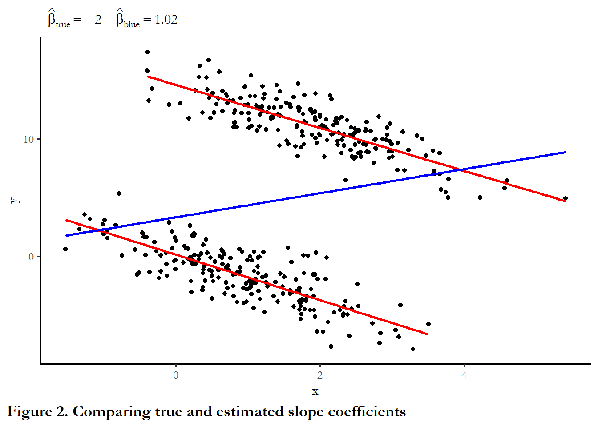

<!-- requires jop2013.dta -->
<!-- introduces panel library--->

# Dynamics panel models - a brief introduction

## Plan for class

We will cover four things today:

- Review - statistical significance - what it means and why it is important
- Review - using model coefficients to describe the size of effects
_ What happens when panel data have an ar(1) error term?
- Replicating "Democratization and International Border Settlements"
- Paper #5
- Looking ahead: the Harvard Dataverse (Class example search: Journal of Politics and R)

## Review: statistical significance.

Statistical significance appeals to the logic of repeated sampling.  What does this mean?

We rely on a specific threshold to differentiate between statistically significant and not statistically significant.  If p<.05 we consider an effect to be statistically significant - unlikely to be due to chance or the product of sampling error.  Why do we use the p<.05 threshold?

So p>.05 and we accept the null hypothesis.  What does this mean in practice?

What types of mistakes do we risk making by sticking with this threshold?  We should brielfy review the errors that we might confront.


**Figure 1.  What is a Type I and Type II error?**

## Review: using model coefficients

In the assignments you are using output from statistical models to evaluate the effects of a variety of conditions on presidential approval, determine what predicts voter turnout, or what makes countries more or less democratic.

When we used logistic regression, we had to use the `cplot` function to calculate the probability of turnout for various configurations of age, education, income, race and gender.  We could see - using several figures - how moving from low to high levels of education increased the probability of turnout and how that effect compared to income or age or race.  We used the `cplot` func since the model was nonlinear and the effect of each X was conditional on the values of the other Xs.

We need to take the same approach to describing the effects of each X in the models we estimate with OLS.  Since we are not using `cplot', this means we need to know something about the actual range of each X in order to explain or understand how much each X matters.  In the example last week, the critical variable - settled borders - was a dummy variable, taking only values of zero or one.  So the coefficient on that variable - the number in the table - captured the positive effect of having settled borders.  Or, in the assignment on presidential approval, the dummy variable for divided government captured the downward pressure on presidential approval under divided government.  But using coefficients for other types of variables requires knowing specific things about those variables - the range, maybe the 25th percentile and 75th percentile, or a pair of low and high values that represent something meaningful. You can only make useful comparisons across variables by combining that information with the reported coefficients.  

For instance, in the presidential approval dataset, a couple of you used the difference in unemployment as an independent variable.  Unemployment was not stationary, so we had to use the first difference   What is the typical change in unemployment from one quarter to the next?  Using the `summary` function, we learn this:


```r
poq<- read_dta("data/poq_guys.dta")
summary(diff(poq$unempl))
     Min.   1st Qu.    Median      Mean   3rd Qu.      Max.      NA's 
-0.966000 -0.200000 -0.034000  0.009542  0.134000  1.667000        17 
```

So if we want to understand the effect of unemployment on approval, it might make sense to compare how approval would differ between periods where unemployment is rapidly declining (-0.97) vs rapidly growing (1.67).  Or we could compare a less dramatic difference - the 25th percentile (-0.200) vs the 75 percentile (0.134). 

Say we observe a coefficient in a Partial Adjustment model of -1.18 and an associated long-run effect of (-1.18/(1-0.84))=7.375.   

We could say that if we shifted from a period of growing employment (-0.200) to a period of rising unemployment (0.134), that implies a change in x = +0.334.  In the short-run, this shift would translate into an decrease 0.334 * 1.18 or only about 0.40 percent.  But in the long-run this one time change would eat away 0.334 * 7.375 or about 2.5 points.  This seems like a relatively small effect (which helps us understand why this effect was not statistically significant in most cases).

Carefully note the logic here:

Take two representative or theoretically relevant values of X

Subtract $X_1-X_2$

Multiply by the coefficient

This is your effect - always compare effects-to-effects not slope-to-slope

## What happens when we have panel data with serially correlated errors?

To determine the implications of serial correlation, we will return to the sample data from last week, where we have 2 countries observed over 100 time periods.  We were able to use fixed effects to accurately recover the true slope coefficient.  The codechunk below replicates that example, but uses an ar(1) error term.


```r
# Create 400 draws of an error term that is serially correlated rho=0.7

rho <- 0.7
set.seed(3567567)
N<-400
v <- ts(rnorm(N,0,1))
# AR(1)
e <- ts(rep(0,N))
for (t in 2:N){
  e[t]<- rho*e[t-1]+v[t]
}

#Recreate the example from last week with the new error term
set.seed(10725)
x1 <- rnorm(200,1,1)
x2 <- rnorm(200,2,1)
e1 <- e[1:200]
e2 <- e[201:400]
# y1 and y2 are the same function of x but different intercept
# In the second regression, x is the same (-2) but the intercept is higher (15)
y1 <- 0 - 2*x1 + e1
y2 <- 15 - 2*x2 + e2

xy<-data.frame(x=append(x1,x2), y=append(y1,y2))
xy1<-data.frame(x=x1, y=y1)
xy2<-data.frame(x=x2, y=y2)
ggplot()+
  geom_point(data = xy, aes(x = x, y = y)) +
  geom_smooth(method=lm, se=FALSE, color="red", formula = y ~ x, data=xy1, aes(x = x, y = y)) +
  geom_smooth(method=lm, se=FALSE, color="red", formula = y ~ x, data=xy2, aes(x = x, y = y)) +
  geom_smooth(method=lm, se=FALSE, color="blue", formula = y ~ x, data=xy, aes(x = x, y = y)) +
  labs(subtitle=expression(~~hat(beta)[true]==-2~~~~hat(beta)[blue]==1.02),
    caption="Figure 2. Comparing true and estimated slope coefficients") + 
  theme(plot.caption.position = "plot", plot.caption = element_text(hjust=0, face="bold", size=rel(1.15)))
```




```r
# quietly=TRUE suppresses a warning message about conflict with dplyr
library(plm, quietly=TRUE)

Attaching package: 'plm'
The following objects are masked from 'package:dplyr':

    between, lag, lead
# This creates a dataset that is T>N
ccode1<-c(rep(1, 200), rep(2, 200))
time1<-c(rep(1:200,2))
data1<-data.frame(cbind(ccode1,time1,xy))
# Like last week, use plm packge to specify panel structure and use tests
pdim(data1, index=c("ccode1", "time1"))
```

Balanced Panel: n = 2, T = 200, N = 400

```r
reg.pooled<- plm(y~x, model="pooling", data=data1)
reg.fixed<- plm(y~x, model="within", data=data1)
reg.pa<- plm(y~x+lag(y), model="within", data=data1)
pbgtest(reg.fixed)
```


	Breusch-Godfrey/Wooldridge test for serial correlation in panel models

data:  y ~ x
chisq = 293.31, df = 200, p-value = 1.876e-05
alternative hypothesis: serial correlation in idiosyncratic errors

```r
stargazer(reg.pooled, reg.fixed, reg.pa, style="apsr", type="html" , digits=2, model.numbers=FALSE, column.labels = c("Pooled","Fixed effects"), dep.var.labels = c(""),
title="Table 1. Panel data with serially correlated errors", notes= "p<.10* ; p<.05**",  omit.stat=c("ser","f"), notes.append = FALSE, star.cutoffs = c(0.10,0.05))
```


<table style="text-align:center"><caption><strong>Table 1. Panel data with serially correlated errors</strong></caption>
<tr><td colspan="4" style="border-bottom: 1px solid black"></td></tr><tr><td style="text-align:left"></td><td colspan="3"></td></tr>
<tr><td style="text-align:left"></td><td>Pooled</td><td>Fixed effects</td><td></td></tr>
<tr><td colspan="4" style="border-bottom: 1px solid black"></td></tr><tr><td style="text-align:left">x</td><td>1.02<sup>**</sup></td><td>-1.88<sup>**</sup></td><td>-1.91<sup>**</sup></td></tr>
<tr><td style="text-align:left"></td><td>(0.30)</td><td>(0.07)</td><td>(0.07)</td></tr>
<tr><td style="text-align:left">lag(y)</td><td></td><td></td><td>0.23<sup>**</sup></td></tr>
<tr><td style="text-align:left"></td><td></td><td></td><td>(0.03)</td></tr>
<tr><td style="text-align:left">Constant</td><td>3.32<sup>**</sup></td><td></td><td></td></tr>
<tr><td style="text-align:left"></td><td>(0.54)</td><td></td><td></td></tr>
<tr><td style="text-align:left">N</td><td>400</td><td>400</td><td>398</td></tr>
<tr><td style="text-align:left">R<sup>2</sup></td><td>0.03</td><td>0.64</td><td>0.69</td></tr>
<tr><td style="text-align:left">Adjusted R<sup>2</sup></td><td>0.03</td><td>0.64</td><td>0.69</td></tr>
<tr><td colspan="4" style="border-bottom: 1px solid black"></td></tr><tr><td colspan="4" style="text-align:left">p<.10* ; p<.05**</td></tr>
</table>


## Replicating "Democratization and International Border Settlements"

The assignment draws on the dataset used in a 2013 *Journal of Politics* article that investigated the link between border security and democratization. The code chunk below reads the data and replicates the model that is reported in Table 2, column 2 of that article.  You can compare the numbers in the output to the numbers in the paper.

The dependent variable is the *Polity 2* score for democratization (-10 to 10).  Independent variables include:
- trade openness (lagged natural log of exports plus imports)
- settled border
- two measures of military expenditures
- two measures of economic performance
- a lag of the dependent variable (so this is a Partial Adjustment model)  

See @owsiak2013 for details


```r
# Need JOP data
jop<-read_stata("data/jop_2013.dta")
# Identify the dataset as panel data
pdim(jop, index=c("ccode", "year"))
Unbalanced Panel: n = 200, T = 2-89, N = 10434
```

The dataset includes 200 countries, observed as few as 2 years and as many as 89 years.  There are total of 10,434 observations and, since we have different numbers of years for some countries, the data are "unbalanced."

Last week we learned how to test for unit effects - unmeasured heterogeneity that we capture by permitting each observation to have a unique intercept. 

This week we focus on dynamics, how to merge our existing understanding of how to handle time series with what we learned about unit effects.

The strategies for dealing with dynamics in panel models involves starting at the same point as we did with a single unit observed over a long period of time - to test that our series are stationary and to evaluate the residuals of the OLS model for serial correlation.

### Testing for stationarity

You do not need to repeat these tests for your assignment since it is clear all of these series are stationary. 

The code cunk below first filters out any cases with missing values for any variable - this is known as "listwise deletion"  Beck and Katz discusses alternatives to this approach - missing data imputation.  This is where you use some type of algorithm or random draw to fill in missing values for particular variable so you don't end up deleting an entire observation if only one variable has a missing value.  This can also help to balance panel data (filling in gaps so that we have the same time coverage for each unit and the same units at every time)


```r
# This isolates lengths of the series with no missing values.
jop_test1<-jop %>% drop_na()
# This step recreates the data set by adds the index information, clarifying that each observation is a unique combination of country code and year
panel.set <- pdata.frame(jop_test1, index = c("ccode", "year"))
#  This is the augmented dickey fuller test from three weeks ago
#  requires the tseries package
library(tseries, quietly=TRUE)
adf.test(panel.set$polity2, k=1)

	Augmented Dickey-Fuller Test

data:  panel.set$polity2
Dickey-Fuller = -13.329, Lag order = 1, p-value = 0.01
alternative hypothesis: stationary
adf.test(panel.set$allsettle , k=1)

	Augmented Dickey-Fuller Test

data:  panel.set$allsettle
Dickey-Fuller = -11.411, Lag order = 1, p-value = 0.01
alternative hypothesis: stationary
adf.test(panel.set$laggdpam , k=1)

	Augmented Dickey-Fuller Test

data:  panel.set$laggdpam
Dickey-Fuller = -11.568, Lag order = 1, p-value = 0.01
alternative hypothesis: stationary
adf.test(panel.set$lagtradeopen , k=1)

	Augmented Dickey-Fuller Test

data:  panel.set$lagtradeopen
Dickey-Fuller = -13.872, Lag order = 1, p-value = 0.01
alternative hypothesis: stationary
adf.test(panel.set$lagmilex , k=1)

	Augmented Dickey-Fuller Test

data:  panel.set$lagmilex
Dickey-Fuller = -15, Lag order = 1, p-value = 0.01
alternative hypothesis: stationary
adf.test(panel.set$lagmilper , k=1)

	Augmented Dickey-Fuller Test

data:  panel.set$lagmilper
Dickey-Fuller = -14.377, Lag order = 1, p-value = 0.01
alternative hypothesis: stationary
adf.test(panel.set$lagsumdown , k=1)

	Augmented Dickey-Fuller Test

data:  panel.set$lagsumdown
Dickey-Fuller = -10.962, Lag order = 1, p-value = 0.01
alternative hypothesis: stationary
adf.test(panel.set$laggdpchg , k=1)

	Augmented Dickey-Fuller Test

data:  panel.set$laggdpchg
Dickey-Fuller = -47.521, Lag order = 1, p-value = 0.01
alternative hypothesis: stationary
adf.test(panel.set$lagupop , k=1)

	Augmented Dickey-Fuller Test

data:  panel.set$lagupop
Dickey-Fuller = -34.966, Lag order = 1, p-value = 0.01
alternative hypothesis: stationary
```
In each case above we can reject the null hypothesis.  The null is that the series has a unit root and the alternative hypothesis is that the series is stationary.  Each series used in the paper is stationary. (Note: the p-values are reported as 0.01. but are rounded up, so many are much lower.)

### Testing for serial correlation

We will use the standard BG test for serial correlation.  The code chunk below estimates the model without a lagged dependent variable.  I don't report the results, only the test for serial correlation.  There are two reported results.  The first set ignores the fact that this is panel data, relying on the simple `lm` function and related tests.  The second set of results use the `pbgtest` from the **plm** package. Given the large number of time points and relatively smaller number of countries, both approaches yield the same result.


```r
pooled.ols <- lm(polity2~ allsettle+laggdpam+laggdpchg+lagtradeopen+lagmilper+lagmilex+lagupop+lagsumdown, data=jop, na.action=na.omit)
bgtest(pooled.ols, order=1, type = c("Chisq"))

	Breusch-Godfrey test for serial correlation of order up to 1

data:  pooled.ols
LM test = 6430.6, df = 1, p-value < 2.2e-16

pooled.plm <- plm(polity2~ allsettle+laggdpam+laggdpchg+lagtradeopen+lagmilper+lagmilex+lagupop+lagsumdown, data=jop, na.action=na.omit, model="pooling")
pbgtest(pooled.plm)

	Breusch-Godfrey/Wooldridge test for serial correlation in panel models

data:  polity2 ~ allsettle + laggdpam + laggdpchg + lagtradeopen + lagmilper +     lagmilex + lagupop + lagsumdown
chisq = 6433.4, df = 13, p-value < 2.2e-16
alternative hypothesis: serial correlation in idiosyncratic errors
```

### A partial adjustment model

In the paper and in your assignment, we use a partial adjustment model - a lagged value of the dependent variable.  This implies a gradual incorporation of a change in X to Y - a partial adjustment in period 1, period 2....and for the long-run.

The code chunk below replicates the results reported in the paper.  The second column of numbers matches up with Table 2, Model 2 in the JOP piece.


```r

# This models pools the data, ignoring unit heterogeneity.  I estimate and report the coefficients along with 2 sets of standard errors:  conventional, clustered (as reported in the paper),

# This is standard OLS

pooled.pa <- lm(polity2~ allsettle+laggdpam+laggdpchg+lagtradeopen+lagmilper+lagmilex+lagupop+lagsumdown+ lagpolity, data=jop, na.action=na.omit)

#cov2 is the variance covariance matrix calculated with an adjustment that compensates for the presence of heteroskedasticity,  We have not used this before, so check out the syntax carefully


cluster_se2        <- sqrt(diag(vcovCL(pooled.pa, cluster = ~ ccode, type = "HC2")))


stargazer(pooled.pa, pooled.pa, style="apsr", type="html", se = list(NULL, cluster_se2), column.labels=c("Standard", "Clustered"), title="**Table 1. Polity 2 scores as a function of trade, economics, and borders**", notes= "p<.10* ; p<.05**",  notes.append=FALSE, omit.stat=c("ser","f"), star.cutoffs=c(0.10,0.05), digits=3, dep.var.labels = c("Polity democracy score"), covariate.labels = c("Trade openness", "Economic growth", "Settled borders", "Constant"))
```


<table style="text-align:center"><caption><strong>**Table 1. Polity 2 scores as a function of trade, economics, and borders**</strong></caption>
<tr><td colspan="3" style="border-bottom: 1px solid black"></td></tr><tr><td style="text-align:left"></td><td colspan="2">Polity democracy score</td></tr>
<tr><td style="text-align:left"></td><td>Standard</td><td>Clustered</td></tr>
<tr><td style="text-align:left"></td><td>(1)</td><td>(2)</td></tr>
<tr><td colspan="3" style="border-bottom: 1px solid black"></td></tr><tr><td style="text-align:left">Trade openness</td><td>0.179<sup>**</sup></td><td>0.179<sup>**</sup></td></tr>
<tr><td style="text-align:left"></td><td>(0.048)</td><td>(0.049)</td></tr>
<tr><td style="text-align:left">Economic growth</td><td>0.00001</td><td>0.00001</td></tr>
<tr><td style="text-align:left"></td><td>(0.00001)</td><td>(0.00001)</td></tr>
<tr><td style="text-align:left">Settled borders</td><td>-0.744<sup>**</sup></td><td>-0.744<sup>**</sup></td></tr>
<tr><td style="text-align:left"></td><td>(0.340)</td><td>(0.378)</td></tr>
<tr><td style="text-align:left">Constant</td><td>0.063<sup>**</sup></td><td>0.063<sup>**</sup></td></tr>
<tr><td style="text-align:left"></td><td>(0.015)</td><td>(0.013)</td></tr>
<tr><td style="text-align:left">lagmilper</td><td>-0.00002</td><td>-0.00002</td></tr>
<tr><td style="text-align:left"></td><td>(0.0001)</td><td>(0.0001)</td></tr>
<tr><td style="text-align:left">lagmilex</td><td>-0.000<sup>*</sup></td><td>-0.000<sup>**</sup></td></tr>
<tr><td style="text-align:left"></td><td>(0.000)</td><td>(0.000)</td></tr>
<tr><td style="text-align:left">lagupop</td><td>-0.029</td><td>-0.029</td></tr>
<tr><td style="text-align:left"></td><td>(0.081)</td><td>(0.045)</td></tr>
<tr><td style="text-align:left">lagsumdown</td><td>0.009<sup>**</sup></td><td>0.009<sup>**</sup></td></tr>
<tr><td style="text-align:left"></td><td>(0.002)</td><td>(0.002)</td></tr>
<tr><td style="text-align:left">lagpolity</td><td>0.962<sup>**</sup></td><td>0.962<sup>**</sup></td></tr>
<tr><td style="text-align:left"></td><td>(0.003)</td><td>(0.005)</td></tr>
<tr><td style="text-align:left">Constant</td><td>-0.614<sup>**</sup></td><td>-0.614<sup>**</sup></td></tr>
<tr><td style="text-align:left"></td><td>(0.099)</td><td>(0.104)</td></tr>
<tr><td style="text-align:left">N</td><td>7,226</td><td>7,226</td></tr>
<tr><td style="text-align:left">R<sup>2</sup></td><td>0.944</td><td>0.944</td></tr>
<tr><td style="text-align:left">Adjusted R<sup>2</sup></td><td>0.944</td><td>0.944</td></tr>
<tr><td colspan="3" style="border-bottom: 1px solid black"></td></tr><tr><td colspan="3" style="text-align:left">p<.10* ; p<.05**</td></tr>
</table>
<br>
The results clearly support the expectations outlined in the paper.  Nations with settled borders are more democratic.  The short-run effect is 0.179 units, but, since this is a partial adjustment model, we know the long-run effect is (0.179)/(1-0.962) or 4.71 units, which is large (almost too large to be believable) on a -10 to 10 scale. Owziak reports in the text the effects over ten periods - how did he calculate that number?   And what about the coefficient on lagged military expenditures?  What does it mean that a coefficient is negative and significant, but the value of zero?  We should talk about why this is not good practice.  

There are some warning signs that this specification and approach might be misleading. While trade openness and military expenditures are consistent with our expectation, GDP change is not - higher levels of GDP are associated with lower levels of democratization?  And is the coefficient consistent with expectations for previous downward movement in the polity scale?  I think, yes, we might see upward movement from very low levels, but that is not explained or clarified in the article.  We can also see the democracy score is very persistent, with a coefficient nearing 1.0 so very, very long adjustment processes.

### What about unit effects?

But so far we appear to be in good shape - the series are stationary, we can add a lagged dependent variable to work with serial correlation.  But are there unit effects of the form we discuss last week?  

The strategy here is to estimate a model without a lagged dependent variable and compare the results to a model without a lagged dependent variable but adding dummy variables for each country (the least squares dummy variable approach to handling fixed effects).


```r
lsdv <- lm(polity2~ allsettle+laggdpam+laggdpchg+lagtradeopen+lagmilper+lagmilex+lagupop+lagsumdown +factor(ccode), data=jop, na.action=na.omit)

#I used heteroskedasticity-consistent standard errors rather than clustered, since I can't cluster on the countries if I have a dummy variable for each country

cov3         <-    vcovHC(lsdv, type = "HC2")
cluster_se3        <- sqrt(diag(cov3))

stargazer(lsdv, lsdv, omit="ccode", se = list(NULL, cluster_se3), column.labels=c("Standard", "Consistent"), style="apsr", type="html", title="**Table 1. Polity 2 scores as a function of trade, economics, and borders, fixed effects**", notes= "p<.10* ; p<.05**",  notes.append=FALSE, omit.stat=c("ser","f"), star.cutoffs=c(0.10,0.05), digits=3, dep.var.labels = c("Polity democracy score"), covariate.labels = c("Trade openness", "Economic growth", "Settled borders", "Constant"))
```


<table style="text-align:center"><caption><strong>**Table 1. Polity 2 scores as a function of trade, economics, and borders, fixed effects**</strong></caption>
<tr><td colspan="3" style="border-bottom: 1px solid black"></td></tr><tr><td style="text-align:left"></td><td colspan="2">Polity democracy score</td></tr>
<tr><td style="text-align:left"></td><td>Standard</td><td>Consistent</td></tr>
<tr><td style="text-align:left"></td><td>(1)</td><td>(2)</td></tr>
<tr><td colspan="3" style="border-bottom: 1px solid black"></td></tr><tr><td style="text-align:left">Trade openness</td><td>0.219</td><td>0.219</td></tr>
<tr><td style="text-align:left"></td><td>(0.206)</td><td>(0.228)</td></tr>
<tr><td style="text-align:left">Economic growth</td><td>-0.0002<sup>**</sup></td><td>-0.0002<sup>**</sup></td></tr>
<tr><td style="text-align:left"></td><td>(0.00002)</td><td>(0.00002)</td></tr>
<tr><td style="text-align:left">Settled borders</td><td>-0.704</td><td>-0.704</td></tr>
<tr><td style="text-align:left"></td><td>(0.830)</td><td>(0.823)</td></tr>
<tr><td style="text-align:left">Constant</td><td>1.715<sup>**</sup></td><td>1.715<sup>**</sup></td></tr>
<tr><td style="text-align:left"></td><td>(0.050)</td><td>(0.054)</td></tr>
<tr><td style="text-align:left">lagmilper</td><td>-0.002<sup>**</sup></td><td>-0.002<sup>**</sup></td></tr>
<tr><td style="text-align:left"></td><td>(0.0003)</td><td>(0.0003)</td></tr>
<tr><td style="text-align:left">lagmilex</td><td>-0.00000<sup>**</sup></td><td>-0.00000<sup>**</sup></td></tr>
<tr><td style="text-align:left"></td><td>(0.000)</td><td>(0.000)</td></tr>
<tr><td style="text-align:left">lagupop</td><td>0.536<sup>**</sup></td><td>0.536<sup>*</sup></td></tr>
<tr><td style="text-align:left"></td><td>(0.218)</td><td>(0.318)</td></tr>
<tr><td style="text-align:left">lagsumdown</td><td>-0.163<sup>**</sup></td><td>-0.163<sup>**</sup></td></tr>
<tr><td style="text-align:left"></td><td>(0.011)</td><td>(0.014)</td></tr>
<tr><td style="text-align:left">Constant</td><td>-4.619<sup>**</sup></td><td>-4.619<sup>**</sup></td></tr>
<tr><td style="text-align:left"></td><td>(0.607)</td><td>(0.461)</td></tr>
<tr><td style="text-align:left">N</td><td>7,238</td><td>7,238</td></tr>
<tr><td style="text-align:left">R<sup>2</sup></td><td>0.689</td><td>0.689</td></tr>
<tr><td style="text-align:left">Adjusted R<sup>2</sup></td><td>0.683</td><td>0.683</td></tr>
<tr><td colspan="3" style="border-bottom: 1px solid black"></td></tr><tr><td colspan="3" style="text-align:left">p<.10* ; p<.05**</td></tr>
</table>

```r


anova(pooled.ols, lsdv)
```

Analysis of Variance Table

Model 1: polity2 ~ allsettle + laggdpam + laggdpchg + lagtradeopen + lagmilper + 
    lagmilex + lagupop + lagsumdown
Model 2: polity2 ~ allsettle + laggdpam + laggdpchg + lagtradeopen + lagmilper + 
    lagmilex + lagupop + lagsumdown + factor(ccode)
  Res.Df    RSS  Df Sum of Sq      F    Pr(>F)    
1   7229 303377                                   
2   7098 125977 131    177400 76.301 < 2.2e-16 ***
---
Signif. codes:  0 '***' 0.001 '**' 0.01 '*' 0.05 '.' 0.1 ' ' 1

This output indicates the model performance is substantially improved if we add the country dummies.  The residual sum of squares - the error - is much lower for model 2, which includes the country factor.

This suggests that perhaps the results published in the JOP piece ignore unmeasured heterogeneity.

## Using a lagged dependent variable with fixed effects

There is a well-known bias that is introduced to panel models that contain both unit effects and lagged dependent variable.  Labeled, the *Nickell bias*, due to @nickell1981, the problem is that if you only rely on a short time series (as was the case for most applications of panel studies), then it is impossible to differentiate between unit effects that are passed through to the next time period in the lagged dependent variable and unit effects that show up in the intercept.  As a result, the conventional wisdom and firm rule was that lagged dependent variables should never be combined with fixed effects.  @beckkatz2011 demonstrate that this is bad advice: since the size of the bias is related to 1/T -  a small T panel (T=3), might have a bias approach 30 percent, but a large T panel (T=90, as we have here) implies a bias of only 1 percent - this bias is acceptable given the tremendous gain we realize - practically (serial correlation) and theoretically (long-term dynamics) if we include a lagged dependent variable.

What happens if we used a lagged Y and control for unit effects?  The code chunk below reports the new results and the original output from the paper.


```r

final <- lm(polity2~ allsettle+laggdpam+laggdpchg+lagtradeopen+lagmilper+lagmilex+lagupop+lagsumdown+factor(ccode)+lagpolity, data=jop, na.action=na.omit)

#I used heteroskedasticity-consistent standard errors rather than clustered, since I can't cluster on the countries if I have a dummy variable for each country

cov4         <-    vcovHC(final, type = "HC2")
cluster_se4        <- sqrt(diag(cov4))

#stargazer(pooled.pa, final, style="qje", type="text", omit="ccode", se = list(cluster_se2, cluster_se4), column.labels=c("As reported", "Fixed effects"))

stargazer(pooled.pa, final, omit="ccode", se = list(cluster_se2, cluster_se4) ,column.labels=c("As reported", "Fixed effects"),  style="apsr", type="html", title="**Table 1. Polity 2 scores as a function of trade, economics, and borders, fixed effects**", notes= "p<.10* ; p<.05**",  notes.append=FALSE, omit.stat=c("ser","f"), star.cutoffs=c(0.10,0.05), digits=3, dep.var.labels = c("Polity democracy score"), covariate.labels = c("Trade openness", "Economic growth", "Settled borders", "Constant"))
```


<table style="text-align:center"><caption><strong>**Table 1. Polity 2 scores as a function of trade, economics, and borders, fixed effects**</strong></caption>
<tr><td colspan="3" style="border-bottom: 1px solid black"></td></tr><tr><td style="text-align:left"></td><td colspan="2">Polity democracy score</td></tr>
<tr><td style="text-align:left"></td><td>As reported</td><td>Fixed effects</td></tr>
<tr><td style="text-align:left"></td><td>(1)</td><td>(2)</td></tr>
<tr><td colspan="3" style="border-bottom: 1px solid black"></td></tr><tr><td style="text-align:left">Trade openness</td><td>0.179<sup>**</sup></td><td>0.055</td></tr>
<tr><td style="text-align:left"></td><td>(0.049)</td><td>(0.081)</td></tr>
<tr><td style="text-align:left">Economic growth</td><td>0.00001</td><td>-0.00002<sup>**</sup></td></tr>
<tr><td style="text-align:left"></td><td>(0.00001)</td><td>(0.00001)</td></tr>
<tr><td style="text-align:left">Settled borders</td><td>-0.744<sup>**</sup></td><td>-0.793<sup>*</sup></td></tr>
<tr><td style="text-align:left"></td><td>(0.378)</td><td>(0.413)</td></tr>
<tr><td style="text-align:left">Constant</td><td>0.063<sup>**</sup></td><td>0.136<sup>**</sup></td></tr>
<tr><td style="text-align:left"></td><td>(0.013)</td><td>(0.019)</td></tr>
<tr><td style="text-align:left">lagmilper</td><td>-0.00002</td><td>-0.0001</td></tr>
<tr><td style="text-align:left"></td><td>(0.0001)</td><td>(0.0001)</td></tr>
<tr><td style="text-align:left">lagmilex</td><td>-0.000<sup>**</sup></td><td>-0.000</td></tr>
<tr><td style="text-align:left"></td><td>(0.000)</td><td>(0.000)</td></tr>
<tr><td style="text-align:left">lagupop</td><td>-0.029</td><td>0.006</td></tr>
<tr><td style="text-align:left"></td><td>(0.045)</td><td>(0.043)</td></tr>
<tr><td style="text-align:left">lagsumdown</td><td>0.009<sup>**</sup></td><td>0.026<sup>**</sup></td></tr>
<tr><td style="text-align:left"></td><td>(0.002)</td><td>(0.007)</td></tr>
<tr><td style="text-align:left">lagpolity</td><td>0.962<sup>**</sup></td><td>0.918<sup>**</sup></td></tr>
<tr><td style="text-align:left"></td><td>(0.005)</td><td>(0.007)</td></tr>
<tr><td style="text-align:left">Constant</td><td>-0.614<sup>**</sup></td><td>-0.299<sup>**</sup></td></tr>
<tr><td style="text-align:left"></td><td>(0.104)</td><td>(0.138)</td></tr>
<tr><td style="text-align:left">N</td><td>7,226</td><td>7,226</td></tr>
<tr><td style="text-align:left">R<sup>2</sup></td><td>0.944</td><td>0.946</td></tr>
<tr><td style="text-align:left">Adjusted R<sup>2</sup></td><td>0.944</td><td>0.945</td></tr>
<tr><td colspan="3" style="border-bottom: 1px solid black"></td></tr><tr><td colspan="3" style="text-align:left">p<.10* ; p<.05**</td></tr>
</table>
<br>

## One other detail

The panel models describe last week hinge on an assumption that can be difficult to sustain and evaluate: *strict exogeneity*.  This means that the error in the past or in future is uncorrelated with current value of X.  A  variety of mechanisms could violate this assumption.  

Feedback - where values of Y today lead to changes in X in the future.  Consider our running example - could democratic nations experience higher levels of economic growth, or more trade openness?  This a specific example of a broader problem called *simultaneity bias*

There is straight forward way to test for strict exogeneity if you are using fixed effects.   Just add future values of X to the model.  If there is no feedback, this information should not be significant.  

You can see below that we have feedback in this case.  Democratization at time t is consistent with trade openness at time t+1


```r
se.model <- plm(polity2 ~ lagtradeopen + laggdpchg +lead(lagtradeopen, k=2), data=jop, index=c("ccode", "year"), na.action=na.omit, model="within")

summary(se.model)
Oneway (individual) effect Within Model

Call:
plm(formula = polity2 ~ lagtradeopen + laggdpchg + lead(lagtradeopen, 
    k = 2), data = jop, na.action = na.omit, model = "within", 
    index = c("ccode", "year"))

Unbalanced Panel: n = 154, T = 1-85, N = 7546

Residuals:
     Min.   1st Qu.    Median   3rd Qu.      Max. 
-14.44631  -2.68323  -0.28629   2.44581  16.89374 

Coefficients:
                          Estimate Std. Error t-value  Pr(>|t|)    
lagtradeopen               0.54497    0.13211  4.1250 3.748e-05 ***
laggdpchg                 -2.17641    0.79086 -2.7520 0.0059384 ** 
lead(lagtradeopen, k = 2)  0.48102    0.13086  3.6758 0.0002388 ***
---
Signif. codes:  0 '***' 0.001 '**' 0.01 '*' 0.05 '.' 0.1 ' ' 1

Total Sum of Squares:    152510
Residual Sum of Squares: 131380
R-Squared:      0.13857
Adj. R-Squared: 0.12038
F-statistic: 396.198 on 3 and 7389 DF, p-value: < 2.22e-16
```
<br>
## What about feasible generalized least squares approaches?

If you read the literature in political science, especially 1985-95, you will see most statistical treatments of panel data use generalized least square or GLS.  @beckkatz1995 note that it is inappropriate to use GLS estimators if T is not much larger than N.  You can, of course, estimate this model with the data above (where T is less than 100 and N is 200). But the output is consistent with the problem identified by Beck and Katz.  The standard errors for the coefficients are much too low. 

### Things I did not have time to 

#### Panel-corrected standard errors compared to cluster using the plm package

