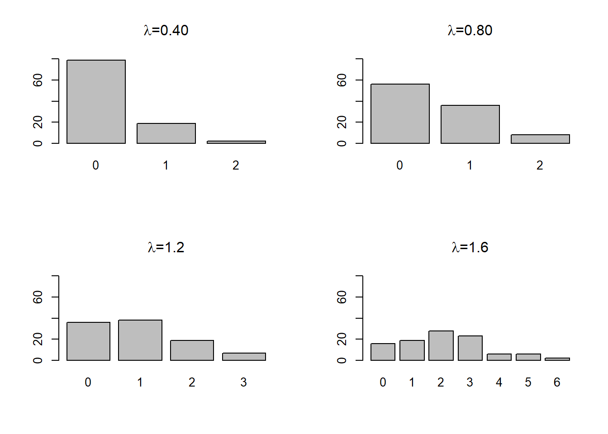
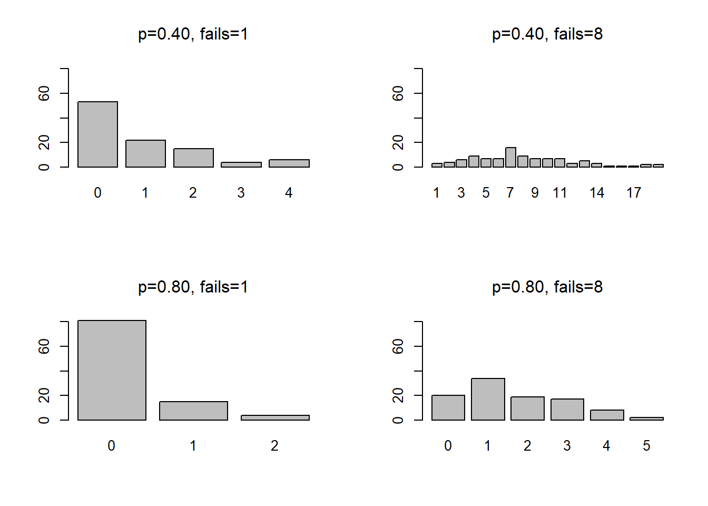

<!-- Needs the MASS library -->
<!-- Uses the ANES -->

# Counts

## Generalized Linear Models in R

R includes a function that permits you to estimate a wide variety of models using maximum likelihood  - `glm` or general linear model. The idea is that you specify how the dependent variable Y is distributed and what function links observed data X to the underlying probabilities associated with observed outcome Y.  So the probability function (or probability density function or PDF) is determined by designating a “family” and the way that you transform X to get Y is determined by a “link.”

If the dependent variable is distributed approximately normally – or more precisely, the error term associated with the difference between a linear function of X and observed Y is distributed normally, then we have family(Gaussian) link(id) model – the simple linear model that we have used many times. 

Family(binomial) link(logit) is logistic regression.  The assumption is that the dependent variable is distributed according to the binomial distribution and that the function that links the observed p to the underlying X is the logit:

$$(\beta_0+\beta_1X)  = \log (p/1-p)$$

Family(binomial) link(probit) is known as *probit*.  The dependent variable is distributed according to the binomial distribution and the function that links X to p is the inverse cumulative normal distribution: 

$$(\beta_0+\beta_1X) =\Phi^{-1}= \left(\frac{1}{\sqrt{2\pi}} \exp(-p^2/2) \right)^{-1} = \frac{\sqrt{2\pi}}{\exp(-p^2/2)}.$$
Logit and probit are closely related.  The distributions are compared in the figure below.  The code chunk evaluates the logit and the inverse cumulative normal distribution for 0.00 to 1.00 in increments of 0.1.  The blue line is the logit and the red line is the inverse cumulative normal.  You can see how marginal effects might diverge if you have many observations with predicted probabilities at the extremes.

```r
p<-seq(0,1,0.01)
y1<-(log(p/(1-p)))
y2<-qnorm(p)
data<-as.data.frame(cbind(p,y1,y2))
ggplot(data=data)+
  geom_line(aes(x=p, y=y1), color="red") +
  geom_line(aes(x=p, y=y2), color="blue") +
  labs(x="Probability", y="")
```


The available families in R include:
- binomial(link = "probit") <==probit
- binomial(link = "logit")  <==logit
- gaussian(link = "identity")  <==OLS
- Gamma(link = "inverse")
- inverse.gaussian(link = "1/mu^2")
- poisson(link = "log")  <==poisson
- quasi(link = "identity", variance = "constant")
- quasibinomial(link = "logit")
- quasipoisson(link = "log")

## Count models

The most important class of models that the `glm` function permits us to incorporate, beyond OLS, probit, and logit, are count models.

Count models describe instances where we observed a count of events aggregated over time.  How many years of education beyond high school did a participant in the Youth Socialization Panel complete during the period 1972-1982?  This number could vary from 0 to 7.  OLS would make little sense if we apply it to the data and recover predicted values that fall below 0 or exceed 7. We need some kind of distributional assumption about Y that permits zeroes but implies some type of upper bound. 

We could have other forms of count data and there are other methods.  For instance, if we only had three or four categories, then we could use extensions of logit (ordered or multinomial) or or other alternatives for discrete outcomes, probit, and related extensions (ordered or multinomial).

If the count is a unit of time – months, years, days – then we have other options.  If we were observing the number of periods that something took to fail or succeed, we would use survival data analysis (which lets us talk about duration dependence).  Next week we will talk about this type of approach.

## Poisson regression

The most common strategy to analyze simple counts is what is known as *Poisson regression* – the data generating process for Y is assumed to be the *Poisson distribution* (Poisson is the “distribution function” or family for Y). This distribution turns out to describe a number of processes that involve waiting in line.  And, classically, the number of horsemen in the Prussian army who were killed by kicks from horses (for details, read about Ladislaus Bortkiewicz in @hardle2014).

The shorthand Y $\sim {\rm poisson}(\lambda)$ is used to indicate that the
random variable Y has the Poisson distribution with scale parameter $\lambda$.

A Poisson random variable Y with scale parameter $\lambda$ has the distribution 

$$p(Y) = \frac{\lambda^Y e^{-\lambda}}{Y!}$$
For any X=0,1,2,3....   $E(Y) = Var(Y) = \lambda$

The code chunk below generates random draws from the Poisson distribution with 4 different settings for $\lambda$:  0.25, 0.50, 1.0, 2.0


```r

x1<-rpois(100,0.25)
x2<-rpois(100,0.50)
x3<-rpois(100,1.0)
x4<-rpois(100,2.0)
par(mfrow = c(2, 2))
barplot(table(x1), main = expression(paste(lambda,"=0.40")), ylim=c(0,80))
barplot(table(x2), main = expression(paste(lambda,"=0.80")), ylim=c(0,80))
barplot(table(x3), main = expression(paste(lambda,"=1.2")), ylim=c(0,80))
barplot(table(x4), main = expression(paste(lambda,"=1.6")), ylim=c(0,80))
```



### An example from the ANES

Earlier in the term we looked at the level of political activity for men and women - a count variable that was zero (no activity) for many people, but up to  four for people who were politically active. The code chunks below read the data and plot the distribution of activity for the 1960 ANES sample.


```r
# read the data from the current directory
# ANES cumulative file 
temp<-read.csv("data/anes_timeseries_cdf_rawdata.txt", header=TRUE, sep="|")
anes<-subset(temp, temp$VCF0004==1960)

# recode missing values and create dummy variables
# The mutate commands could be combined into one long command
# But I prefer to do one at a time

# note: all of the coding information is just cut and paste from the PDF codebook
 
 anes <- 
   anes %>%
   mutate(education=VCF0140a,
          education=na_if(education,8),
          education=na_if(education,9))
 
# #education is coded:
# #1. 8 grades or less ('grade school')
# #2. 9-12 grades ('high school'), no diploma/equivalency
# #3. 12 grades, diploma or equivalency
# #4. 12 grades, diploma or equivalency plus non-academic training
# #5. Some college, no degree; junior/community college level degree (AA degree)
# #6. BA level degrees
# #7. Advanced degrees incl. LLB
# 
anes <- anes %>%
   mutate(turnout=
          case_when(VCF0702==2 ~ 1,
                    VCF0702==1 ~ 0))
#turnout is coded:
# #0 did not vote
# #1 voted
 
 
 anes <- 
   anes %>%
   mutate(income=VCF0114,
          income=na_if(income,0))
 #income is coded:
 #1. 0 to 16 percentile
 #2. 17 to 33 percentile
 #3. 34 to 67 percentile
 #4. 68 to 95 percentile
 #5. 96 to 100 percentile
 
 anes <-
   anes %>%
   mutate(age=VCF0101,
          age=na_if(age,0),
          age=na_if(age,17))
 
 # age is age in years
 # 18 and over only
 # some very old (95+ are grouped together at 95 in ANES pre-1980, see the codebook)
 
 anes <-  anes %>%
   mutate(female=
   case_when(VCF0104==2 ~ 1,
             VCF0104==1 ~ 0))
 # female=1 designate women
 # female=0 designates men
 # Other and refused are treated as missing
 
 # For this module, I specified female as a category or factor - this improves the look of the tables
 anes$female_c<-factor(anes$female, labels=c("Men", "Women"))
 
 
 anes <-  anes %>%
   mutate(minority=
   case_when(VCF0105a>1 & VCF0105a<9~ 1,
             VCF0105a==1 ~ 0))
 # minority=0 is white and not Hispanic
 # minority=1 is any other group, including all Hispanic-identifying

anes <-  anes %>%
mutate(activity=VCF0723a-1,
          activity=na_if(activity,-1))
# in the raw data, 0 is missing and activity ranges from
# 1 (none) to 6 (high)
# I substract one so that scale now ranges from 0 (none) to 5 (high)
```


```r
barplot(table(anes$activity), ylab="N", main="Distribution of campaign activity")
```


The data are clearly consistent with some of the distributions above, so Poisson regression would be appropriate.  We will investigate some tests to better evaluate the suitability of the Poisson distribution for this data, but we can check the results first.  We will test the difference between men and women in 1960, and then introduce controls for age, education, income and race.  The first set of code chunks focuses on the difference between men and women.


```r

model1<-glm((activity)~female, data=anes, family = poisson(link = "log"))
summary(model1)

Call:
glm(formula = (activity) ~ female, family = poisson(link = "log"), 
    data = anes)

Deviance Residuals: 
    Min       1Q   Median       3Q      Max  
-1.0555  -1.0555  -0.9230   0.5331   2.5621  

Coefficients:
            Estimate Std. Error z value Pr(>|z|)    
(Intercept) -0.58503    0.05944  -9.842  < 2e-16 ***
female      -0.26838    0.08625  -3.112  0.00186 ** 
---
Signif. codes:  0 '***' 0.001 '**' 0.01 '*' 0.05 '.' 0.1 ' ' 1

(Dispersion parameter for poisson family taken to be 1)

    Null deviance: 1145.0  on 1108  degrees of freedom
Residual deviance: 1135.3  on 1107  degrees of freedom
  (72 observations deleted due to missingness)
AIC: 2040.9

Number of Fisher Scoring iterations: 5
anova(model1,test="Chisq")
Analysis of Deviance Table

Model: poisson, link: log

Response: (activity)

Terms added sequentially (first to last)

       Df Deviance Resid. Df Resid. Dev Pr(>Chi)   
NULL                    1108     1145.0            
female  1    9.696      1107     1135.3 0.001847 **
---
Signif. codes:  0 '***' 0.001 '**' 0.01 '*' 0.05 '.' 0.1 ' ' 1
```

As with logistic regression, the coefficients are not the parameters of a line.  Instead the coefficients are estimate of the log of $\lambda$ for men and women:  -0.5850 for men and (-0.5850-0.2684) or =0.8503.

The code chunk below plots the distribution of activity implied by these coefficients.  You can see that the model implies that men are much more likely than women to engage in at least one political activity.


```r

x<-rpois(500,exp(-0.5850))
id1<-cbind(x,"Men")
x<-rpois(500,exp(-0.8503))
id2<-cbind(x,"Women")
data<-as.data.frame(rbind(id2,id1))
ggplot(data, aes(x = x, fill = V2)) + geom_bar(position = "dodge") 
```


There are two other things to notice about the output.  The output reminds us that the dispersion parameter is taken to be 1.0 - this is an assumption that we will test.  And there is a goodness-of-fit test statistic reported - the AIC or Akaike's Information Criteria.  This test came up when we discussed logistic regression.  AIC is a simple function of the log of the likelihood function evaluated at a particular set of parameter estimates.

$$AIC = −N * L(m_*)+2k$$ 

N is the number of observations, k is the number of model parameters, and $L_(m_*)$ is the log likelihood.

We can compare the AIC of any two models to determine which model fits the data better.  The code chunk below adds age, education, income and race to see if gender still matters after we introduce controls.

The output includes an estimate of the *deviance*  - this is analogous to the residual sum of squares in OLS.  The null deviance is the model fit when only a constant appears in the model.  The residual deviance is the model fit for the model we stimated.  We should see an improvement or a reduction in error.  We can even test if the difference is statistically significant.


```r
anova(model1,test="Chisq")
Analysis of Deviance Table

Model: poisson, link: log

Response: (activity)

Terms added sequentially (first to last)

       Df Deviance Resid. Df Resid. Dev Pr(>Chi)   
NULL                    1108     1145.0            
female  1    9.696      1107     1135.3 0.001847 **
---
Signif. codes:  0 '***' 0.001 '**' 0.01 '*' 0.05 '.' 0.1 ' ' 1
```
The test indicates that improvement in deviance is statistically significant.

What if we add more information to improve our prediction?  This is a similar strategy to the one we used to create a model of turnout and the model you will use for your assignment.


```r

model2<-glm(activity~female+minority+age+income+education, data=anes, family="poisson")
summary(model2)

Call:
glm(formula = activity ~ female + minority + age + income + education, 
    family = "poisson", data = anes)

Deviance Residuals: 
    Min       1Q   Median       3Q      Max  
-1.6010  -0.9610  -0.7919   0.5420   3.0442  

Coefficients:
             Estimate Std. Error z value Pr(>|z|)    
(Intercept) -1.692636   0.266233  -6.358 2.05e-10 ***
female      -0.233548   0.087210  -2.678 0.007407 ** 
minority    -0.110448   0.187332  -0.590 0.555470    
age          0.004470   0.003342   1.338 0.181003    
income       0.182990   0.049595   3.690 0.000225 ***
education    0.101194   0.027378   3.696 0.000219 ***
---
Signif. codes:  0 '***' 0.001 '**' 0.01 '*' 0.05 '.' 0.1 ' ' 1

(Dispersion parameter for poisson family taken to be 1)

    Null deviance: 1136.8  on 1099  degrees of freedom
Residual deviance: 1071.0  on 1094  degrees of freedom
  (81 observations deleted due to missingness)
AIC: 1982.6

Number of Fisher Scoring iterations: 6
```

The output reveals that, in 1960, income and education are good predictors of political engagement and gender matters too. You can also see from this output the value of the AIC has dropped - this means the more complex model is a better fit.

### What is the dispersion parameter

The central problem that leads to rejection of the Poisson model is overdispersion – when the variance of the dependent variable exceeds the mean.  In the presence of overdispersion, estimates of standard errors from the Poisson regression are biased downward (leading to Type I errors). The alternative is what is known as negative binomial regression 

The negative binomial probability distribution function has two parameters:

$$p(x) = \frac{\lambda\mu^x e^{-\lambda\mu}}{x!}$$
If $\mu=1$, then this reduces to the Poisson

The logic of the negative binomial distribution:
1.  You observe a series of independent trials with outcomes of success or failure
2.  The probability of success or failure is constant from one trial to the next.
3.  Trials are conducted until some number (r) successes are observed

The number produced by the function is the number of failures that occur before you observe rth success.

The distribution requires the specification of two parameters (the average probability of success, and the number of successes to be observed).

If the probability of success is 0.5, how many failures will occur before you observe 8 successes?  If the probability of success is 0.5, then you should observe about 1 failure for every one success – so most likely 8 failures and 8 successes.  

The plots below shows the probability that you observe x failures (1 or 8) before you observe 8 successes at probability of success 0.40 and 0.80.
 

```r
x1 <- rnbinom(100, prob=0.50, size=1)
x2<-  rnbinom(100, prob=0.50, size=8)
x3<-  rnbinom(100, prob=0.80, size=1)
x4<-  rnbinom(100, prob=0.80, size=8)
par(mfrow = c(2, 2))
barplot(table(x1), main = expression(paste(p,"=0.40, fails=1")), ylim=c(0,80))
barplot(table(x2), main = expression(paste(p,"=0.40, fails=8")), ylim=c(0,80))
barplot(table(x3), main = expression(paste(p,"=0.80, fails=1")), ylim=c(0,80))
barplot(table(x4), main = expression(paste(p,"=0.80, fails=8")), ylim=c(0,80))
```



In order to determine which of these two alternatives - negative binomial or Poisson - is most appropriate, we can first estimate the model using an approach called quasi-poisson - this approach includes an estimate for the dispersion parameter.  


```r
model3<-glm(activity~female+minority+age+income+education, data=anes, family="quasipoisson")
summary(model3)

Call:
glm(formula = activity ~ female + minority + age + income + education, 
    family = "quasipoisson", data = anes)

Deviance Residuals: 
    Min       1Q   Median       3Q      Max  
-1.6010  -0.9610  -0.7919   0.5420   3.0442  

Coefficients:
             Estimate Std. Error t value Pr(>|t|)    
(Intercept) -1.692636   0.271546  -6.233 6.51e-10 ***
female      -0.233548   0.088951  -2.626 0.008771 ** 
minority    -0.110448   0.191071  -0.578 0.563351    
age          0.004470   0.003409   1.311 0.189965    
income       0.182990   0.050585   3.617 0.000311 ***
education    0.101194   0.027924   3.624 0.000304 ***
---
Signif. codes:  0 '***' 0.001 '**' 0.01 '*' 0.05 '.' 0.1 ' ' 1

(Dispersion parameter for quasipoisson family taken to be 1.040313)

    Null deviance: 1136.8  on 1099  degrees of freedom
Residual deviance: 1071.0  on 1094  degrees of freedom
  (81 observations deleted due to missingness)
AIC: NA

Number of Fisher Scoring iterations: 6
```

In this case, the dispersion parameter is very close to 1.0, so this data most likely fits the poisson distribution, but we could test to see if you results hold up with negative binomial regression.


### Over-dispersion - Negative binomial

Negative binomial regression requires the `glm.nb` function from the **MASS** package.  


```r
library(MASS)

Attaching package: 'MASS'
The following object is masked from 'package:dplyr':

    select
model4 <-glm.nb(activity ~ female + minority + age + income + education, data=anes)
summary(model4)

Call:
glm.nb(formula = activity ~ female + minority + age + income + 
    education, data = anes, init.theta = 67.53212759, link = log)

Deviance Residuals: 
    Min       1Q   Median       3Q      Max  
-1.5947  -0.9591  -0.7910   0.5393   3.0266  

Coefficients:
             Estimate Std. Error z value Pr(>|z|)    
(Intercept) -1.693877   0.267304  -6.337 2.34e-10 ***
female      -0.234179   0.087561  -2.674 0.007485 ** 
minority    -0.110799   0.187946  -0.590 0.555509    
age          0.004487   0.003355   1.337 0.181107    
income       0.183079   0.049778   3.678 0.000235 ***
education    0.101357   0.027497   3.686 0.000228 ***
---
Signif. codes:  0 '***' 0.001 '**' 0.01 '*' 0.05 '.' 0.1 ' ' 1

(Dispersion parameter for Negative Binomial(67.5321) family taken to be 1)

    Null deviance: 1128.4  on 1099  degrees of freedom
Residual deviance: 1063.1  on 1094  degrees of freedom
  (81 observations deleted due to missingness)
AIC: 1984.6

Number of Fisher Scoring iterations: 1

              Theta:  68 
          Std. Err.:  393 

 2 x log-likelihood:  -1970.562 
```
### Under-dispersion - Zero-inflated regression

You can have a case where there is under-dispersion - variance low relative to the mean and that would require using what is known as zero-inflated poisson regression, implemented in the $pscl$ package with the `zeroinfl` function.

## Using the predict command with count models

We can use the function `cplot`, which we used with logistic regression, to come up with a predicted value of $\lambda$ for our various groups - this will let us get a handle on what variables matter the most.  I calculate the predicted $\lambda$ for ten groups below, the highest and lowest value of each of the five predictors, with other variables held constant at the mean.  I then simulate the number of activities expected based on that parameter and compare each pair of groups in a figure and a table. There is probably a much more efficient way to do this, but it works.


```r
library(margins)
test1<-cplot(model3, x="female", type="response", n=2, draw=FALSE)
test2<-cplot(model3, x="minority", type="response", n=2, draw=FALSE)
test3<-cplot(model3, x="age", type="response", n=2, draw=FALSE)
test4<-cplot(model3, x="education", type="response", n=2, draw=FALSE)
test5<-cplot(model3, x="income", type="response", n=2, draw=FALSE)

x<-rpois(500,test1[1,2])
id1<-cbind(x,"Men")
x<-rpois(500,test1[2,2])
id2<-cbind(x,"Women")
data1<-as.data.frame(rbind(id2,id1))
ggplot(data1, aes(x = x, fill = V2)) + geom_bar(position = "dodge") 
```


```r
prop.table(table(data1$x, data1$V2), margin=2)
   
      Men Women
  0 0.584 0.666
  1 0.318 0.270
  2 0.080 0.054
  3 0.016 0.010
  4 0.002 0.000


x<-rpois(500,test2[1,2])
id1<-cbind(x,"White")
x<-rpois(500,test2[2,2])
id2<-cbind(x,"People of color")
data2<-as.data.frame(rbind(id2,id1))
ggplot(data2, aes(x = x, fill = V2)) + geom_bar(position = "dodge")
```


```r
prop.table(table(data2$x, data2$V2), margin=2)
   
    People of color White
  0           0.678 0.604
  1           0.260 0.330
  2           0.056 0.060
  3           0.006 0.004
  4           0.000 0.002

x<-rpois(500,test3[1,2])
id1<-cbind(x,"Young")
x<-rpois(500,test3[2,2])
id2<-cbind(x,"Old")
data3<-as.data.frame(rbind(id2,id1))
ggplot(data3, aes(x = x, fill = V2)) + geom_bar(position = "dodge")
```


```r
prop.table(table(data3$x, data3$V2), margin=2)
   
      Old Young
  0 0.556 0.660
  1 0.344 0.266
  2 0.082 0.068
  3 0.018 0.004
  4 0.000 0.002


x<-rpois(500,test4[1,2])
id1<-cbind(x,"Low education")
x<-rpois(500,test4[2,2])
id2<-cbind(x,"High education")
data4<-as.data.frame(rbind(id2,id1))
ggplot(data4, aes(x = x, fill = V2)) + geom_bar(position = "dodge")
```


```r
prop.table(table(data4$x, data4$V2), margin=2)
   
    High education Low education
  0          0.472         0.686
  1          0.384         0.262
  2          0.110         0.042
  3          0.026         0.010
  4          0.008         0.000


x<-rpois(500,test5[1,2])
id1<-cbind(x,"Poor")
x<-rpois(500,test5[2,2])
id2<-cbind(x,"Rich")
data5<-as.data.frame(rbind(id2,id1))
ggplot(data5, aes(x = x, fill = V2)) + geom_bar(position = "dodge")
```


```r
prop.table(table(data5$x, data5$V2), margin=2)
   
     Poor  Rich
  0 0.718 0.496
  1 0.248 0.336
  2 0.026 0.134
  3 0.008 0.026
  4 0.000 0.008
```

One way to make sense of these numbers might just be to see which variable had the biggest differences in the percentage with zero activity - rich vs. poor is 54% of the rich at zero vs.  73% of the poor.  The rich are more likely to engage in at least one campaign activity.  The effect of education is comparable or maybe a little stronger. The effect of age, race, and gender are much smaller.  We know that the small effect of race is not statistically significant.  You can imagine that if we combined the effect of income and education, we wold find that high income, high education respondents are much more likely to engage.

<!-- ## Revisitng the cplot function with lm -->

<!-- For paper 5 we used OLS to study the impact of settled borders on democratization.  You can use the `cplot` functon to check your math or verify your finding with OLS.  The code chunk below reads in the paper5 data, estimates the model as it appears in JOP.  The second chunk compares he size of effects. -->

<!-- ```{r replicate, results = 'asis', warning=FALSE, message=FALSE} -->
<!-- load("jop.Rdata") -->
<!-- #pdim(jop, index=c("ccode", "year")) -->

<!-- # This models pools the data, ignoring unit heterogeneity.  I estimate and report the coefficients along with 2 sets of standard errors:  conventional, clustered (as reported in the paper), -->

<!-- # This is standard OLS -->

<!-- pooled.pa <- lm(polity2~ allsettle+laggdpam+laggdpchg+lagtradeopen+lagmilper+lagmilex+lagupop+lagsumdown+ lagpolity, data=jop, na.action=na.omit) -->

<!-- #cov2 is the variance covariance matrix calculated with an adjustment that compensates for the presence of heteroskedasticity,  We have not used this before, so check out the syntax carefully -->


<!-- cluster_se2        <- sqrt(diag(vcovCL(pooled.pa, cluster = ~ ccode, type = "HC2"))) -->
<!-- stargazer(pooled.pa, pooled.pa, style="qje", type="text", se = list(NULL, cluster_se2), column.labels=c("Standard", "Clustered")) -->

<!-- ``` -->


<!-- ```{r compare} -->
<!-- # n=2 just gives me two values to compare X=0 and X=1 -->
<!-- cat("Borders") -->
<!-- test1a<-cplot(pooled.pa, x="allsettle", type="response", n=2, draw=FALSE) -->
<!-- test1a[2,2]-test1a[1,2] -->

<!-- # For the continuous variables, I compare the 10th and 90th percentiles -->
<!-- # so I use xvals= rather than n= -->

<!-- cat("Change in GDP") -->
<!-- test2a<-cplot(pooled.pa, x="laggdpchg", type="response", xvals=quantile(jop$laggdpchg, c(.10, .90), na.rm=TRUE), draw=FALSE) -->
<!-- test2a[2,2]-test2a[1,2] -->

<!-- cat("Military expenditures") -->
<!-- test3a<-cplot(pooled.pa, x="lagmilex", type="response", xvals=quantile(jop$lagmilex, c(.10, .90), na.rm=TRUE), draw=FALSE) -->
<!-- test3a[2,2]-test3a[1,2] -->

<!-- cat("Cumulative downward movement") -->
<!-- test4a<-cplot(pooled.pa, x="lagsumdown", type="response", xvals=quantile(jop$lagsumdown, c(.10, .90), na.rm=TRUE), draw=FALSE) -->
<!-- test4a[2,2]-test4a[1,2] -->

<!-- The control variable have the expected sign - economic decline and military expenditures result in lower democracy scores in the short-run.  But the effect of previous downward movement (a rebound effect?) is about as large as settled borders.  Note that these are all short-run effect. -->

## Exercise:  Modeling political activity with the ANES

Read the ANES cumulative dataset and pick an election year - estimate the campaign activity model with poisson regression. Interpret the output from the regression and use the same strategy described above, with `cplot`, to figure out which variables matter more in the election year you choose.

## Next week:  duration models


