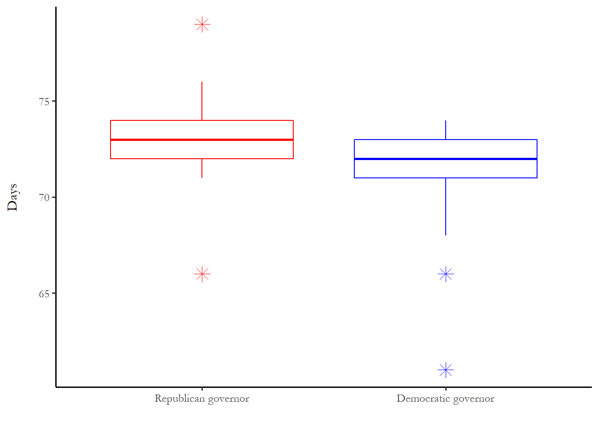

# Duration models


Survival analysis or duration models are distinct from count models.  The distinction takes the form of *duration dependence* - the probability of failure today may be related to the probability of failure in the past. We know that flips of a coin or turns of a card are unrelated – no memory.  We know, on the other hand, that mechanical parts have an increasing probability of failure as they age (people too). One recent text suggests that you use the “whether or when” test to determine if survival analysis is an appropriate technique to use.  If your research question contains the word “when” or “whether,” then you might need to learn about this technique.  Do addicts relapse? Do nurses leave the profession?  When do governments fail?  Are programs terminated?

## Longitudinal data

Survival data analysis offers a convenient empirical strategy to identify features of that lead to success or failure – life or death – of some subject.  Does the program or patient or innovation thrive or fail? 

Prominent in biostatistics, survival data describe the time that a subject (patient or program) comes under observation, the time the subject failed (patient death or program termination), and attributes of the subject during the period of observation.  The empirical objective is to model the time to failure for each subject under observation.

In order to exploit survival data analysis techniques, you must observe subjects for more than one (preferably many more than one) time periods – the typical prescription is three or more waves and a metric for time (months under observation, miles driven for a car).  Survival data analysis is one of several types of “longitudinal data analysis.”   Much of the statistical foundations for this work come out of biostatistics, specifically models that evaluate the efficacy of medical interventions (so the survival time really is the survival time).

### The challenge of censoring {-}

There is one important technical consideration in survival data analysis: censoring.  Consider a clinical trial.  Subjects are recruited so we know with certainty the date that a subject came under observation (when they were given a treatment for the first time, for instance.)  We also know when subjects move out of observation, but this could be due to the end of the trial or experiment.  If the trial ends, we really don't know if they would fully recover or not or when.  The subjects that do not experience the termination event when the period of observation ends are *right-censored.*  Any subject that is right-censored is excluded from a statistical model - more details about the implications of this below.

In many political science applications, we use an observational approach that picks some arbitrary start date.  In this case, we don't know, at the start date, how long each subject has been in the initial state.  This is known as *left-censoring.*

If you ever read medical studies, you might notice that one metric is median survival time (for a cancer therapy, for instance.  We use the median to get around the censoring problem - if you want to figure out the average lifespan of the control and treatment group, you would need to wait until everyone died.  But we can learn the median survival time of the group without treatment (the number of months or years until 50 percent of the group has died) and compare that to the control group.

## The hazard function and survivor function

Box-Steffensmeier and Jones (1997) provide an introduction to the modeling framework and describe the application of duration analysis to political science questions ranging from durations of war to the career paths of members of Congress.  For a thorough technical introduction, see Hougaard (2000).

The core empirical and theoretical concepts are the hazard function and the surivor function.

### What is the hazard function? {-}

A hazard function summarizes the probability that a subject under observation experiences some event at time t, given that they survived until t-1. You can think of two hazard functions that represent opposite extremes - one where the hazard of the event increases with every period a subject survives.  A mechanical part that is subject to wear likely survives the first period, but, over time, the probability of failure increases. The second extreme would be a case where survival in early periods makes survival more likely in later periods - some kind of process that weeds out the weak so the survivors are more and more hardy.

Three hazard functions are reproduced below - the red line shows a typical example of increasing hazards,  the green line is consistent with decreasing hazards - once the subject survives early time periods, then the  hazard diminishes.  The blue line is a constant hazard. We will talk about the parameter values below.  I adapted to figures from @moore2016.


```r

# These examples from Moore (2016) in the Use R! series.   Figure 2.4

weibHaz <- function(x, shape, scale) dweibull(x, shape=shape,scale=scale)/pweibull(x, shape=shape, scale=scale,lower.tail=F)

curve(weibHaz(x, shape=1.5, scale=1/0.03), from=0, to=80,ylab="Hazard", xlab="Time", col="red")
curve(weibHaz(x, shape=1.0, scale=1/0.03), from=0, to=80,ylab="Hazard", xlab="Time", col="blue", add=TRUE)
curve(weibHaz(x, shape=0.075, scale=1/0.03), from=0, to=80,ylab="Hazard", xlab="Time", col="green", add=TRUE)
text(8.0,0.06, expression(alpha == 0.075))
text(50.0,0.035, expression(alpha == 1.0))
text(60.0,0.005, expression(alpha == 1.5))
```


### What is the survival function? {-}

The survival function summarizes the total proportion of subjects that have survived the event - 1.0 in period 0 and, eventually, 0.  Every hazard function has an associated survival function.  The survival functions below are associated with the hazard functions above.  You can see that more than 1/2 of the subjects experience the event at time t=1 for the green hazard function but it takes about 25 periods to see that for the other hazard functions.  For the latter, the median survival time is more than 20 periods.


```r

# These examples from Moore (2016) in the Use R! series.   Figure 2.4

weibSurv <- function(t, shape, scale)
   pweibull(t, shape=shape,scale=scale, lower.tail=F)
curve(weibSurv(x, shape=1.5, scale=1/0.03), from=0, to=80,ylim=c(0,1), ylab="Survival probability", xlab="Time", col="red")
curve(weibSurv(x, shape=1.0, scale=1/0.03), from=0, to=80,ylim=c(0,1), ylab="Survival probability", xlab="Time", col="blue", add=TRUE)
curve(weibSurv(x, shape=0.075, scale=1/0.03), from=0, to=80,ylim=c(0,1), ylab="Survival probability", xlab="Time", col="green", add=TRUE)
abline(h=0.5)
```


## Parametric vs nonparametric approaches

Survival analysis requires several modeling choices, arguably the most important choices are the use of a parametric or nonparametric statistical modeling approach and the appropriate form of the survivor function for a parametric approach.

A nonparametric approach (such as the Cox proportional hazards model) permits estimation with no assumptions about how risk of termination changes over (requiring a more weak and testable assumption of the proportionality of hazard across programs and time).  The nonparametric approach does not, however, permit a graphical representation of the underlying hazard of termination, a useful visualization of the outcomes of interest. 

Parametric models require some assumptions about the distribution that describes the survivor function.  A variety of functional forms can be used and we will just talk about two: the Weibull distribution and the generalized gamma distribution. 

### The Weibull distribution {-}

For an important class of commonly used models, the survivor function is assumed to have a form that makes the associated risk of termination in each period of observation (the hazard function) *monotonic*. Monotonicity implies that risk either increases over time or decreases over time, but forecloses increasing risk the outset and later decreasing risk.  The Weibull distribution is a widely-used for these cases.  The distribution has only two parameters ($\lambda$) and what is known as the scale parameter(1/\alpha$)

$$ h(t)=\alpha\lambda^\alpha t^{\alpha-1}$$
The figures above are examples of the Weibull distribution with $\lambda$ equal to 0.075, 1.0 and 1.5.  The scale parameter in each case is 0.03.

### Generalized gamma distribution {-}

Since (theoretically) the probability of survival could in fact initially increase and then decline in many social science applications, imposing a monotonic hazard function may not not be appropriate.

One of a broader class of  accelerated failure time models,  the generalized gamma distribution is extremely complex, but is very general form that reduce to other distributions as a special case.  It is useful since it is monotonically increasing up to a certain time period, then monotonically decreasing after that.  An example is below.


## An example:terminating federal programs

Are government programs immortal?  Theoretical work on public sector programs seems to offer two very different yet equally well-developed answers to this question.

Since each Congress does not create the structure of the bureaucracy de novo, current programs may not represent the needs of contemporary legislators (the problem of *legislative or coalitional drift*). Or managers of a program may adapt or innovate in ways that frustrate the original architects of the program (*bureau drift*). Either type of drift suggests that, over time, a program or agency may be increasingly out of step with members of Congress and vulnerable to termination. 

Another set of research emphasizes the obstacles that reform-minded politicians or fiscal conservatives face in attempting to abolish public sector programs.  Downs (1966), for instance, makes the explicit claim that "the older a bureau is the less likely it is to die.”   

Certainly both perspectives cannot be descriptively accurate.  Either programs face the credible risk of termination or they do not.  These two perspectives can be distinguished by the answer to a single empirical question:  are hazards of termination highest at program creation (implying that older, surviving programs are difficult to terminate) or does the probability of termination increase over time (implying vulnerability for older programs)?  Estimation and description of the hazard of termination for a sample of federal programs should answer this question.

The hazard function implied by the "program immortality" perspective is summarized in Figure 1, reproduced from @corder2004.


The hazard function implied by the "drift" perspective is summarized in Figure 2.


This application of survival analysis is compelling since the two perspectives imply such different prospects for programs over time, suggesting a crisp empirical test.

### The data

Indicators of program activity used for this project are all federal credit programs (loan or loan guaranteee program) included as entries in the Catalog of Federal Domestic Assistance (CFDA).  The CFDA provides an exhaustive list of all active credit programs exclusive of the off-budget agencies (the Export-Import Bank) and the secondary market programs of the Government-Sponsored Enterprises (GSEs). Federal credit programs described in the CFDA span the cabinet departments, are components of a number of independent agencies and account for the primary activity of one agency, the Small Business Administration. The sample includes all credit programs existing in 1974 and all programs created after 1974.  Termination was identified as the date of last entry in the CFDA.  After that date applications for loans or guarantees were not accepted under the program. 

### The hazard function in this sample

Results reported below are based on a generalized gamma distribution for the survivor function, a conventional way to introduce non-monotonic hazards in a linear survival model.  One of a broader class of  *accelerated failure time models*,  the generalized gamma distribution was the best empirical fit for the survivor function of the credit program data based on the Akaike Information Criteria).  This distributional assumption has absolutely no effect on the substantive results reported in the table below -- the results are the same for a number of different distributional families.  The distributional assumption is important for the graphical representation of the hazard. 

The upshot is the programs face increasing vulnerability until they are about 10 years old, but after that point hazards diminish to practically zero over the long term.  This result has been replicated in a number of contexts by other scholars.  This results suggest that the emphasis on legislative or bureau drift is misplaced.  The empirical reality is that old programs are unlikely to be terminated.


 
## An example: Shelter-In-Place Orders (SIPOs) in the United States

### What explains state variation in timing?

This section reproduces the figures and models for 2020 paper I co-authored that appeared in *Policy Design and Practice*.  We relied on two durations - the time between the WHO announcement of a pandemic (5 January 2020) and the data a state crosses the 1:100,000 threshold for COVID-19 cases per capita, and the time between crossing the threshold and implementation of the first SIPO.

The first chunk, which is not echoed, reads in and manages the data on cases and state characteristics.


### Box plots

The box plots below summarize two different times: time to reach 1:100,000 (time1) and time from 1:100,000 case to implementation (tto3). 

The long delays in the Democratic states are the first cases in the United States - Washington,  Illinois and California. 

The box plot includes eight Republican states with a start date entered as the end of the observation period - to manage right-censoring.



### Kaplan Meier curves

We have discussed parametric approaches to estimating the hazard and survival functions.  One common non-parametric approach just uses sample information abou the proportion of the subjects entering observation that experience an event.  I produce a figure shows the percentage of subjects that experience the event (the survivors are states that do not implement an SIPO so "failure" in this case is implementation or action).  The proportion is reported for each of four groups of states.  This is called a "Kaplan-Meier" curve


### Parametric models 

Weibull models for two durations are below.

Model 1 is time from WHO announcement to 1:100,000
Model 3 is time from 1:100,000 to SIPO for 42 states that implemented SIPOs.  Model 5 includes the eight states that never implemented with an action data of 30 May, the end of the observation period.


##### Time to 1:100,000

Weibull model - predicting the time it takes states to reach 1 case per 100,000 population, based on political and other factors


```

============================================================================
                                                    timetocase              
----------------------------------------------------------------------------
controlDemocratic governor only                      -0.03***               
                                                      (0.01)                
                                                                            
controlRepublican governor only                      -0.05***               
                                                      (0.02)                
                                                                            
controlDemocratic governor and senate                -0.04***               
                                                      (0.01)                
                                                                            
urban                                                -0.0003                
                                                     (0.0004)               
                                                                            
elderly                                               0.002                 
                                                     (0.002)                
                                                                            
taxrevenuepercapita                                  -0.0001                
                                                     (0.0003)               
                                                                            
population                                           -0.0003                
                                                     (0.001)                
                                                                            
Constant                                             4.31***                
                                                      (0.05)                
                                                                            
N                                                       50                  
Log Likelihood                                        -93.18                
chi2                                            32.86*** (df = 7)           
============================================================================
Notes:                                ***Significant at the 1 percent level.
                                       **Significant at the 5 percent level.
                                       *Significant at the 10 percent level.
```
#### Time to SIPO with censored data excluded


```

============================================================================
                                                      tto3_a                
----------------------------------------------------------------------------
controlDemocratic governor only                       -0.24                 
                                                      (0.17)                
                                                                            
controlRepublican governor only                       -0.03                 
                                                      (0.27)                
                                                                            
controlDemocratic governor and senate                 -0.07                 
                                                      (0.21)                
                                                                            
urban                                                 -0.001                
                                                     (0.004)                
                                                                            
elderly                                               0.003                 
                                                      (0.03)                
                                                                            
taxrevenuepercapita                                   -0.003                
                                                     (0.003)                
                                                                            
population                                            0.0001                
                                                      (0.01)                
                                                                            
Constant                                             2.96***                
                                                      (0.71)                
                                                                            
N                                                       42                  
Log Likelihood                                       -121.84                
chi2                                              5.44 (df = 7)             
============================================================================
Notes:                                ***Significant at the 1 percent level.
                                       **Significant at the 5 percent level.
                                       *Significant at the 10 percent level.
```


#### Time to SIPO with censored observations included.


```

============================================================================
                                                   tto3_uncen_a             
----------------------------------------------------------------------------
controlDemocratic governor only                      -1.44***               
                                                      (0.26)                
                                                                            
controlRepublican governor only                      -1.72***               
                                                      (0.40)                
                                                                            
controlDemocratic governor and senate                -1.58***               
                                                      (0.27)                
                                                                            
urban                                                 -0.01                 
                                                      (0.01)                
                                                                            
elderly                                               -0.10*                
                                                      (0.05)                
                                                                            
taxrevenuepercapita                                   0.01**                
                                                      (0.01)                
                                                                            
population                                           -0.05***               
                                                      (0.01)                
                                                                            
Constant                                             5.21***                
                                                      (1.29)                
                                                                            
N                                                       50                  
Log Likelihood                                       -154.28                
chi2                                            47.81*** (df = 7)           
============================================================================
Notes:                                ***Significant at the 1 percent level.
                                       **Significant at the 5 percent level.
                                       *Significant at the 10 percent level.
```

I calculated predicted values for the number of days until the order is implemented.  All variables held equal to the mean:

Republican governor and senate:  51 days
Republican governor and Democratic senate: 10 days
Democratic governor and Republican senate: 9 days
Democratic governor and Democratic senate: 12 days
Republican governor, population 1 million
Republican governor, Democratic senate, population=1 million: 12 
Republican governor, Democratic senate, population=10 million: 7.8

The largest non-political effect is much, much smaller than the effect of partisan control.

## Looking ahead

### Paper 6:  Modeling political activity with the ANES

There RMD shell for paper 6 is available.  You will need to pick an election year and estimate the campaign activity model with Poisson regression, quasi-poisson and a negative binomial regression.  You will interpret the output from one regression and use the same strategy I did, with cplot, to figure out which variables matter more in the election year you choose.


