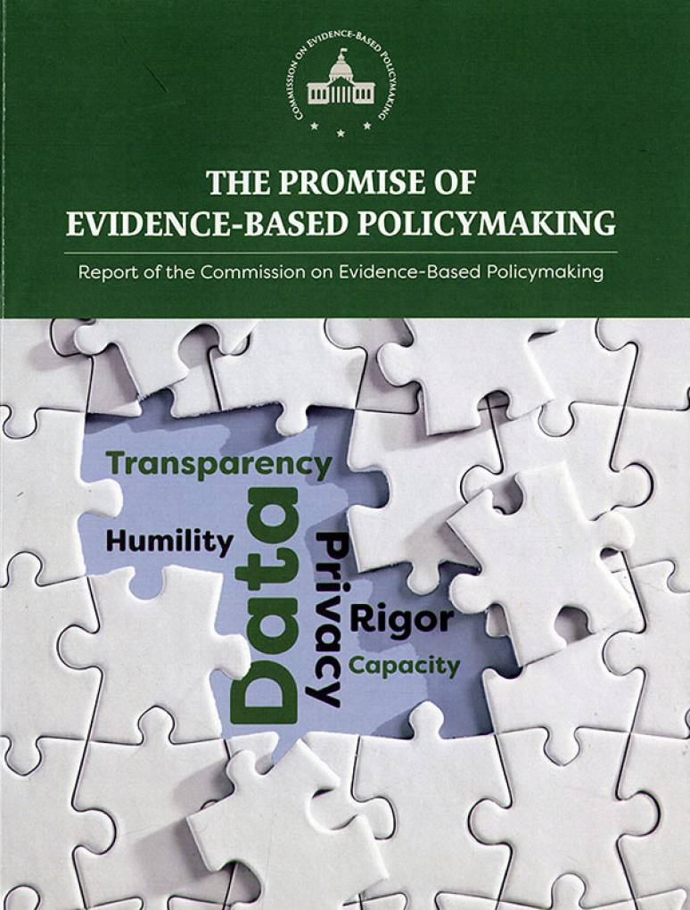

<!-- Run common_r first if using as a Notebook -->---

# Data, models and evidence-based policymaking

## What can we - as political scientists - learn from advances in evidence-based policymaking?

### Data
While there are new and exciting opportunities to use readily available electronic records, there are challenges in matching records from diverse sources, data security is persistent challenge and the centralized collection of information about individuals invites extraordinary surveillance and surveillance by government.

### Models
One thing that unites social science research strategies and evidence-based policymaking is the use of models.  

### Evidence-based policymaking in practice
Research design choices, novel use of data, resources for evaluating evidence.  The research design approach we use - theory applied to problems motivating data collection - is analogous to evidence-based policymaking.  How our research designs (or data collection strategies) borrow from this work?
 
## Data: automation of data collection

### Data collection – manually versus automated (90 testers vs 3,000,000 actual transactions) (Why now?)

More and more information is stored electronically. Data are “captured electronically in the first instance”  Ayers example points out the costs and challenges of data collection – site visits, paper forms, data entry.  Example: interest rate discrimination in new car purchases – data set of three million auto loan transactions – recoding name and other features captured by the lender, merged with CA driver’s license data that includes Social Security Number and race.   This digital data is now a commodity.  And data is frequently stored in ways that permit easy access…
And many organizations are embracing enterprise data solutions 

### What is administrative data? 
How is this different from survey data? Administrative data – routinely collected for non-statistical purposes (efficient to use, broad coverage, timely), readily accessible digital records are key (how can you exploit this).  Example (?): Bank regulation: variety of data available for Financial Holding Companies:  https://www.ffiec.gov/npw/Institution/Profile/2380443?dt=20150101
Sources of administrative data (individual-level records vs. aggregated or reports)  

### Local governments have been innovators

s in the adoption of performance metrics – pervasive data collection.  Can this be scaled to a national level?  Clinton administration initiatives (GPRA) and Bush administration efforts culminated in the PART.  So why didn’t things improve faster?  What was missing?  We need more high quality evidence.  Today; “We don’t keep score, we don’t know what inning it is, but everybody gets a trophy.”  (We will talk about the distinction between performance metrics and evidence of success below)

 
## Data: storage

If data are available, there are still 3 important constraints:
- statistical knowledge: “core regression and randomization techniques” are well-established
- computational power: Computing power has not been a problem for decades
- storage: storage was a limit (compare $50 for a 1TB drive today vs $400 in the book c. 2008)

## Data – matching and integration

### Merging
– both a function of access, freeze/capture/preserve and match – still a challenge – improvements in what Ayers labels database technology is ongoing

### Example: Florida felon matching
– for details, see The United States Civil Rights Commission report on Voting Irregularities in the 2000 Presidential Election.  Chapter 5. The Reality of List Maintenance.    (Why now? 137/8).  

### Federal data infrastructure
 What is optimal arrangement for administrative, survey, and related statistical data series (to reduce the “barriers to the use of already collected data”)
 “A lots of data were kept in isolated “data silos” (@ayres2007:135).  
What does this mean? 
What are the major Federal Statistical Agencies (FSAs) – have you used data from these sources?  See Fedstats and the 13 primary federal statistical agencies
Commission – gains for evidence-building in the near-term are linked to the challenge of secure, private, confidential data access

### Solution:  The Commission

proposed a  “National Secure Data Service” to integrate data for purely statistical purposes (record linkages, privacy, transparency)  Some specific ideas - data about earnings are likely the most vital piece of personal information to share (IRS, SSA)

## Confidentiality and privacy concerns (surveillance)

### Data – privacy 

### Privacy, confidentiality issue at end of why now? – ubiquitous surveillance

## Models

Research design – data-driven decision-making is an alternative driven by responding to anecdotes, complaints, or good ideas.  

The research design process – background, problem, theory, research question, hypothesis, operationalization, methods, evaluate the data.  

One insight from this is that research tends to be problem-driven – you are searching for a solution.  (Streets are flooding more often, crime is up, complaints about park maintenance are up).

Another insight is that we rely on models – a simple representation of outcomes and causes (appeals informally to ideas of covariance or correlation).

The combination of problem statement, theory, and research question should lead you to a specific empirical claim that you can test – wider roads have increased storm-water runoff.
To test these specific empirical questions – we need data – how do we measure the individual components, can we exploit existing data to answer this question?
 
### Why are people bad at making decisions?

What is Moneyball?

Unbiased, unemotional, mechanical (what is a neural network)

Models - dispassionate In determining how a marketing strategy works, a policy works, or a partnership lasts? Or how much movie a money will earn.

Why are human beings bad at making predictions?

- too much weight to unusual events

- selective acceptance or attention to disconfirming evidence.

- overconfident in predictive accuracy

- ...and all of these get worse as problems get more complicated

(For Ayers, a stark contrast to equations – no emotional attachment, specific information about uncertainty)

Why not blend human and machine?  Human discretion at the end of the process wipes out gains from mechanical prediction  Can’t judgement and data coexist?

Problem: judgment of the aided expert is somewhere between the unaided expert and the mechanical prediction.  So the conclusion is that the machine/software should control the decision.

Example: parole decisions.  Marked decline of expert decisions.  RRASOR scores can trigger an involuntary indefinite civil commitment (movie analogy Minority Report).   A Virginia statute mandates that the scores be used – narrowing the discretion of criminal justice experts. But even this limited discretion can lead to mistakes.   What about the thresholds proposed in the text – if more than 10 percent of automatic choices are reversed, then there is a problem with the decisionmakers.  Further, if more than half of the overrides are ultimately wrong, then overrides are too frequent even if only 5 percent.   Example: decline of human component of parole decisions.  VA statue that includes a RRASOR tripwire – mandating involuntary confinement of sexually violent criminal likely to repeat offend
 
## Models:  clinical vs statistical predicions

An argument: Paul Meehl on clinical versus statistical prediction.  Meehl distinguishes informal or non-mechanical judgments from formal or mechanical or statistical – also labeled actuarial- predictions.  The latter require no professional judgements. 

The basic question is whether exposure to some treatment will produce a benefit or generate a cost.  For example…. “if a four-variable regression equation or. . . actuarial table tells the criminal court judge that this particular delinquent will probably commit another felony in the next 3 years and if a case conference or a social worker says he will probably not . . . the plain fact is that [the judge] cannot act in accordance with both of these incompatible predictions.”    

Meehl argues that in an overwhelming majority of cases, the mechanical prediction will be superior.  And others reach similar conclusions. “As long as you have some history and some quantifiable data form past experiences” …the regression will win.

#### Example: Supreme Court challenge

egal scholars vs political scientists.  Models are retrospective – but can they predict future behavior?  The political science team used a simple model - only six factors.

The political science model outperformed the legal scholars expert.   But there was expert judgement (human intervention) in at least two ways – determining the elements of the model and “coding” the cases – capturing the measures that may be somewhat subjective.  (Ayers makes much of the fact that discretion is “channeled” to these narrower functions.)

What about the financial crisis?  What does that suggest about quantitative understanding of risks?

## Role of experts

Data for models

Neural network researcher role: what raw data

Human role – decide what to test and collect data (what data do we collect?)
Threats to professional autonomy

Hypothesize.  X and Z cause Y.  But statistical techniques can confirm the existence and “parameterize” the size of the effect.  In the experimental context (rather than regression), researchers determine what to test – what interventions or treatments?

### Machine learning and neural networks

What are the tools of Moneyball?  

Regression/neural networks – learning from the past

Experimental design- especially nimble low cost adaptation

What is neural network? (a special type of machine learning algorithm).  Neural networks (very large n, complex, multi-equation, nonlinear) ) vs regression (simple, single equation, lower n, linear)

What a neural network looks like:  inputs (observed), layers, and outputs (observed to train, predicted when implemented).

Neural network drawback: identifying impact of single input on predicted outcome 

Neural network risk: what is over-fitting? (same hazard of stepwise regression)

Example:  Epagogix “dispassionate weighting of what works” to identify movie scripts that would generate large box-office revenues.

Data-driven decision making requires results of repeated decisions – so many records of success/failure – millions – to train (large), validate (tune), and test. Why now?

## Evidence-based policymaking

### Evidence-building: history.

What does it mean to use data for a “statistical purpose”? “Statistical activity with is a statistical purpose summarizes information about a group rather than a single individual or organization.” (Promise 11)

History/evolution of evidence-building – 1939 Roosevelt order to coordinate “Federal and other statistical services,” , Add: Employment Act of 1946, GPRA and PART scores, 1960s Defense and Great Society innovations in data analysis (military /  education, human services, health), 2000s CIPSEA – legal authorities

###Community of actors/experts – government, researchers, evaluators – (Promise 12)  See COPAFS (Council of Professional Associations on Federal Statistics)

### Evidence-based practice in other contexts

Evidence-based policymaking draws on experience with evidence-based practice in medicine, education, and management.

### Medicine

The FDA requires random clinical trials of a particular form evaluated in a particular way – a very strict protocol to demonstrate safety and efficacy.   Advocates of evidence-based medicine argue that similar practices should determine a much wider set of health care choices.  One major innovation in medical education involves the idea of continuous education – integrating the latest data and evidence.

#### Education

What curriculum, hiring policies, discipline policies, or other practices produce the best outcomes?  Education relies extensively on large statistical studies – using standardized exams.   Critics point to two major challenges – defining what outcomes constitute a good education and, more importantly, recognizing that if the absence of random assignment, parent, teacher and community factors may overwhelm policy or practice changes. 

#### Management

Much of the management literature is grounded in personal experience and cliché. 

Evidence-based management has embraced a variety of methods – less wedded to experimental design.

Challenges for public management.  What do public managers do – personnel (hire/fire), budgets, monitoring, contract administration, customer service.   So public managers need to know how to survey customers, evaluate evidence-based claims, and conduct their own research.
 
###  The legacy of performance management

What is the performance management movement and how is that different from Moneyball for Government?  (Moneyball emphasizes statistical models and experiments, performance management is more narrowly data or measurement)

Exploiting performance measures, an example:  Accurate and timely intelligence, rapid deployment, effective tactics, relentless follow-up – the four principles behind CompStat, a “major innovation in American policing” that led to a citywide implementation of performance indicators in Baltimore CitiStat and spilled over into Rudi Guilliani’s vision of more nimble federal government.  At its core, CompStat is a leadership strategy.

Collecting the data.  The search for data is driven by two needs – analytical and motivational – what can we analyze?  How can we motivate people to embrace improvements?    The availability of data varies widely – police produce reports – collect data – routinely.  In other agencies, performance measure are more obscure or difficult and expensive to record.  But even the police department may not analyze data daily or even weekly.  All organizations keep at least two forms of data – internal administrative and external reporting data.  So that is a start. 

The Moneyball comparison might not be appropriate – in baseball, the purpose is clear: win games and the rules are specific, enforced and rarely subject to change.  Neither describes government. How do you craft a meaningful metric that is “correlated with the organization’s purpose and relatively easy to obtain”?  (Robert Behn describes the hazard of maximizing performance on metrics that do not capture the organization’s mission – and related problems of corruption and distortion – the “Campbell effect”)

Dials, Tin Openers and Alarm bells.  Performance indicators can be prescriptive, descriptive, and proscriptive (requiring immediate action to stop some behavior).  Robert Behn claims most performance metrics are tin openers  “opening a can of worms” that might suggest a performance deficit exists.

Inputs, outputs, outcomes.  Outcomes data suffer from two problems – they are rarely timely (decades to fruition) and they are difficult to attribute (other factors can generate changes in the metric).  “Output data is timely and controllable substitute” (Note that this is another difference between performance management and Moneyball approaches)

Performance measurement is the first step in performance management.

Learning by asking questions.  How are we performing?  What is working?  What are our deficits?  What innovations are possible?  This is the core of performance management but only the starting point for evidence-based management.
 
### Evidence-based policymaking:  the role of experiments

One proposal from Money ball is to follow the lead of business to create low cost high impact interventions (like the Google marketing strategies) – test a change in procedure in random sample of program participants, 

One example:  specific successes of the Nurse Family Partnership (3 site randomized trials with women diverted to NFP onsite program or offered opportunities for screening and treatment referral – among the findings, from the Denver site,  “3.6% of nurse-visited children scored in the borderline or clinical range for internalizing problems, such as depression and anxiety, versus 8.2% of control-group children. This difference was statistically significant at the 0.10 level, but not the 0.05 level.).”

For the authors, evidence-based governance is an fiscal, economic and moral imperative – use limited resources to close the achievement gap between low and high SES children.

### Evidence-based policymaking: solutions

A moneyball index.  (Congress has apparently adopted top tier evidence guidelines – see toptierevidence.org and GAO report number GAO-10-30 entitled 'Program Evaluation: A Variety of Rigorous Methods Can Help Identify Effective Interventions' which was released on November 23, 2009. Specific language in a 2007 HHS authorization:  “ensure that states use the funds to support [home visiting program] models that have been shown, in well-designed randomized controlled trials, to produce sizeable, sustained effects on important child outcomes, such as abuse and neglect.)  But the authors caution we should think continuum not on/off  - don’t simply sort programs keep or kill, but use the data to improve performance.  
Another idea is to build a clearinghouse to share results (see evidencebasedprograms.org) Search “Postsecondary” at http://ies.ed.gov/ncee/wwc/) 

The Commission proposed funding and Chief Evaluation Officers for departments and programs.  This is consistent with the Moneyball prescription to divert 1% of all program funding to evaluation.

This suggests a new objective for a graduate PA or PSCI methods course:   a primary objective of the course is to enable you to (1) determine when it might make sense to undertake some form of statistical analysis,  (2) determine if a consultant might  be required and how to evaluate consulting proposals, and (3) to evaluate and understand products a statistical consultant might produce.
