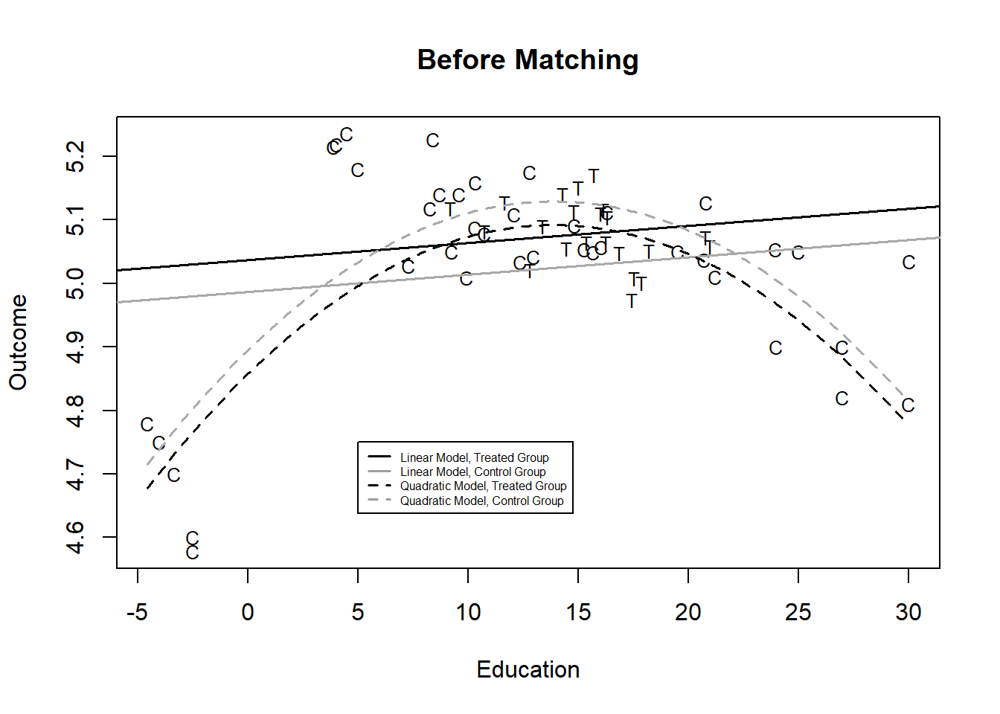
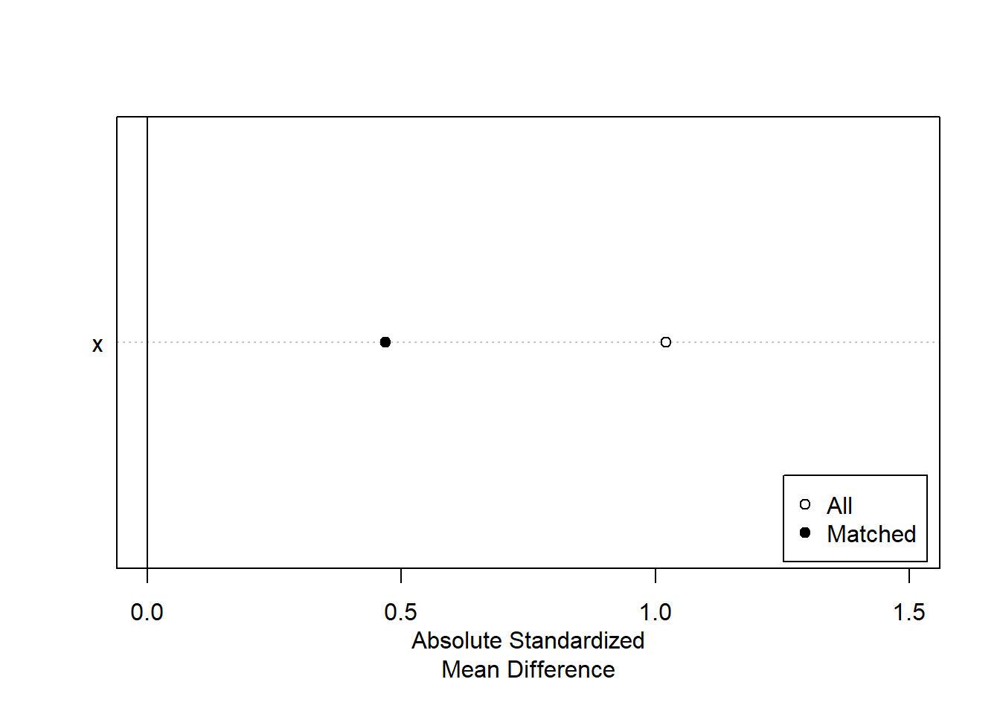
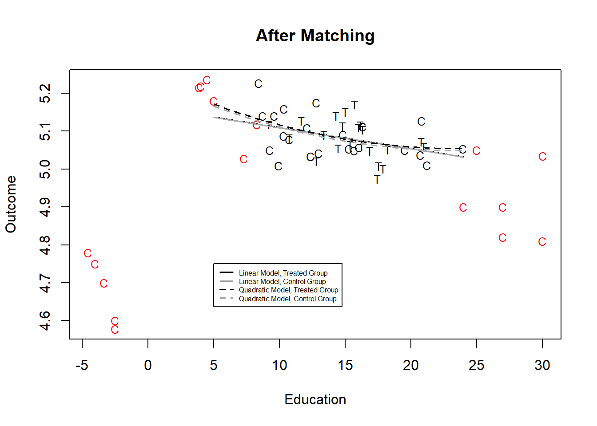
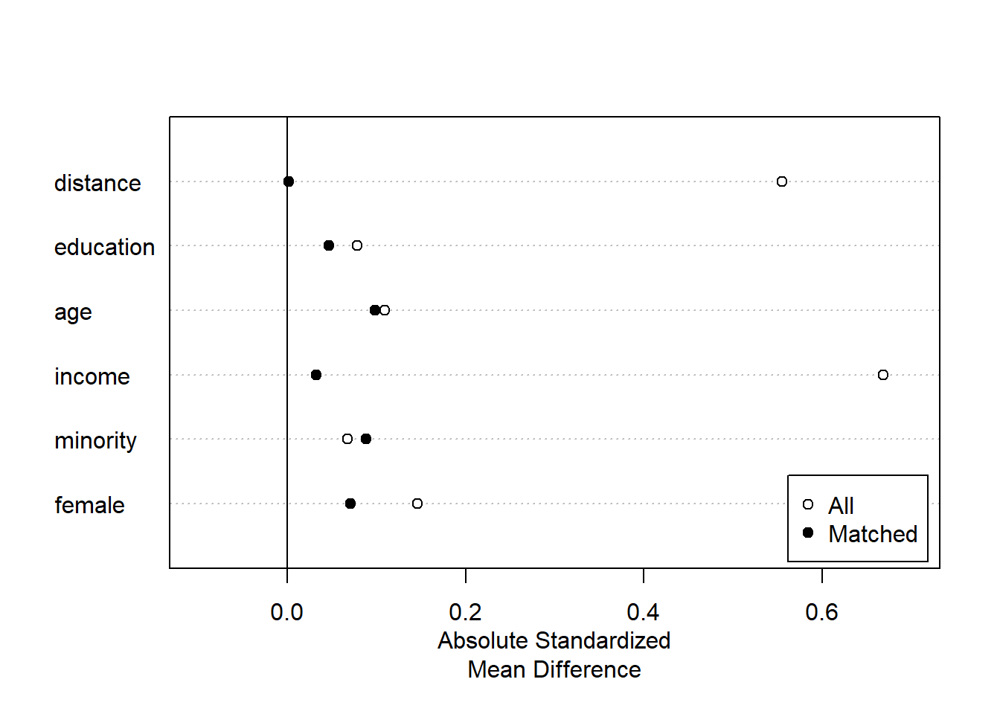
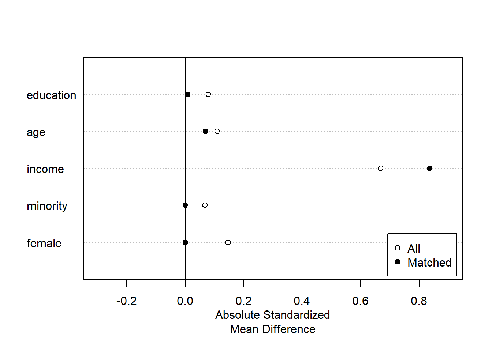
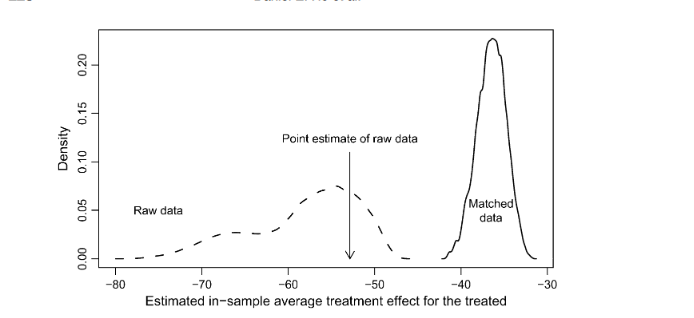
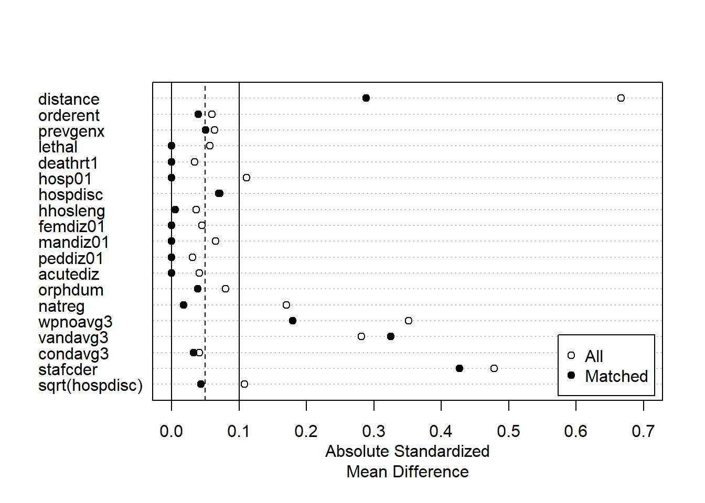
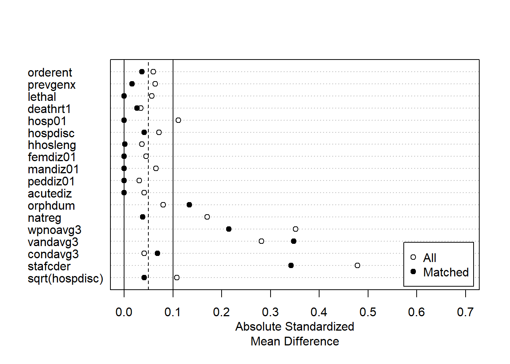

# Matching {-}

## What is matching?

Matching is an approach to estimating treatment effects or causal effects by pruning data to create treatment and control groups that are very similar.  

We know that observational data (distinct from experimental data) involves non-random assignment to control and treatment groups, so there could be some variable that is related to whether or not you are in treatment group and related to the level of the outcome variable. If this is the case and we neglect to control for that variable, then our estimate of the impact of the treatment effect will be biased.  Matching involves making sure that the treatment and control groups have very similar levels of the various observed control variables - to ensure that the groups are as similar as possible in order to isolate the effect of the treatment variable or key predictor we are interested in. 

The regression discontinuity designs followed a similar logic, focusing on a subset of observations near some arbitrary threshold. Matching doesn't require the quasi- or natural experiment design.  It can be applied to any observational data.

## Describing treatment effects

We will use the same language or conventions to describe data and outcomes as we used last week.   In experiments, we are interested in observing and measuring some outcome in order to estimate a treatment effect.  We are simply interested in the difference in the outcome variable Y~i~ for people who did and did not receive the treatment.  For the examples and equations below, T~i~ will represent the treatment. The average treatment effect is simply the difference between the expected value of the outcome for people who did receive the treatment and the expected value of the outcome for people who did not receive the treatment.


$$\text{Average Treatment Effect} =  E(Y_i\vert T_i=1) -  E(Y_i\vert T_i=0)$$

In this context, work on matching carefully distinguishes between pre-treatment differences (both measured and unmeasured) and post-treatment differences.  The idea is that we need to take into account and control for relevant pre-treatment differences when we calculate the average treatment effect.

As was the case last week, we consider a classical randomized experiment as an ideal type. In this context, individual observations are randomly sampled from a population, assignment to treatment and control groups is random, and the sample size is large.  This means we avoid both selection bias (sample deviating from population) and omitted variable bias (since nothing will covary with the treatment assignment).

Observational research can fail to meet any of these criteria - we may have selection bias (a function of how we selected cases to observe and measure), we may have omitted crucial variables X~i~ which influence both T~i~ and Y~i~ and we may have relatively few opportunities to observe (small n).  

On top of the three features above, we also are imposing some other assumptions - that none of the pre-treatment covariates are a function of T, that units are independent of each other (no spatial or temporal correlation) and that the treatment intensity is the same across all units.

In experimental or observational contexts, we can attempt to estimate the average treatment effect by including the treatment indicator and the pre-treatment covariates in one model.

This looks like the *differences estimator with additional regressors,* introduced in the chapter on quasi-experiements, but we are recognizing that treatment T~i~ is not randomly assigned so it is not independent of the the pre-treatment characteristic X~i~ and we are not imposing a linear functional form.

$$Y_i = f(T_i, X_i)$$


## Why use matching?

@hiks2007 make the case that matching can dramatically reduce what they label *model dependence.*  The idea is that when we try to estimate the effects of some T on some Y we have to make many choices about model specification (which covariates?), functional form (OLS or count model?), and how variables are transformed (logs or squares or interaction terms).  All of these choice imply an impossibly large number of permutations, but we typically only report and publish a handful of alternatives.  

There is a pernicious dynamic at work here:  researchers may bias results by picking a specification that returns estimates that confirm their expectations. @king_nielsen_2019 explain: "The tendency to imperceptibly favor one’s own hypotheses, or to be swayed in unanticipated directions even without strong priors, is unavoidable. People do not have easy access to their own mental processes and they have little self-evident information to use to avoid the problem ... To make matters worse, subject matter experts overestimate their ability to control their personal biases more than nonexperts, and more prominent experts are the most overconfident ... Moreover, training researchers to make better qualitative decisions based on empirical estimates when there exists little information to choose among them scientifically is unlikely to reduce bias even if taught these social-psychological results." (cites omitted)

As an example, @hiks2007 construct a dataset with three variables - an outcome (Y~i~, the outcome), a dummy treatment variable (T~i~) and a single covariate X~i~, education) that is related to treatment.  They estimate the treatment effect using two approaches, first OLS - a linear model - and then a quadratic, nonlinear model (by adding a squared X term). The difference in intercepts in each case is our estimate of the treatment effect.  You can see in Figure 1 that the two functional forms - quadratic and linear - when applied to the entire set of data - yield two very different estimates of the effect of treatment - the treatment effect is positive when we use a linear model and negative when we use a quadratic fit. 




You can probably guess the source of the problem here - all of the treated individuals are in the middle of the distribution of X, while we have control subjects at the extremes.  So we are only observing the effect of treatment in a narrow range of $X$.  This is labeled a *common support* problem and one simple fix is to exclude any observations in the control group where X is lower than minimum X observed in the treatment group or X is higher than the maximum X observed in the treatment group.
## How matching works

Matching means trimming or pruning the data to balance our treatment and control group.  You can see that the treatment and control have a much different distribution on the key covariate above.  We will use the `MatchIt` package to generate an 1:1 match between each treated observation and one control. 

In this case, we have many more controls than treated observations, so 1:1 matching means excluding many control observations.  

Recall that one of the prescriptions for data collection to improve causal inference is to maximize the variation in X, so we are making a trade-off between reducing bias and reducing efficiency.  More observations means more efficiency, but fewer observations means more balance between the control an d treatment groups.

The output below reports the results of the matching, comparing the values of X for the treatment and control groups for all data and for the matched data.  You can see that the control group mean on X was 12.59, much lower than the treatment group, but matching reduced that difference by 54%, by elimnating 22 observations that did not have a match in the treatment group.  We can summarize this improvement in a simple figure.


```r
# Identify a match object and match using nearest neighbor method without propensity scoring - this is a different match method from the original article
temp <- matchit(t ~ x, data=dta, method="nearest", distance="mahalanobis")
matched <- match.data(temp)
summary(temp)

Call:
matchit(formula = t ~ x, data = dta, method = "nearest", distance = "mahalanobis")

Summary of Balance for All Data:
  Means Treated Means Control Std. Mean Diff. Var. Ratio eCDF Mean eCDF Max
x       15.5392       12.5973          1.0206     0.0927    0.2077   0.4161


Summary of Balance for Matched Data:
  Means Treated Means Control Std. Mean Diff. Var. Ratio eCDF Mean eCDF Max
x       15.5392       14.1854          0.4696     0.3878    0.1182   0.3636
  Std. Pair Dist.
x          0.8685

Percent Balance Improvement:
  Std. Mean Diff. Var. Ratio eCDF Mean eCDF Max
x              54       60.2      43.1     12.6

Sample Sizes:
          Control Treated
All            39      22
Matched        22      22
Unmatched      17       0
Discarded       0       0
frame()
plot(summary(temp), threshold=NA, xlim=c(0, 1.5))
```



The figure below reproduces the estimate of the treatment effect using the matched data, excluding the observations identified in red.

The estimates, using either functional formal, suggest that there is no treatment effect. So, in this case we reduced the variation in X in our sample, but improved our estimate.


```r
# Linear model - matched data
lm.m1 <- lm(y ~ t+x, data=matched)


# Quadratic model - matched data
lm.m2 <- lm(y ~ t+x+I(x^2), data=matched)

plot(matched$x[matched$t==1], matched$y[matched$t==1],
     pch="T", xlab="Education", ylab="Outcome", xlim=range(dta$x),
     ylim=range(dta$y), cex=0.8, main="After Matching")
points(matched$x[matched$t==0], matched$y[matched$t==0], pch="C", cex=0.8)
points(dta$x[temp$weights==0 & dta$t==0],
       dta$y[temp$weights==0 & dta$t==0],
       pch="C", col="red", cex=0.8)
lines(plot.pts2, lm.m1$coef[1] + lm.m1$coef[2] + lm.m1$coef[3]*plot.pts2, lty=1, lwd=1.5)
lines(plot.pts2, lm.m1$coef[1] + lm.m1$coef[3]*plot.pts2, lty=1, col="darkgrey", lwd=1.5)
lines(plot.pts2, lm.m2$coef[1] + lm.m2$coef[2] +
      lm.m2$coef[3]*plot.pts2 + lm.m2$coef[4]*plot.pts2^2,
      lty=2, lwd=1.5)
lines(plot.pts2, lm.m2$coef[1] + lm.m2$coef[3]*plot.pts2 +
      lm.m2$coef[4]*plot.pts2^2, lty=2, col="darkgrey", lwd=1.5)
legend(5, 4.75, lty=c(1, 1, 2, 2), col=c(1, 8, 1, 8), lwd=1.5,
       legend=c("Linear Model, Treated Group",
         "Linear Model, Control Group",
         "Quadratic Model, Treated Group",
         "Quadratic Model, Control Group"), cex=0.5)
```



### The method of matching matters

In the example above, we simply used one covariate, but we could have (and often have) situations where the treatment group and control group are different in several ways - you could imagine a case where the control group was higher education or higher income or more likely to live in urban areas or all of these. 

In order to match in these situations MatchIt employs a logistic regression to calculate a *propensity score* - the probability of being part of the treatment group based on the covariates.  We can then match observations with similar levels of the propensity score - implying similar levels on the covariates. 

Recent work, @king_nielsen_2019, suggests that propensity scoring can result in cases that are not ideal matches - like pairing two observations with a similar propensity score where one person has high income and low education and the other has low income and high education.  We calculate the same propensity score for very different subjects.  While the default in MatchIt is to use this prospensity scoring approach, we can use other, preferred approaches in the same package.  

Here are three options:

- matchit(y~x1+x2, data=data) 
- matchit(y~x1+x2, data=data, method="nearest", distance="mahalanobis")
- matchit(y~x1+x2, data=data, method="genetic")

The first method is nearest neighbor based on propensity scores, the default and the most widely used in the literature.  The Mahalanobis distance matching method measures each covariate imbalance individually, rather than aggregating to a propensity score.  The genetic matching method borrows from both.  It is easy to do each of these, to test the sensitivity of the results to the matching method - each approach will prune different observations.

## Two applications

### Union membership and campaign activity

To continue with a simple example, consider the model of turnout we used early in the term - we predicted the probability of turnout based on age, education, income, gender and race.  What about the effect of living in a union household?  You might expect a member of union household to be mobilized or engaged and more likely to vote.   We could test that with logistic regression, controlling for a variety of other controls.  I did not echo the code chunk that reads the ANES data, but it is visible in the RMD file.


The code chunk below selects the 1992 presidential election year, creates a subset of just the variables we are interested and drops any observation with missing values for any variable.  The `drop_na()` function requires the **tidyverse** package.  

The table reports the results of four regressions - all logit - with different control variables added.

The effect of union is positive in each case, but the size of estimated effect varies across model specifications.  We would need to convert the logistic to a proportion or probability to see exactly the size of effects implied.


```r
# filter to select 1992
temp1 <- anes %>% filter(VCF0004==1992)  %>% select(turnout, age, education, income, union, minority, female) %>% drop_na()


# estimate a logistic regission  of turnout 

model1<-glm(turnout~union, data=temp1, family=binomial(link = "logit"))

model2<-glm(turnout~union+education, data=temp1, family=binomial(link = "logit"))

model3<-glm(turnout~union+education+age+income, data=temp1, family=binomial(link = "logit"))

model4<-glm(turnout~union+education+age+income+minority+female, data=temp1, family=binomial(link = "logit"))

stargazer(model1, model2, model3, model4, style="qje", type="text" , omit="factor" , dep.var.labels = c("Turnout", "\n"), digits=3)

===========================================================
                                   Turnout                 
                      (1)        (2)       (3)       (4)   
-----------------------------------------------------------
union              0.772***   0.742***  0.526***  0.540*** 
                    (0.165)    (0.171)   (0.179)   (0.179) 
                                                           
education                     0.482***  0.532***  0.529*** 
                               (0.035)   (0.044)   (0.044) 
                                                           
age                                     0.040***  0.039*** 
                                         (0.004)   (0.004) 
                                                           
income                                  0.380***  0.383*** 
                                         (0.057)   (0.059) 
                                                           
minority                                           -0.120  
                                                   (0.135) 
                                                           
female                                              0.174  
                                                   (0.119) 
                                                           
Constant           1.034***   -0.732*** -3.638*** -3.678***
                    (0.055)    (0.132)   (0.281)   (0.310) 
                                                           
N                    2,025      2,025     2,025     2,025  
Log Likelihood    -1,108.069  -998.532  -912.627  -911.201 
Akaike Inf. Crit.  2,220.137  2,003.064 1,835.254 1,836.402
===========================================================
Notes:               ***Significant at the 1 percent level.
                      **Significant at the 5 percent level.
                      *Significant at the 10 percent level.
```

The code chunk below creates the matched data set, pairing up each relatively rare union household with a non-union household that has similar levels of the covariates.  The summary of the matchit object - this time presented as a figure - compares the treatment and control groups - look at the mean of income for the treatment and control groups in all of the data - the union households are much higher.  Compare that difference to the difference between the treatment and control groups in the matched sample.  Matching dramatically reduces the difference for every characteristic except minority (see "Percent Balance Improvement").

I used both the propensity scoring approach and the Mahalanobis
 distance approach and you can compare how the different matching methods improve balance or not.  In this case, I think the propsenity matching is superior, so I will report those results.
 

```r
matched <- matchit(union ~education+age+income+union+minority+female, na.action=na.exclude, data=temp1)
temp2 <- match.data(matched)
plot(summary(matched), xlim=c(-0.1, 0.7), threshold=FALSE)
```



```r


matched_m <- matchit(union ~education+age+income+union+minority+female, na.action=na.exclude, data=temp1, distance="mahalanobis")
temp3 <- match.data(matched_m)
plot(summary(matched_m), xlim=c(-0.3, 0.9), threshold=FALSE)
```



We can compare our estimates with logistic regression using the matched data.  You can see that the estimate of the effect of being in a union household is now entirely robust to the inclusion or exclusion of covariates.  Not nearly as much model dependence. (There is a bit of sleight of hand here and some researchers have picked up on this - our estimates are now dependent on the covariates that we use to match and the matching method, so a different set of variables used for the propensity score will result in a different set of matched pairs.)  There is a recent piece that suggests ways to pick across alternative matching approaches (@king2017)


```r
model1<-glm(turnout~union, data=temp2, family=binomial(link = "logit"))

model2<-glm(turnout~union+education, data=temp2, family=binomial(link = "logit"))

model3<-glm(turnout~union+education+age+income, data=temp2, family=binomial(link = "logit"))

model4<-glm(turnout~union+education+age+income+minority+female, data=temp2, family=binomial(link = "logit"))

stargazer(model1, model2, model3, model4, style="qje", type="text" , omit="factor" , dep.var.labels = c("Turnout", "\n"), digits=3)

===========================================================
                                   Turnout                 
                     (1)        (2)        (3)       (4)   
-----------------------------------------------------------
union              0.456**    0.446**    0.462**   0.479** 
                   (0.206)    (0.212)    (0.221)   (0.223) 
                                                           
education                     0.455***  0.499***  0.489*** 
                              (0.075)    (0.086)   (0.086) 
                                                           
age                                     0.047***  0.046*** 
                                         (0.008)   (0.008) 
                                                           
income                                  0.583***  0.597*** 
                                         (0.131)   (0.134) 
                                                           
minority                                           -0.253  
                                                   (0.250) 
                                                           
female                                              0.334  
                                                   (0.226) 
                                                           
Constant           1.350***    -0.344   -4.376*** -4.450***
                   (0.134)    (0.290)    (0.683)   (0.724) 
                                                           
N                    680        680        680       680   
Log Likelihood     -311.285   -289.659  -264.559  -262.960 
Akaike Inf. Crit.  626.569    585.318    539.119   539.920 
===========================================================
Notes:               ***Significant at the 1 percent level.
                      **Significant at the 5 percent level.
                      *Significant at the 10 percent level.
```
<br>

### FDA drug approval times

One of the works replicated in the matching piece, @dc2002, is from the bureaucratic politics literature. Carpenter uses a duration model of the form we looked at a few weeks ago to investigate determinants of the time it takes for the FDA to approve new drug.  The dataset consists of drugs waiting for approval and predictors include features of the disease the drug is intended to treat, the intensity of interest group activity related to the disease, media coverage, as well as the political environment (with a central expectation that Republican influence will speed up drug approval times).

Carpenter ultimately finds that it is disease characteristics, media and interest group activity that explain delays or action, rather than Republican or Democratic control of key parts of Congress.  In fact, he finds (and only gives cursory attention to) a Democratic majority in the Senate is associated with faster approval times.  The results are summarized in the table below, from the piece. Notice that the coefficient in Democratic Senate Majority is negative and significant, so a shorter approval time.

The bold-faced effects are the most consistent and substantively important: incidence and severity of disease, as well as media coverage and the number of groups (a quadratic).


@hiks2007 demonstrate that changes to modeling choices generate substantial uncertainty about the Senate Democratic Majority effect if we use the entire dataset.   But, by employing matching, they are able to reduce the model dependence substantially.  The impact of matching is summarized in the figure below.  



We can replicate the original estimate and test the effect of alternative matching strategies to see if we can get a more balanced set of data than the approach using propensity scores in the article. The figures suggest (and this is a judgment call) that the second method results in a more balanced dataset.


```r
# Slimmed down just to show how matching works

## data
data <- read.table("data/FDA-Carpenter.csv.txt", header=T, sep=",")

## democratic senate as the treatment variable
data$treat <- data$demsnmaj

## rescaling
data$hospdisc <- data$hospdisc/100000
data$natreg <- data$natreg/100
data$stafcder <- data$stafcder/100
data$prevgenx <- data$prevgenx/100
data$hhosleng <- data$hhosleng/10
data$condavg3 <- data$condavg3/10
data$orderent <- data$orderent/10
data$vandavg3 <- data$vandavg3/10
data$wpnoavg3 <- data$wpnoavg3/100

## Democratic senate
spec <- treat ~ orderent  + prevgenx  + lethal +
  deathrt1 + hosp01 + hospdisc + hhosleng + femdiz01 + mandiz01 +
  peddiz01 + acutediz + orphdum + natreg  +  wpnoavg3 +
  vandavg3 + condavg3 + stafcder + sqrt(hospdisc) 

m1.out <- matchit(spec, method = "nearest", data = data,
                 discard="both", exact=c("acutediz", "peddiz01", "hosp01",
                                   "lethal", "femdiz01", "mandiz01"))

plot(summary(m1.out), xlim=c(0,0.7))
```



```r

m2.out <- matchit(spec, method = "nearest", distance="mahalanobis", data = data, exact=c("acutediz", "peddiz01", "hosp01",
                                   "lethal", "femdiz01", "mandiz01"))
plot(summary(m2.out), xlim=c(0,0.7))
```



### Estimating the lognormal duration model with 3 samples

With the full data set and two matched datasets, we can estimate the model using a specification and functional form very close to the published work.  The estimates from three duration models - the full model, the propensity score matched data, and the other matched data - are reported below.


```r
library(survival)
fullmodel <- survreg(Surv(acttime, d) ~ treat + orderent  +prevgenx  + lethal + deathrt1 + hosp01 + hospdisc + hhosleng +femdiz01 + mandiz01 + peddiz01 + acutediz + orphdum + natreg + wpnoavg3 + condavg3 +vandavg3 + stafcder + I(natreg^2), dist="lognormal", data=data)


m1.data <- match.data(m1.out)
model1 <- survreg(Surv(acttime, d) ~ treat + orderent  +prevgenx  + lethal + deathrt1 + hosp01 + hospdisc + hhosleng +femdiz01 + mandiz01 + peddiz01 + acutediz + orphdum + natreg + wpnoavg3 + condavg3 +vandavg3 + stafcder + I(natreg^2), dist="lognormal", data=m1.data)

m2.data <- match.data(m2.out)
model2<- survreg(Surv(acttime, d) ~ treat + orderent  +prevgenx  + lethal + deathrt1 + hosp01 + hospdisc + hhosleng +femdiz01 + mandiz01 + peddiz01 + acutediz + orphdum + natreg + wpnoavg3 + condavg3 +vandavg3 + stafcder + I(natreg^2), dist="lognormal", data=m2.data)

stargazer(fullmodel, model1, model2, style="qje", type="text" , digits=2)

=======================================================
                               acttime                 
                    (1)           (2)          (3)     
-------------------------------------------------------
treat            -0.41***       -0.21*       -0.45***  
                  (0.11)        (0.12)        (0.13)   
                                                       
orderent          0.14**        0.18***       0.13*    
                  (0.06)        (0.07)        (0.08)   
                                                       
prevgenx          0.17***        0.11         0.20**   
                  (0.06)        (0.07)        (0.08)   
                                                       
lethal             0.07          -0.05         0.13    
                  (0.19)        (0.23)        (0.26)   
                                                       
deathrt1         -0.54***       -0.44**      -0.55**   
                  (0.21)        (0.21)        (0.23)   
                                                       
hosp01             0.003         -0.10        -0.19    
                  (0.20)        (0.23)        (0.26)   
                                                       
hospdisc          0.15***       0.15***      0.19***   
                  (0.04)        (0.05)        (0.06)   
                                                       
hhosleng           -0.07         -0.01        -0.03    
                  (0.15)        (0.16)        (0.18)   
                                                       
femdiz01          -0.54*        -0.56*        -0.51    
                  (0.30)        (0.31)        (0.33)   
                                                       
mandiz01           -0.13         0.04         -0.03    
                  (0.33)        (0.35)        (0.38)   
                                                       
peddiz01           -0.21         -0.21        -0.35    
                  (0.37)        (0.39)        (0.43)   
                                                       
acutediz           -0.15         -0.20        -0.16    
                  (0.19)        (0.22)        (0.23)   
                                                       
orphdum           -0.32*         -0.22        -0.37*   
                  (0.18)        (0.18)        (0.21)   
                                                       
natreg            2.08***       1.88**       2.42***   
                  (0.68)        (0.84)        (0.84)   
                                                       
wpnoavg3         -0.50***      -0.83***      -0.74***  
                  (0.12)        (0.15)        (0.16)   
                                                       
condavg3           0.20         0.77***       0.41**   
                  (0.16)        (0.25)        (0.19)   
                                                       
vandavg3           0.10          0.11          0.13    
                  (0.13)        (0.15)        (0.15)   
                                                       
stafcder         -0.21***      -0.16***      -0.21***  
                  (0.02)        (0.03)        (0.03)   
                                                       
I(natreg2)       -1.01***        -0.85       -1.27**   
                  (0.38)        (0.64)        (0.53)   
                                                       
Constant          6.13***       5.44***      6.18***   
                  (0.39)        (0.45)        (0.50)   
                                                       
N                   408           306          312     
Log Likelihood   -1,224.86      -973.75      -955.59   
chi2 (df = 19)   200.57***     134.73***    156.01***  
=======================================================
Notes:           ***Significant at the 1 percent level.
                  **Significant at the 5 percent level.
                  *Significant at the 10 percent level.
```

To some extent we are back where we started, the size of the estimated effect depends on the matching method.  But at least you can select the matching method in an honest way - by evaluating balance - before you check to see what is significant or not.

## Looking ahead: multi-level modeling

Multi-level modeling exploits situations where you have observations nested in a hierarchy - individuals observed in neighborhoods, that are part of cities, nested in counties, nested in states, for instance.  

We could include variables from various levels in our individual-level model. The top-level data can help improve our lower-level, individual-level, estimates.

One focus of class will be a recent piece on the US congress: @park2021

This piece is interesting and useful for a couple of reasons and merits a careful read:

- The work is nicely located in the literature on Congress.  If you are working on the reading list in American politics for your comprehensive exam, you will see several classic and recent work from the list.

- The dependent variable - grand-standing - is a meticulously crafted measure that uses congressional statements and machine learning to identify when members of Congress are engaged in message politics.

- The modeling strategy uses multi-level approaches, leveraging the fact that individual members are in committees, and in particular Congresses.  (And there is also an application of matching)

All of the replication data and R code are available at the Harvard Dataverse.
