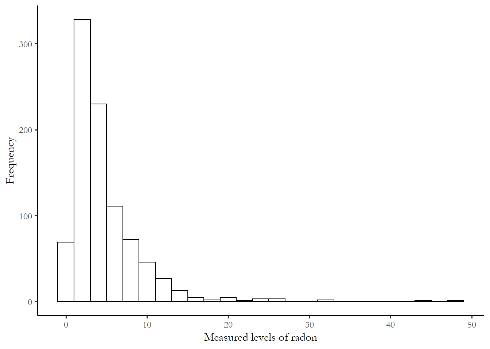
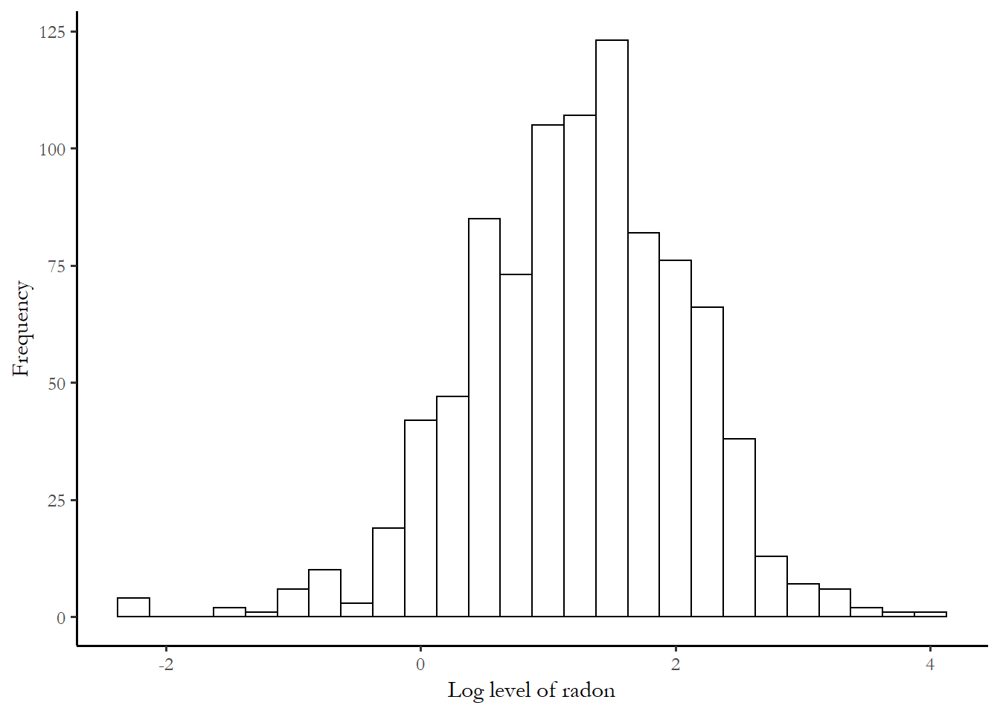
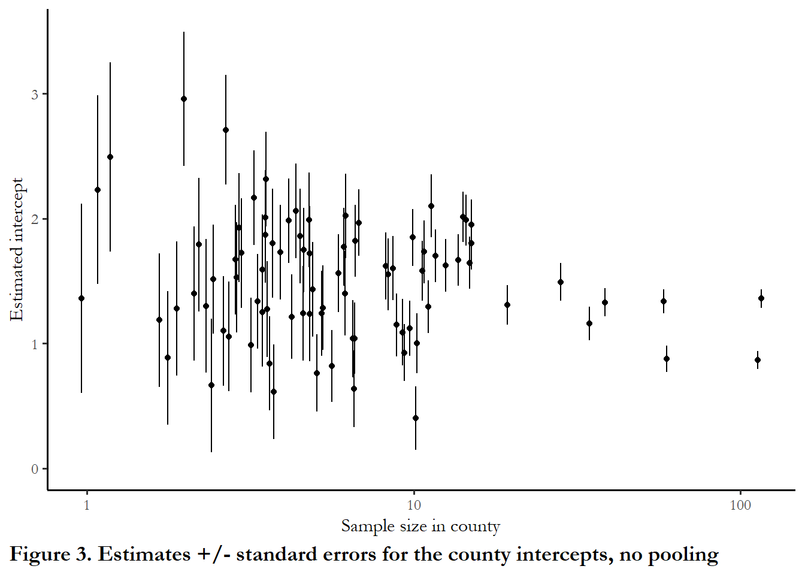
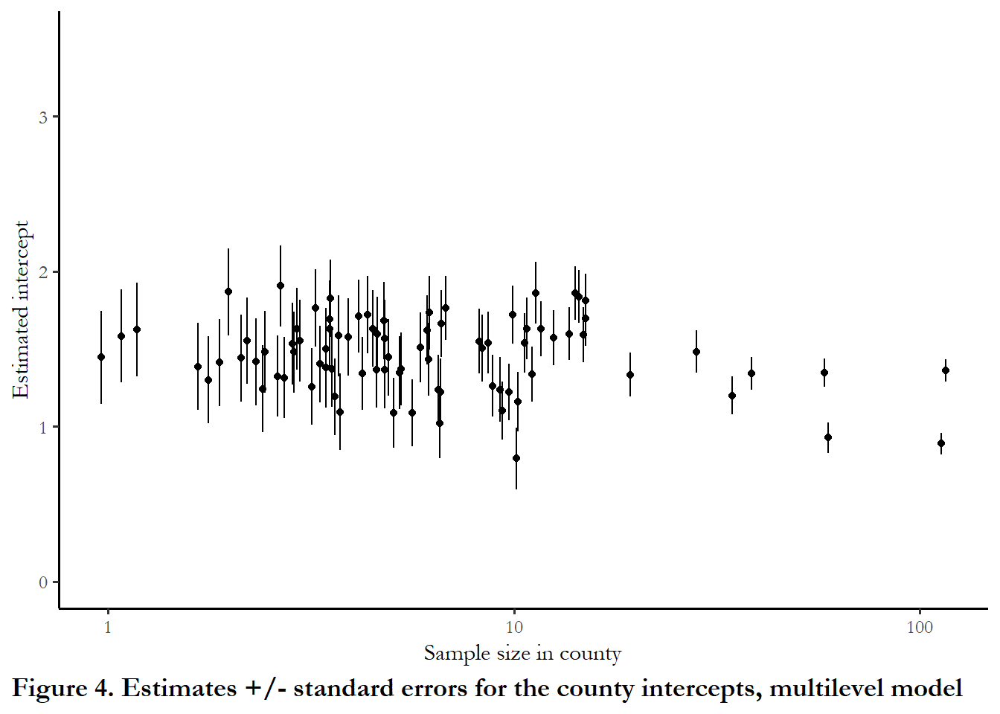
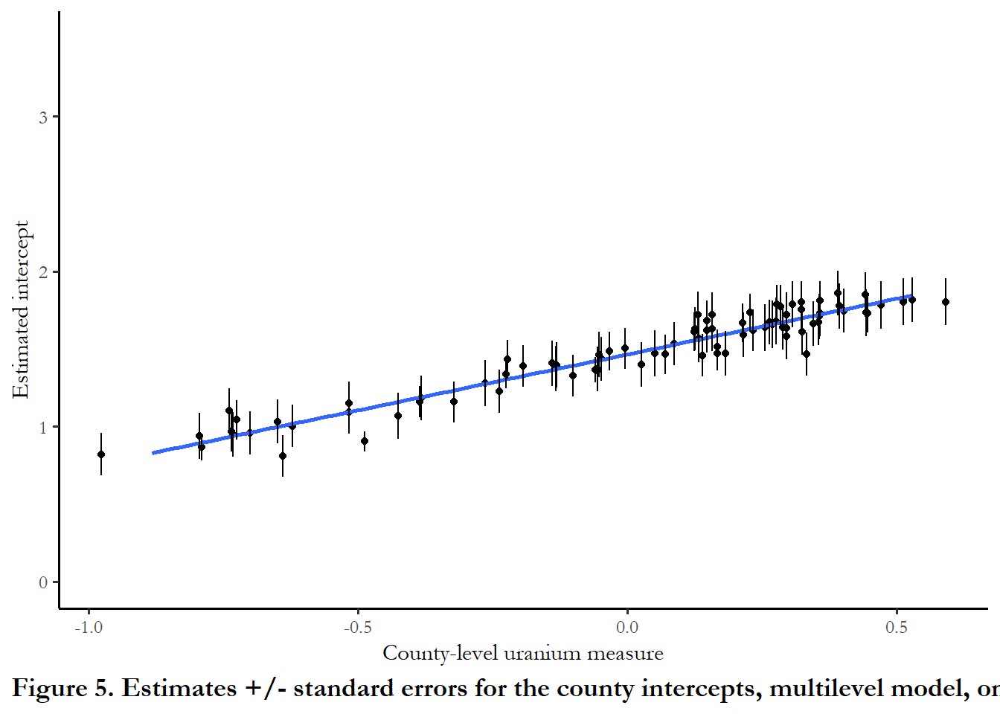

<!-- Run common_r first if using as a Notebook -->

<!--
See the email from Naomi Bick for the ICPSR multilevel modeling syallbus
And the syllabus for the class offered by Jeff Gill at American University
-->


# Multilevel and hierarchical models {-}

This is a short introduction to hierarchical models - drawn almost entirely from Chapter 12. "Multilevel Linear Models: The Basics" in @gelmanhill. The authors use R throughout the text and make available all of the data and R code used in the book. I adapt the data manipulation and presentation of output to lean on functions from **dplyr**, **ggplot2**, and **stargazer**.

## Why is OLS a special case?

Classical regression can imply a number of assumptions: treatment effects are homogeneous (same slope coefficients) and there is no unmeasured heterogeneity (same intercepts).  We have covered a couple of ways to permit these assumptions to be relaxed.  We use *interaction terms* to model conditional marginal effects. In this instance, we are claiming that groups of observations may have different slopes.  If we have data that are repeated measures - panel data - same units measured more than one time - then we can use *fixed effects* (least squares dummy variables).  In that case, we are attempting to handle unmeasured heterogeneity by allowing intercepts to vary.

## Why multilevel models?

An alternative way of managing research situations where we expect or see diverse or heterogeneous responses is a *hierarchical* or *multilevel* model - two names for the same approach.  The idea is that we recognize that observations are from different sources (organizations, geographic units, groups of people).  We have chosen to group all of those observations in a single dataset.  We might have many households from a number of different counties.  We might have many counties from many states or provinces from many countries.  We might have individuals at particular sites.  We might have respondents to different iterations of similar surveys.

We understand our observations to be indexed x~ij~  where *i* indicates the individual and *j* indicates the group. Panel data are really a specific case of this form of data, where *i* is the unit observed and *j* is the time period x~it~.  *Time series cross sectional data (TSCS)* have this form.  

Gelman and Hill also introduce *non-nested models* which implies multiple and perhaps overlapping groups. For example, in an individual-level dataset, people may be drawn from the same geographic area and people may be related in other ways (share the same occupation). Recall that some of our approaches to panel data required or assumed that the data were *strongly balanced* - same individuals observed in each time period with no gaps.  Multilevel modeling does not impose this type of restrictions - you might have a few units in one area, many units in another area. 

Unlike our approach to panel data in earlier classes, we do not simply rely on the knowledge that groups of observations may share different intercepts or errors.  We can actually introduce information at the higher level of aggregation to model this variation.  For instance, we might have information about states that less us improve predictions for something we measure at the level of counties or townships.  This is why this approach is described a hierarchical - there are top-level (group level) data and lower level (individual level) data.  Multilevel models imply two or more models estimated simultaneously - a regression for the coefficients modeled at the lowest level and a regression model for the intercept or differences in coefficients at the level of groups. This is a powerful generalization of the classical linear model.

When we introduced the panel data estimators, we considered how we could estimate a regression by simply pooling all of the data together, ignoring any unmeasured heterogeneity and ignoring problems of heteroscedasticity (this is designated as *complete pooling*).  An alternative strategy might be to simply estimate model parameters separately for each group of observations (*no pooling*): this creates a problem of low numbers of observations and low power.  Gelman and Hill describe the multilevel model as a compromise between complete pooling (ignoring a categorical grouping variable like country) and no pooling (estimating different models for each category or country).

One area where multilevel models are commonly used is to study education outcomes.  The dataset might consist of student performance outcomes and student characteristics, but we also know the school and the county or city the student is observed.  We may be interested in the size of the school or the percentage of free/reduced lunches.  We may be interested in the demographics of the city or county.   We know that student characteristics interact with these environmental features to influence performance.

If you collect data of this form, you should consider and use a multilevel approach.

## A sample dataset and problem

Gelman and Hill use a dataset of radon measurements to motivate discussion of the multilevel approach.  The dataset contains information about radon levels in thousands of homes located in hundreds of U.S. counties.

Radon is a naturally occurring gas that is a by-product of the decay of uranium.  Homes near uranium deposits may accumulate dangerous levels of radon gas; exposure to this gas has been linked to lung cancer.  We will use four pieces of information from the dataset: the measured radon level, whether the sample was taken in the basement or on the first floor, what county the home is in, and the measurement of soil uranium in that county.  The idea is that we use information from the aggregate (the county) to improve predictions at lower levels of aggregation (the homes).  The data and all of the R code for the figures and models are adapted or directly from the companion website for the book.  These examples are drawn from Chapter 12.

The R package **lme4** permits us to estimate basic hierarchical models.  The particular function that we will use is `lmer`, a maximum likelihood estimator.

I estimate and interpret a series of progressively more complicated models using data from the 85 counties in the dataset from the state of Minnesota.  We use information about each county and each household to understand the likely value of a radon test in a home in a particular county.  Since radon levels are higher in basements, it is important to use this information in the model, especially if data from some counties is primarily taken from basement measurements while others are taken on the first floor.


```r
## Set up the radon data
# Read, subset and tranform the data
srrs2 <- read.table ("http://www.stat.columbia.edu/~gelman/arm/examples/radon/srrs2.dat", header=T, sep=",")
mn <- srrs2 %>%
  filter(state=="MN") %>%
  mutate(log.activity=log(ifelse (activity==0, .1, activity)))

# Get the county-level predictor
cty <- read.table ("http://www.stat.columbia.edu/~gelman/arm/examples/radon/cty.dat", header=T, sep=",")
cty2 <- cty %>%
  filter(st=="MN") %>%
  mutate(u=log(Uppm), cntyfips=ctfips)

# There are two duplicate counties, which need to be deleted before joining - other wise model 5 has problems
cty2 <- cty2 %>% filter(!row_number() %in% c(11, 39))


# This creates the data frame with all variables available
data<-left_join(mn, cty2, by=c("cntyfips"))

# This step just strips out the uranium by county, used below
u_county <- data %>%
  group_by(county) %>%
  summarise(u=mean(u))
```

### Data and figures

The actual distribution of radon activity reported in the national survey is fairly close to zero is most households.   The metric for the measure is picocuries per liter of air, or pCi/L.  According the EPA's __A Citizen Guide to Radon__, the typical level of radon in outside air is 0.4 pCi/L and the average home indoor level is 1.7.  The measured radon levels in the 919 sample homes are summarized in the figure below.  The threshold for remediation is 4.0.


```r
# Plot the histogram
ggplot(mn, aes(x=activity))+
  geom_histogram(binwidth = 2, colour = "black", fill = "white")+
  labs(x="Measured levels of radon", y="Frequency")
```



Since radon effects are cumulative, the researchers use the log of the measure as a measure of risk.  The overall distribution of the dependent variable, the log of measured radon activity, is displayed below:


```r
# Plot the log
ggplot(mn, aes(x=log.activity))+
  geom_histogram(binwidth = 0.25, colour = "black", fill = "white")+
  labs(x="Log level of radon", y="Frequency")
```



### Model 1 (complete pooling, one predictor)

This model uses logged radon measurement as the dependent variable and the location of the test (first floor or basement as the predictor).   We ignore the information that multiple households are from one county.  This is just a basic regression.  All of the counties share the same intercept and the same value of the estimated slope coefficient.


```r
lm.pooled <- lm (log.activity ~ floor, data=mn)
stargazer (lm.pooled, style="apsr", type="html" , omit="factor" , dep.var.labels = c("Log of radon measure", "\n"), digits=3, covariate.labels = c("First floor reading"), omit.stat=c("LL","ser","f"),column.sep.width=c("12pt"))
```


<table style="text-align:center"><tr><td colspan="2" style="border-bottom: 1px solid black"></td></tr><tr><td style="text-align:left"></td><td>Log of radon measure</td></tr>
<tr><td colspan="2" style="border-bottom: 1px solid black"></td></tr><tr><td style="text-align:left">First floor reading</td><td>-0.613<sup>***</sup></td></tr>
<tr><td style="text-align:left"></td><td>(0.073)</td></tr>
<tr><td style="text-align:left">Constant</td><td>1.327<sup>***</sup></td></tr>
<tr><td style="text-align:left"></td><td>(0.030)</td></tr>
<tr><td style="text-align:left">N</td><td>919</td></tr>
<tr><td style="text-align:left">R<sup>2</sup></td><td>0.072</td></tr>
<tr><td style="text-align:left">Adjusted R<sup>2</sup></td><td>0.071</td></tr>
<tr><td colspan="2" style="border-bottom: 1px solid black"></td></tr><tr><td colspan="2" style="text-align:left"><sup>*</sup>p < .1; <sup>**</sup>p < .05; <sup>***</sup>p < .01</td></tr>
</table>
<br>

The table tells us that the average predicted reading for any household in any county would be 1.33 for a basement measurement and 0.713 for a first floor measurement.  This would be our best guess for a radon measurement from any house in the sample, depending on where the measure was taken.

### Model 2 (no pooling, one household predictor, county-level fixed effects)

We estimate the model with standard OLS with fixed effects for each county. This is the approach we used with panel data, a dummy variable for each household.   The " -1 " after `factor(county)` indicates no intercept, so I can have a dummy for every county.  Adding the county-level dummy permits otherwise unmeasured county-level differences to improve the prediction. The model does include 85 dummy variables - one for each county - but I suppressed that output (using the `omit` option in the stargazer command).


```r
lm.unpooled <- lm (log.activity ~ floor + factor(county) - 1, data=mn)
stargazer (lm.unpooled, style="apsr", type="html" , omit="factor" , dep.var.labels = c("Log of radon measure", "\n"), digits=2, covariate.labels = c("First floor reading"), omit.stat=c("LL","ser","f"),column.sep.width=c("12pt"))
```


<table style="text-align:center"><tr><td colspan="2" style="border-bottom: 1px solid black"></td></tr><tr><td style="text-align:left"></td><td>Log of radon measure</td></tr>
<tr><td colspan="2" style="border-bottom: 1px solid black"></td></tr><tr><td style="text-align:left">First floor reading</td><td>-0.72<sup>***</sup></td></tr>
<tr><td style="text-align:left"></td><td>(0.07)</td></tr>
<tr><td style="text-align:left">N</td><td>919</td></tr>
<tr><td style="text-align:left">R<sup>2</sup></td><td>0.77</td></tr>
<tr><td style="text-align:left">Adjusted R<sup>2</sup></td><td>0.74</td></tr>
<tr><td colspan="2" style="border-bottom: 1px solid black"></td></tr><tr><td colspan="2" style="text-align:left"><sup>*</sup>p < .1; <sup>**</sup>p < .05; <sup>***</sup>p < .01</td></tr>
</table>
<br>

Notice the jump in the R-squared.

The figure below shows the intercept and standard errors associated with each intercept as a function of the number of households sampled in each county.  One thing that jumps out is that extremely high intercepts (positive readings) are associated with counties that have only 1 or 2 households in the sample. Our estimate for these counties is probably too high and our overall assessment of county-level variation is too high since we have small samples with large standard errors in these counties.


```r
# tidy the data and retain the 85 dummy coefficients and standard errors
results<-tidy(lm.unpooled)
results<- results %>% filter(term!="floor")

## get a table of sample size in each county
sample.size<-as.data.frame(table(mn$county))

# Be cautious with this command - doesn't really join just mashes the dataframes
# A careful approach would strip out county names and use join
results<-cbind(results, sample.size)

# Reproduce the figure with horizontal jitter
ggplot(data=results, aes(x=Freq, y=estimate))+
  geom_point(position = position_jitter(width = 0.10, seed = 123)) +
  scale_x_continuous(trans = "log10") + ylim(0, 3.5)+
  geom_linerange(aes(x = Freq, ymin = estimate+std.error, ymax = estimate-std.error),
                   lwd = 0.5, position = position_jitter(width = 0.10, seed = 123)) +
  labs(x="Sample size in county", y="Estimated intercept", caption="Figure 3. Estimates +/- standard errors for the county intercepts, no pooling")
```


(This replicates Figure 12.3)

### Model 3 (partial pooling, one household predictor, multilevel model)

This is a multilevel model that permits the intercept to vary about a shared mean.  We know the shared mean (1.33) from Model 1 and the individual fixed effects from Model 2.  This model is a combination of that information. Note that different information is reported when we invoke (`lmer`, rather than `lm`). We have goodness of fit test statistics and the deviance reported below, rather than R-squared.  This is one indicator we are estimating via maximum likelihood.

The `(1 | county)' notation in the lmer function indicates unique intercepts for each county.


```r
# This corresponds to M1 at page 259 of Gelman and Hill
model3 <- lmer (formula = log.activity ~ floor + (1 | county), data=mn)
stargazer (model3, type="html" , style="apsr", omit="factor" , dep.var.labels = c("Log of radon measure", "\n"), covariate.labels = c("First floor reading"), digits=2, omit.stat=c("LL","ser","f"), title="**Table 3. Household radon, partial pooling, multilevel model**",
          notes= "p<.01*** ; p<.05**",  notes.append = FALSE)
```


<table style="text-align:center"><caption><strong>**Table 3. Household radon, partial pooling, multilevel model**</strong></caption>
<tr><td colspan="2" style="border-bottom: 1px solid black"></td></tr><tr><td style="text-align:left"></td><td>Log of radon measure</td></tr>
<tr><td colspan="2" style="border-bottom: 1px solid black"></td></tr><tr><td style="text-align:left">First floor reading</td><td>-0.69<sup>***</sup></td></tr>
<tr><td style="text-align:left"></td><td>(0.07)</td></tr>
<tr><td style="text-align:left">Constant</td><td>1.46<sup>***</sup></td></tr>
<tr><td style="text-align:left"></td><td>(0.05)</td></tr>
<tr><td style="text-align:left">N</td><td>919</td></tr>
<tr><td style="text-align:left">AIC</td><td>2,179.31</td></tr>
<tr><td style="text-align:left">BIC</td><td>2,198.60</td></tr>
<tr><td colspan="2" style="border-bottom: 1px solid black"></td></tr><tr><td colspan="2" style="text-align:left">p<.01*** ; p<.05**</td></tr>
</table>
<br>

The figure below shows the estimated intercept for each county with standard errors attached.


```r
# tidy won't work lmer
a.hat.model3 <- coef(model3)$county[,1]   
a.se.model3 <- se.coef(model3)$county
results<- as.data.frame(cbind(a.hat.model3, a.se.model3))
results<-std.err<-results$`(Intercept)`
## get a table of sample size in each county
sample.size<-as.data.frame(table(mn$county))

# Be cautious with this command - doesn't really join just mashes the dataframes
# A careful approach would strip out county names and use join
results<-cbind(results, sample.size)

# Reproduce the figure with horizontal jitter
ggplot(data=results, aes(x=Freq, y=a.hat.model3))+
  geom_point(position = position_jitter(width = 0.10, seed = 123)) +
  scale_x_continuous(trans = "log10") + ylim(0,3.5) +
  geom_linerange(aes(x = Freq, ymin = a.hat.model3+std.err, ymax = a.hat.model3-std.err),
                   lwd = 0.5, position = position_jitter(width = 0.10, seed = 123)) +
  labs(x="Sample size in county", y="Estimated intercept", caption="Figure 4. Estimates +/- standard errors for the county intercepts, multilevel model")
```


(Reproduces Figure 12.3(b))

The idea is that we leverage the information about the state mean and counties with very few observations are drawn closer to this state mean.  Counties with large numbers of households are not affected.   Gelman and Hill note that both of Model 1 and Model 2 can be problematic: we might overstate county-level variation based on small samples in Model 2 or we might understate county-level variation if ignore too much information in counties with extreme variation from the mean in Model 1.  Model 3 is a compromise.

### Model 4 (pooled data, one household predictor, one county-level predictor, multilevel model).

The real advantage of multilevel modelling is that we can directly introduce information from the higher levels of aggregation levels to the equation.  Remember when we used fixed effects for our panel data, we could not introduce time invariant country features since they dropped out?  In this modelling framework you do use features of the grouping variable (county in this case) that do not vary across households within the county.  The variable we are introducing is soil uranium.   County-level uranium soil levels are introduced as a predictor.  The assumption here is that the coefficients on basement/floor and soil uranium will be the same for all households in all counties. But the level of uranium in the soil in the county will improve our estimate for the intercept, the remaining unmeasured heterogeneity.

Notice that the goodness of fit test statistics are all lower - this indicates better model performance.


```r
# This corresponds to M2 in Gelman and Hill page 266
model4 <- lmer (formula = log.activity ~ floor + u + (1 | county), data=data)
stargazer (model4, type="html" ,style="apsr",  omit="factor" ,  dep.var.labels = c("Log of radon measure", "\n"), covariate.labels = c("First floor reading", "Soil uranium"), digits=2, omit.stat=c("LL","ser","f"),column.sep.width=c("12pt"))
```


<table style="text-align:center"><tr><td colspan="2" style="border-bottom: 1px solid black"></td></tr><tr><td style="text-align:left"></td><td>Log of radon measure</td></tr>
<tr><td colspan="2" style="border-bottom: 1px solid black"></td></tr><tr><td style="text-align:left">First floor reading</td><td>-0.67<sup>***</sup></td></tr>
<tr><td style="text-align:left"></td><td>(0.07)</td></tr>
<tr><td style="text-align:left">Soil uranium</td><td>0.72<sup>***</sup></td></tr>
<tr><td style="text-align:left"></td><td>(0.09)</td></tr>
<tr><td style="text-align:left">Constant</td><td>1.47<sup>***</sup></td></tr>
<tr><td style="text-align:left"></td><td>(0.04)</td></tr>
<tr><td style="text-align:left">N</td><td>919</td></tr>
<tr><td style="text-align:left">AIC</td><td>2,144.19</td></tr>
<tr><td style="text-align:left">BIC</td><td>2,168.30</td></tr>
<tr><td colspan="2" style="border-bottom: 1px solid black"></td></tr><tr><td colspan="2" style="text-align:left"><sup>*</sup>p < .1; <sup>**</sup>p < .05; <sup>***</sup>p < .01</td></tr>
</table>
<br>

The figure below plots the intercept in the counties as a function of measured soil uranium. I kepy the y-axis on the same scale as Figure 4, so you can clearly see how the standard errors are much smaller when we introduced the group=level predictor


```r
# Plot of ests & se's vs. county uranium (Figure 12.6)
# Pick up the standard errors and coefficients
# Write as new columns in the results file created above
results$std.err.model4 <- se.coef(model4)$county
a.hat.model4 <- fixef(model4)[1] + fixef(model4)[3]*u_county$u + ranef(model4)$county
results$a.hat.model4<-a.hat.model4[,1]
results$b.hat.model4 <- fixef(model4)[2]
results$u<-u_county$u
# Need vector of u to pass to results (n=85 only)

# Produce the figure
# Reproduce the figure with horizontal jitter
ggplot(data=results, aes(x=u, y=a.hat.model4))+
  geom_point(position = position_jitter(width = 0.10, seed = 123)) +
  geom_smooth(method="lm", se= FALSE, formula = y~x) + ylim(0, 3.5) +
 labs(x="County-level uranium measure", y="Estimated intercept", caption="Figure 5. Estimates +/- standard errors for the county intercepts, multilevel model, one group predictor") +
geom_linerange(aes(x = u, ymin = a.hat.model4+std.err.model4, ymax = a.hat.model4-std.err.model4),
                   lwd = 0.5, position = position_jitter(width = 0.10, seed = 123))
```


(Reproduces Figure 12.6)

As county level uranium increases, our estimate of the intercept increases and the remaining county-level error is much lower.
 
### Model 5.  Permit intercepts and coefficients to vary.  No restrictions.

This is the least restrictive model.  `x:ufull` is the interaction term  (permitting slopes to vary), and `(1 | county)` indicates that the intercept can vary across counties independent of the soil measure.  There is an error messgae or warning "boundary (singular) fit:"  - this suggests we are *over-fitting* the model, estimating too many parameters with too little data.


```r
# This corresponds to M4 in Gelman and Hill, p. 281
model5 <-  lmer (formula = log.activity ~ floor + +u + floor:u + (1 + floor | county), data=data)

stargazer (model5, type="html" , style="apsr", omit="factor" , dep.var.labels = c("Log of radon measure", "\n"), digits=2, covariate.labels = c("First floor reading", "Soil uranium", "Interaction term"), omit.stat=c("LL","ser","f"),column.sep.width=c("12pt"))
```


<table style="text-align:center"><tr><td colspan="2" style="border-bottom: 1px solid black"></td></tr><tr><td style="text-align:left"></td><td>Log of radon measure</td></tr>
<tr><td colspan="2" style="border-bottom: 1px solid black"></td></tr><tr><td style="text-align:left">First floor reading</td><td>-0.64<sup>***</sup></td></tr>
<tr><td style="text-align:left"></td><td>(0.09)</td></tr>
<tr><td style="text-align:left">Soil uranium</td><td>0.85<sup>***</sup></td></tr>
<tr><td style="text-align:left"></td><td>(0.07)</td></tr>
<tr><td style="text-align:left">Interaction term</td><td>-0.42<sup>*</sup></td></tr>
<tr><td style="text-align:left"></td><td>(0.24)</td></tr>
<tr><td style="text-align:left">Constant</td><td>1.44<sup>***</sup></td></tr>
<tr><td style="text-align:left"></td><td>(0.03)</td></tr>
<tr><td style="text-align:left">N</td><td>919</td></tr>
<tr><td style="text-align:left">AIC</td><td>2,148.24</td></tr>
<tr><td style="text-align:left">BIC</td><td>2,186.82</td></tr>
<tr><td colspan="2" style="border-bottom: 1px solid black"></td></tr><tr><td colspan="2" style="text-align:left"><sup>*</sup>p < .1; <sup>**</sup>p < .05; <sup>***</sup>p < .01</td></tr>
</table>
<br>

The figures below show how the slopes and the intercepts vary.  Notice, again, how the standard errors around the intercepts are smaller.  And notice that the slopes decline (more negative) as uranium in the soil increases.  This means that the difference between first floor and basement is larger in those counties.


```r

a.hat.model5 <- fixef(model5)[1] + fixef(model5)[3]*u_county$u + ranef(model5)$county[,1]
b.hat.model5 <- fixef(model5)[2] + fixef(model5)[4]*u_county$u + ranef(model5)$county[,2]
a.se.model5 <- se.ranef(model5)$county[,1]
b.se.model5 <- se.ranef(model5)$county[,2]


# par (mfrow=c(1,1))
# 
#  # plot on Figure 13.2(a)
# lower <- a.hat.model5 - a.se.model5
# upper <- a.hat.model5 + a.se.model5
# par (mar=c(5,5,4,2)+.1)
# plot (u, a.hat.model5, cex.lab=1.2, cex.axis=1.1, ylim=range(lower,upper), 
#       xlab="county-level uranium measure", ylab="regression intercept", 
#       pch=20, yaxt="n")
# axis (2, c(0,1,1.5,2))
# curve (fixef(model5)[1] + fixef(model5)[3]*x, lwd=1, col="black", add=TRUE)
# segments (u, lower, u, upper, lwd=.5, col="gray10")
# mtext ("Intercepts", line=1)
# 
#  # plot on Figure 13.2(b)
# lower <- b.hat.model5 - b.se.model5
# upper <- b.hat.model5 + b.se.model5
# par (mar=c(5,5,4,2)+.1)
# plot (u, b.hat.model5, cex.lab=1.2, cex.axis=1.1, ylim=range(lower,upper),
#       xlab="county-level uranium measure", ylab="regression slope", pch=20)
# curve (fixef(model5)[2] + fixef(model5)[4]*x, lwd=1, col="black", add=TRUE)
# segments (u, lower, u, upper, lwd=.5, col="gray10")
# mtext ("Slopes", line=1)
```

## Summary

Multilevel models are extremely useful for research situations where we have data collected across varying geographic or organizational contexts, but where we expect common mechanisms linking X and Y and we expect the form of these links to be variable or dependent on the context.

## Next week

Review the replication example in the Appendix, reproducing key results from @park2021

We will use the multilevel model as a bridge to learn about Bayesian methods.
