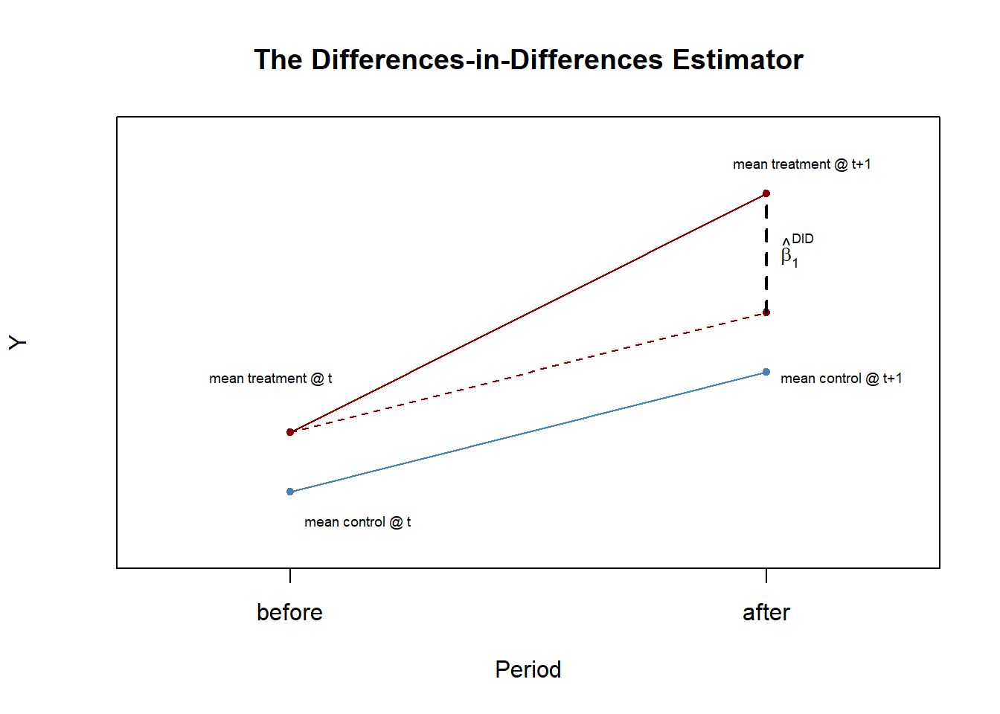
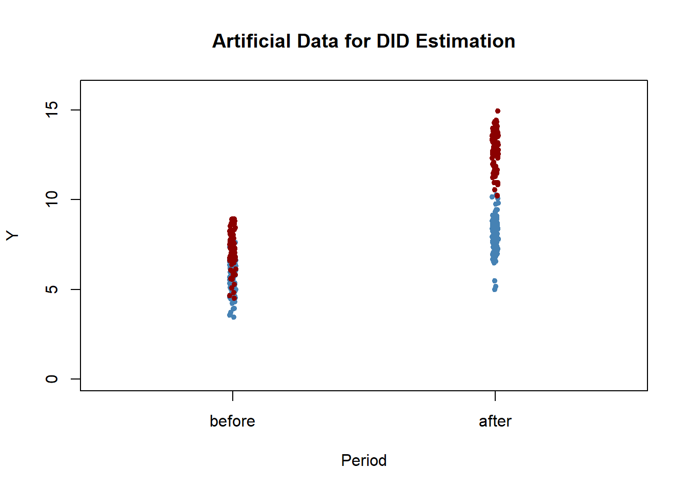
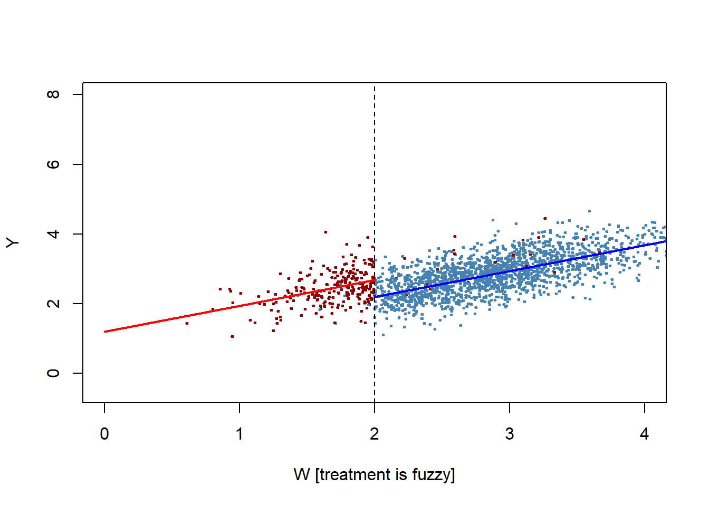

# Why study experimental design and results?

This short introduction to quasi- and natural experiments is drawn from @stockwatson2015, Chapter 13, " Experiments and Quasi-Experiments".  I also rely extensively on an R companion for that text, @hanketal2021.  This is a very useful resource. 

We should review the basics of experimental design and distinguish that work from the observational approaches that we typically adopt in Political Science. The experimental approach came up briefly when we looked at **Moneyball for Government** and the evaluation of federal programs.  Experimental designs leverage randomization.  We split subjects into two groups - one treatment and one control.  Since the groups are identical in every respect, except for exposure to the treatment, we can be confident that any difference in outcomes is due to the treatment alone. Robust experimental work not only relies on randomization, but also blinds - in a double-blind experiment, neither the researcher administering the treatment nor the subject receiving the treatment knows whether they are working with the treatment or a placebo. The cuts down on several potential biases: individuals who they are given the treatment may work harder to succeed, physicans who know they are using a novel approach may wish to see their intervention work.

While we can use true randomization in some contexts, in most experimental applications in Political Science, particularly public policy, the researcher is aware of who is receiving what treatment and participants may also recognize which group they are in.
 
@stockwatson2015 argue we can improve our understanding and design of observational research if we pay close attention to experimental design and practice.  Specifically:

>(1) a randomized controlled experiment acts as a "benchmark for our observational approach" (so we can recognize the limits of our ability to make causal inferences)

>(2) "the results of [randomized controlled] experiments can be very influential", so it is important to understand their limitations (this implies considerations of internal and external validity)

>(3) "external circumstances sometimes produce what appears to be randomization; that is, because of external events, the treatment of some individual occurs “as if” it is random, possibly conditional on some control variables. This “as if” randomness produces a *quasi-experiment* or *natural experiment*, and many of the methods developed for analyzing randomized experiments can be applied (with some modifications) to quasi-experiments."

### Describing treatment effects (adapted from https://www.econometrics-with-r.org/13.4-qe.html#regression-discontinuity-estimators)

In experiments, we are interested in observing and measuring some outcome in order to estimate a treatment effect.  We are simply interested in the difference in the outcome variable Y~i for people who did and did not receive the treatment.  For the examples and equations below, T will represent the treatment. The average treatment effect is simply the difference between the expected value of the outcome for people who did receive the treatment and the expected value of the outcome for people who did not receive the treatment.

$$\text{Average treatment effect} =  E(Y_i\vert T_i=1) -  E(Y_i\vert T_i=0)$$

The average causal effect can be estimated using the *differences estimator*, which is nothing but the OLS estimator in the simple regression model. 

$$Y_i = \beta_0 + \beta_1 T_i + u_i \ \ , \ \ i=1,\dots,n $$
 
where random assignment ensures that $E(u_i|T_i)=0$

The OLS estimator in the regression model: 

$$Y_i = \beta_0 + \beta_1 X_i + \beta_2 W_{1i} + \dots + \beta_{1+r} W_{ri} + u_i \ \ , \ \ i=1,\dots,n$$
with additional regressors, $W_1,…,W_r$, is called the *differences estimator with additional regressors*. It is assumed that treatment T~i is randomly assigned so that it is independent of the the pretreatment characteristic $W_i$. This assumption is called conditional mean independence and implies:

$$E(u_i|T_i,W_i)=E(u_i|W_i)=0$$

so the conditional expectation of the error $u_i$ given the treatment indicator T~i and the pre-treatment characteristic $W_i$ does not depend on the T~i.

The differences estimator with additional regressors is more efficient than the differences estimator if the additional regressors explain some of the variation in the Y~i.

## Analyzing experimental data: the STAR project

Stock and Watson (2017) discuss a widely-cited example of experimental design.  This description of the study is adapted from Hanck et al (2020).

The Project Student-Teacher Achievement Ratio (STAR) was a large randomized controlled experiment designed to determine if small class size improves academic performance.  Data was collected over four years in 80 elementary schools in Tennessee.  About 6400 students were randomly assigned into one of three interventions: small class (13 to 17 students per teacher), regular class (22 to 25 students per teacher), and regular-with-aide class (22 to 25 students with a full-time teacher’s aide). Teachers were also randomly assigned to the classes they taught. The interventions were initiated as the students entered school in kindergarten and continued through to third grade.

Each year, the students’ learning progress was assessed using the sum of the points scored on the math and reading parts of a standardized test (the Stanford Achievement Test). The STAR data set is part of the package `AER` - a package that includes over 100 datasets used in a variety of econometrics textbooks.


```r
# load the package AER and the STAR dataset
library(AER)
data(STAR)
```

To estimate the impact of class size - the average treatment effect - we use the differences estimator. 

$$Y_i = \beta_0 + \beta_1 SmallClass_i + \beta_2 RegAide_i + u_i$$

The results are briefly summarized below.  The "stark" prefix indicates we are looking at kindergarten classes.  The impact of a small class is positive and significant, but the presence of a teacher's aide does not seem to matter.


```r
fmk <- lm(I(readk + mathk) ~ stark, data = STAR)
coeftest(fmk, vcov = vcovHC, type= "HC1")

t test of coefficients:

                   Estimate Std. Error  t value  Pr(>|t|)    
(Intercept)       918.04289    1.63339 562.0473 < 2.2e-16 ***
starksmall         13.89899    2.45409   5.6636 1.554e-08 ***
starkregular+aide   0.31394    2.27098   0.1382    0.8901    
---
Signif. codes:  0 '***' 0.001 '**' 0.01 '*' 0.05 '.' 0.1 ' ' 1
```

We could also add regressors that we know to be associated with academic performance to improve the efficiency of the estimate. Recall that noisy models - lots of error - will decrease precision - higher standard errors for the coefficients.  So if we can identify and add relevant variables, it might not change our point estimate, but the standard error should be lower (more efficient).  The model below adds three covariates:  years of teacher experience, whether the student is boy or girl, and whether the student qualifies for a free lunch (a proxy for low socioeconomic status).

$$Y_i = \beta_0 + \beta_1 SmallClass_i + \beta_2 RegAide_i + \beta_3 gender +\beta_4 poor +\beta_5experience + u_i$$

```r
fmke <- lm(I(readk + mathk) ~ stark+gender+lunchk+experiencek, data = STAR)
coeftest(fmke, vcov = vcovHC, type= "HC1")

t test of coefficients:

                   Estimate Std. Error  t value  Pr(>|t|)    
(Intercept)       919.09404    2.49639 368.1693 < 2.2e-16 ***
starksmall         14.14339    2.35845   5.9969 2.134e-09 ***
starkregular+aide   0.63946    2.16104   0.2959    0.7673    
genderfemale       13.80443    1.85516   7.4411 1.146e-13 ***
lunchkfree        -39.11061    1.85864 -21.0426 < 2.2e-16 ***
experiencek         1.18034    0.16641   7.0931 1.469e-12 ***
---
Signif. codes:  0 '***' 0.001 '**' 0.01 '*' 0.05 '.' 0.1 ' ' 1
```
The estimates are more precise and the results are the same - small class size matters but the presence of an aide does not.

## Validity in experiments

Ensuring that inferences are valid is a central concern of experimental design. We distinguish between internal vaiidity and external validity.

A statistical analysis has internal validity if a statistical inference made about causal effects is valid for the population - no Type I or Type II error.

An analysis is said to have external validity if inferences and conclusion are valid for the studies’ population and can be generalized to other populations and settings.

There are two conditions for internal validity to exist:

- The estimator of the causal effect, the coefficient(s) of interest, should be unbiased and consistent.

- statistical inference is valid, that is, hypothesis tests permit us to distinguish accurately between significant and insignificant effects.

External validity might be jeopardized:

- if there are differences between the population studied and the population of interest. 

- if there are differences in the settings of the considered populations, e.g., the legal framework or the time of the investigation.

We should consider what these mean specifically in the context of experiments. 

This list and descriptions are drawn from @stockwatson.

### Internal validity in experimental settings

####  Failure to Randomize

If the subjects are not randomly assigned to the treatment group, then the outcomes will be contaminated with the effect of the subjects’ individual characteristics or preferences and it is not possible to obtain an unbiased estimate of the treatment effect. One can test for nonrandom assignment using a significance test (F-Test) on the coefficients in the regression model:

$$T_i = \beta_0 + \beta_1 W_{1i} + \dots +\beta_r W_{ri} + u_i \ \ , \ \ i=1,\dots,n.$$
where $W_i$ are observable characteristics of the subject.  If assignment is random, none of the covariates should be related to selection for the treatment.

#### Failure to Follow the Treatment Protocol

If subjects do not follow the treatment protocol, i.e., some subjects in the treatment group manage to avoid receiving the treatment and/or some subjects in the control group manage to receive the treatment (partial compliance), there is correlation between $T_i$ und $u_i$ such that the OLS estimator of the average treatment effect will be biased.

#### Attrition

Attrition may result in a non-randomly selected sample. If subjects systematically drop out of the study after being assigned to the control or the treatment group (systematic means that the reason of the dropout is related to the treatment) there will be correlation between $T_i$ und $u_i$, biasing the OLS estimate of the treatment effect.

#### Experimental Effects

If human subjects in treatment group and/or control group know that they are in an experiment, they might adapt their behavior in a way that prevents unbiased estimation of the treatment effect.  This is widely known as the **Hawthorne effect**.

#### Small Sample Sizes

Small sample sizes lead to imprecise estimation of the coefficients and thus imply imprecise estimation of the causal effect. Furthermore, confidence intervals and hypothesis test may result in Type II errors when the sample size is small.

### Threats to external validity in experimental settings

#### Nonrepresentative Sample

If the population studied and the population of interest are not sufficiently similar, there is no justification in generalizing the results.  Is the experimental situation so different from the actual experience that the lessons of the experiment won't translate?

#### Nonrepresentative Program or Policy

If the program or policy for the population studied differs considerably from the program (to be) applied to population(s) of interest, the results cannot be generalized. For example, a small-scale program with low funding might have different effects than a widely available scaled-up program that is actually implemented. There are other factors like duration and the extent of monitoring that should be considered here.

#### General Equilibrium Effects

If external or environmental conditions cannot be kept constant when an internally valid program is implemented broadly, external validity may be doubtful.

## So what is a quasi-experiment?

A quasi-experiment is a situation when nature (or someone else) assigns people to treatment and control groups in way that approximates a random selection. Assignment is "as-if" it were random. 

As in an experiment, we need to have observations of individual subjects prior to and after exposure to some treatment.  So at least two observations per subject with some measure for both groups in both periods.  We will clarify how this works by considering two techniques for analysis of quasi-experimental data - the difference-in-difference estimator and regression discontinuity designs.


### Difference-in difference estimators.

This example (and this entire section) is almost directly from Hanck et al (2020).

In quasi-experiments the source of “as if” randomness in treatment assignment can often not entirely prevent systematic differences between control and treatment groups. This problem was encountered by Card & Krueger (1994) who use geography as the “as if” random treatment assignment to study the effect on employment in fast-food restaurants caused by an increase in the state minimum wage in New Jersey in 1992. Their idea was to use the fact that the increase in minimum wage applied to employees in New Jersey (treatment group) but not to those living in neighboring Pennsylvania (control group).

It is quite conceivable that such a wage hike is not correlated with other determinants of employment. However, there still might be some state-specific differences and thus differences between control and treatment group. This would render the differences estimator biased and inconsistent. Card & Krueger (1994) solved this by using a DID estimator: they collected data in February 1992 (before the treatment) and November 1992 (after the treatment) for the same restaurants and estimated the effect of the wage hike by analyzing differences in the differences in employment for New Jersey and Pennsylvania before and after the increase.

The figure below sketches out the logic.  If we have some outcome $Y$ we acknowledge the the treatment and control group may start out at different levels so we focus on the change in that difference over time.




The DID estimator can also be written in regression notation: $\hat\beta^{DID}$ is the OLS estimator of $\beta_1$ in 

$$\Delta Y_i = \beta_0 + \beta_1 T_i + u_i$$

### An example with artificial data

The code chunk below creates an artificial dataset with a treatment and control group.  The control group mean is 6.0 prior to treatment, and the treatment group has a mean of 8.0.  After treatment, the control group mean increases to 7.0, but the treatment group means increases fo 13.0.  So the treatment effect introduced ($\hat\beta^{DID}$) is exactly 4.0. 



We can estimate the treatment effect in a couple of different ways: manually, with the DID estimator and with OLS using dummy variables for periods and treatment.


```r
# Method 1: manually
# compute the DID estimator for the treatment effect 'by hand'
mean(y_post[TDummy == 1]) - mean(y_pre[TDummy == 1]) - 
(mean(y_post[TDummy == 0]) - mean(y_pre[TDummy == 0]))
[1] 3.528729
```


```r
# Method 1: DID
# compute the DID estimator using a linear model
lm(I(y_post - y_pre) ~ TDummy)

Call:
lm(formula = I(y_post - y_pre) ~ TDummy)

Coefficients:
(Intercept)       TDummy  
      2.225        3.529  
```


```r
# Method 1: OLS with dummies
# prepare data for DID regression using the interaction term 
d <- data.frame("Y" = c(y_pre,y_post),
                "Treatment" = TDummy, 
                "Period" = c(rep("1", n), rep("2", n)))

# estimate the model
lm(Y ~ Treatment * Period, data = d)

Call:
lm(formula = Y ~ Treatment * Period, data = d)

Coefficients:
      (Intercept)          Treatment            Period2  Treatment:Period2  
            5.802              1.314              2.225              3.529  
```

### Regression discontinuity designs

Regression discontinuity exploits empirical situations where subjects are selected for treatment based on some threshold or cutoff.  The canonical example is compulsory summer school for students who are performing poorly.  The idea is that we observe a group of students at the end of a school year and require summer school for students with grades below a certain cut-off, say 2.0.  At the end of the next school year, we look at the grades of the same group of students.  Did summer school improve the future performance of the students who were required to attend? 

Discontinuity designs exploit the fact that students very close to the threshold are quite similar.  A group of students with a 2.1 GPA is probably quite similar to a group of students with a 1.9 GPA.  The arbitrary administrative determination of the 2.0 threshold artificially splits this group, in a way that approximates a random assignment.

When we discussed experimental design earlier in the term, I brought up the idea of exploiting wait-lists for services.  If you have a large group of subjects seeking a small number of treatments, then you could randomly assign subjects to treatment (a lottery) or control and set up an experiment to measure the impact of treatment.  This raises a host of problems - ethics of denying treatment to subjects in greatest need, possible exposure to harms if the treatment does not work.  But someone has to use some criteria to figure out who gets what service - maybe geography - who lives close to a center or facility for treatment - or maybe some kind of need - based on income, for instance.  Any kind of administrative determination of this form sets up the possibility of using a discontinuity design.

To walk through the technical options, I create an artificial data set. In the first instance, everyone under 2.0 gets the treatment and no one under 2.0 (a strict cut-off).  In the second instance, a small proportion of the eligible students do not attend and a small proportion of students above 2.0 opt to attend (so the cut-off is *fuzzy*). 

I left code visible so you could see how I did this.  

The true treatment effect is 0.50 units. The figure shows the predicted values for each group, and the break in the regression line is the impact of treatment.

I use two approaches to estimate the size of the effect.


```r
# generate sample data
# The mean GPA is the same in year and year 2
mu <- c(2.75, 2.75)

# first and last term is variance - middle terms are covariance 
# since the covariance is a larger proportion of the variance, performance is correlated.  I adjusted the variance to try to keep the numbers between 0 and 4
sigma <- matrix(c(0.4, 0.3, 0.3, 0.4), ncol = 2)

#I pulled 2000 observations from a multivariate normal distribution
#set.seed() makes sure that the random draw can be replicated.
set.seed(1266)
d <- as.data.frame(mvrnorm(2000, mu, sigma))
colnames(d) <- c("W", "Y")

# introduce fuzziness
# Probabilty of treatment is 95% if you are under 2.0 and 1% if you are over 2.0
d$treatProb <- ifelse(d$W < 2.0, 0.95, 0.01)
# Also have a strict treatment.
d$strict<- ifelse(d$W< 2.0, 1.0, 0.0)
d$fuzz <- sapply(X = d$treatProb, FUN = function(x) rbinom(1, 1, prob = x))

# treatment effects = 0.50
d$Y_strict <- d$Y+  d$strict*0.50
d$Y_fuzzy  <- d$Y + d$fuzz*0.50

# generate a colored plot of treatment and control group
plot(d$W, d$Y_fuzzy,
     col = c("steelblue", "darkred")[factor(d$fuzz)], 
     pch= 20, 
     cex = 0.5,
     xlim = c(0, 4),
     ylim = c(-0.5, 8),
     xlab = "W [treatment is fuzzy]",
     ylab = "Y")

# add a dashed vertical line at cutoff
abline(v = 2, lty = 2)
## now predict 50 values spread evenly on range (-20, 0]
fit<-lm(Y_strict~W+strict, data=d)

newdat1 <- data.frame(W = seq(0, 2, length = 50))
newdat1$strict<-1
newdat1 <- within(newdat1, ypred1 <- predict(fit, newdat1))
newdat0 <- data.frame(W = seq(2, 5, length = 50))
newdat0$strict<-0
newdat0 <- within(newdat0, ypred0 <- predict(fit, newdat0))

lines(ypred0 ~ W, data = newdat0, col = "blue", lwd = 2)
lines(ypred1 ~ W, data = newdat1, col = "red", lwd = 2)
```



####  Estimating the size of the effect - strict assignment

We have a couple of alternatives - we can use the entire sample, apply OLS, and permit the intercept to vary by treatment assignment.  This is in the spirit of the figure above.  Or we could just look at observations very close to the cut-off.  To accomplish this I use the `RDD` package.  Both estimates for the strict cutoff are below. 


```r
# Estimate the strict RDD using a subset of observations
summary(RDestimate(Y_strict~W, data=d, cutpoint=2))

Call:
RDestimate(formula = Y_strict ~ W, data = d, cutpoint = 2)

Type:
sharp 

Estimates:
           Bandwidth  Observations  Estimate  Std. Error  z value  Pr(>|z|) 
LATE       0.5122      672          -0.4162   0.08021     -5.189   2.120e-07
Half-BW    0.2561      338          -0.3706   0.11152     -3.323   8.905e-04
Double-BW  1.0243     1332          -0.4693   0.05887     -7.971   1.575e-15
              
LATE       ***
Half-BW    ***
Double-BW  ***
---
Signif. codes:  0 '***' 0.001 '**' 0.01 '*' 0.05 '.' 0.1 ' ' 1

F-statistics:
           F      Num. DoF  Denom. DoF  p        
LATE       20.12  3          668        3.409e-12
Half-BW    13.29  3          334        6.439e-08
Double-BW  67.43  3         1328        0.000e+00
```
In the output above, LATE indicates the Local Area Treatment Effect"  - the Bandwidth indicates how many observations total above and below the cutoff were used for the calculation.  The estimate with 672 observations was -0.41.  
This is close our known value 0.50.  The sign is negative since the group above the cutoff did not get the treatment, so a lower outcome.


```r
# Estimate the effect using all observations
summary(lm(Y_strict~W+strict, data=d))

Call:
lm(formula = Y_strict ~ W + strict, data = d)

Residuals:
     Min       1Q   Median       3Q      Max 
-1.28587 -0.28317  0.00286  0.29226  1.65117 

Coefficients:
            Estimate Std. Error t value Pr(>|t|)    
(Intercept)  0.72096    0.05443   13.25   <2e-16 ***
W            0.73954    0.01847   40.03   <2e-16 ***
strict       0.47802    0.03607   13.25   <2e-16 ***
---
Signif. codes:  0 '***' 0.001 '**' 0.01 '*' 0.05 '.' 0.1 ' ' 1

Residual standard error: 0.4192 on 1997 degrees of freedom
Multiple R-squared:  0.476,	Adjusted R-squared:  0.4754 
F-statistic: 906.9 on 2 and 1997 DF,  p-value: < 2.2e-16
```
OLS gives us similar results, but even closer to the true if we use all of the data.  In my artificial data, the data-generating process is the same for all observations, so more observations is more efficient and more accurate.  But in some circumstances it may make more sense to just concentrate on observations close to the threshold.  Using both approaches lets you compare the implications of larger or smaller samples.

#### Fuzzy assignment.

We can use the same strategy with fuzzy assignment.  For the fuzzy assignment, we introduce the treatment probability variable directly.  We can also do this with OLS, but a two-stage approach would be preferred here so this is just FYI. 

```r

# What if treatment is fuzzy?
# The default in RDestimate is to treat greater than W as treatment so treatprob needs to be .05 and .99 in order for signs to be comparable to above
d$treatProb2<-1-d$treatProb
summary(RDestimate(Y_fuzzy~W+treatProb2, data=d, cutpoint=2))

Call:
RDestimate(formula = Y_fuzzy ~ W + treatProb2, data = d, cutpoint = 2)

Type:
fuzzy 

Estimates:
           Bandwidth  Observations  Estimate  Std. Error  z value  Pr(>|z|) 
LATE       0.5176      683          -0.4311   0.08595     -5.016   5.276e-07
Half-BW    0.2588      338          -0.3826   0.11917     -3.211   1.325e-03
Double-BW  1.0352     1344          -0.4799   0.06328     -7.584   3.351e-14
              
LATE       ***
Half-BW    ** 
Double-BW  ***
---
Signif. codes:  0 '***' 0.001 '**' 0.01 '*' 0.05 '.' 0.1 ' ' 1

F-statistics:
           F      Num. DoF  Denom. DoF  p        
LATE       17.94  3          679        3.240e-11
Half-BW    11.80  3          334        2.300e-07
Double-BW  68.60  3         1340        2.864e-41
summary(lm(Y_fuzzy~W+treatProb, data=d))

Call:
lm(formula = Y_fuzzy ~ W + treatProb, data = d)

Residuals:
     Min       1Q   Median       3Q      Max 
-1.29321 -0.28232  0.00369  0.28859  1.66531 

Coefficients:
            Estimate Std. Error t value Pr(>|t|)    
(Intercept)  0.71966    0.05501   13.08   <2e-16 ***
W            0.74097    0.01859   39.87   <2e-16 ***
treatProb    0.48721    0.03861   12.62   <2e-16 ***
---
Signif. codes:  0 '***' 0.001 '**' 0.01 '*' 0.05 '.' 0.1 ' ' 1

Residual standard error: 0.4217 on 1997 degrees of freedom
Multiple R-squared:  0.4769,	Adjusted R-squared:  0.4764 
F-statistic: 910.3 on 2 and 1997 DF,  p-value: < 2.2e-16
```

In this case, we know the treatment effect is 0.5.   Using a strict cut-off, we had estimates of the effects in the range of 0.42 to 0.48.  Using the fuzzy cut-off, we had estimates from 0.43 to 0.48.  Note the implication here - in the fuzzy case, we knew what the administrative cut-off was (2.0) and we didn't know exactly or were not sure which students attended, but we were nevertheless able to estimate the effect.


### A recent application in gender and politics

From Basques and Campes (2017)

>In a recent paper, we provide a comprehensive analysis of the impact of candidate gender quotas using the unique quasi-experimental evidence offered by their introduction in Spanish local elections.

>In the context of closed lists with proportional representation, the quota prescribes that at least 40% of the candidates in the list should be female (and male). The provision applies to the entire list, and also to every block of five candidates. 

>The quota was first implemented in 2007 in municipalities with more than 5,000 inhabitants, and was extended in 2011 to municipalities with more than 3,000 inhabitants.

>We take advantage of the existence of these population cut-offs to implement a regression discontinuity design where we compare municipalities slightly above and below these cut-offs over three rounds of elections (2007, 2011, and 2015). 
By comparing municipalities that are practically identical in terms of population (the optimal bandwidth is around 1,000 inhabitants), this empirical strategy is robust to the existence of any other relevant factors that vary smoothly at the threshold. The analysis provides information on the impact of quotas in an important context: relatively small municipalities, likely in rural areas, where the persistence of gender stereotypes tends to be stronger and where women have been traditionally excluded from decision-making to a larger extent. Interestingly, this is a group of municipalities that many countries have decided to exclude from the quota (e.g. France, Italy, and Spain).

>In sum, our study confirms that quotas in electoral lists increase the number of women elected. 

>However, during the ten years in which quotas have been in place in Spain, they have not significantly affected the probability that women reach leadership positions or the type of policies that are implemented, at least in small municipalities that were the object of our study. At the same time, the fear that quotas would decrease the quality of politicians has not been confirmed: quota candidates have similar educational attainment and they attract a similar number of votes compared to the candidates they replace.

Details: https://voxeu.org/article/electoral-gender-quotas-fail-empower-women

## Why quasi-experiments might be superior

Green (2010) makes the strong case for more widespread use of quasi-experiments.  While randomized controlled experiments are generally superior to other types of casual inference, she argues that we should think of a continuum ranging form poorly designed quasi-experiments (least preferred) to strongly designed controlled experiments (most preferred).  In the middle range are both strongly designed quasi-experiments and poorly-designed controlled experiments.  In that category, there is a case to be made for using quasi-experiments.

Think about our threats to validity:

In a quasi-experiment, no one - researcher or subject - knows at the time they are part of experiment.  So we have higher confidence in internal validity.

In a quasi-experiment, you are not constrained by access to subjects or other practical and ethical constraints. You are only observing post-hoc.

- you are not making choices about access to some treatment
- you are not exposing subjects to potential harm

Since the design can be applied to a broader range of settings and contexts, we can have a higher confidence in external validity.  

But since the natural or administrative choices that set up the quasi-experiment may be rare, external validity may be a challenge.

These insights might explain why quasi-experiments and particularly regression discontinuity design are becoming so widely used and popular:  inexpensive, powerful, practical.

## A note on sources

These notes draw heavily on two related texts:  Stock and Watson (2015) and Hanck et al (2020).  Stock and Watson is an introduction to econometrics that is written at the level I teach this class.  Hanck et al is an R companion to that text.  You have enough background with R to work through that entire book.

Hanck, Christoph, Martin Arnold, Alexander Gerber, and Martin Schmelzer. 2020.
__Introduction to Econometrics with R.__ https://www.econometrics-with-r.org/index.html  

Stock, J. H., and M. W. Watson. 2015. __Introduction to Econometrics, Third Update, Global Edition.__ Pearson Education Limited

Also useful:

Green, Jane. 2010. "Points of Intersection between Randomized Experiments and Quasi-Experiments." __The Annals of the American Academy of Political and Social Science__, 628, 97-111. doi:10.2307/40607515
